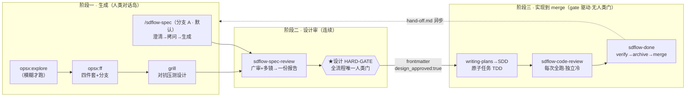

# sdflow 工作流：目标与设计动机演化史

> **本文回答两个问题**：这套工作流系统**要做成什么**（目标），以及**为什么长成现在这样**（设计动机——每个机制背后踩过的坑）。
> 配套阅读：[02-module-reference.md](./02-module-reference.md)（模块是什么/怎么实现）· [03-self-improvement-loop.md](./03-self-improvement-loop.md)（自改进闭环）· [04-optimization-proposal.md](./04-optimization-proposal.md)（优化建议）。
> 系统现状速查另见既有文档 [workflow-overview.md](../workflow-overview.md)（人类向总览）与 [workflow-map.md](../workflow-map.md)（字段×脚本全景）。
>
> ℹ️ 调研曾发现 `docs/workflow-skills/` 三份详解与 `workflow-overview.md` §6.3 停留在旧 inline 锚口径（07-07 mlh-p5 已迁 frontmatter）——**已于 2026-07-10 全部同步更新**。规则真相源以各 SKILL.md 与 `ship_gate.py` 为准。

---

## 1. 项目目标

**一句话**：围绕 OpenSpec 规格驱动流程，在 Claude Code / Codex CLI 上构造一条
**「roadmap 制定 → 需求明确 → 生成 Spec → 设计评审 → 代码生成 → 代码评审 → Spec 归档」的 SDD 闭环**，
附带缺陷/待办/批次记录工具，且工作流自身带**自我评估、自我改进机制**。

**目标画像**：

| 维度 | 取值 | 对设计的影响 |
|---|---|---|
| 主力模型 | Opus 4.8 / GPT-5.5 级 | 判断层可交强模型；但机队含弱档 → 机械协议必须脚本化（adr/0006） |
| 开发 agent | Claude Code CLI / Codex CLI 双运行时 | skills 双装（`~/.claude/skills` + `~/.codex/skills`）；跨模型 outside-voice 成为可能 |
| 目标用户 | 单人开发者 / 几人小团队 | 人类注意力是最稀缺资源 → 全流程只留**一个人类门**；评审靠多子代理而非多人 |
| 非功能需求 | 时间成本 + token 成本 | 度量回路（成本×价值）、trivial 豁免、model 三档、批次策略 |

**基座与自建的边界**：不重造已有轮子——`OpenSpec`（change 四件套 + archive CLI）、
`gstack`（autoplan 广审 / review）、`superpowers`（writing-plans / subagent-driven-development）、
`MattPopock skills`（issue tracker 约定）作为黑盒复用；自建的 15 个 `sdflow-*` skill 只做**编排、门禁、记录、复盘**四类粘合层。
复用边界有明文红线（adr/0002）：**读外部 skill 的产出物合法，依赖其内部实现非法**——依赖内部实现在对方升级时会静默失效。

---

## 2. 全局形态：三阶段、一个人类门

这个形态不是一开始设计好的，而是 **8 天 31 个归档 change 迭代出来的**（2026-07-02 → 07-09，全部 dogfooding——用这套工作流开发这套工作流本身）。下面按时间讲清每个机制是被哪个坑逼出来的。

---

## 3. 设计哲学：四条元规律

所有机制都是这四条的实例。它们本身也是踩坑后提炼的（出处见 §4 时间线）。

### 3.1 机械/判断切分线 = 有无确定性信号

> 对错可由机器证据判定（退出码 / diff 空不空 / 正则匹配 / 文件存在）→ **脚本 owns**；
> 需要读内容做取舍 → **模型 owns**；无确定性信号的纯判断 → **禁止脚本化**（会制造假绿源）。

落地形态：ID 不撞号/双写一致/状态门禁交 `buglist.py`；「这是不是真 bug」留给模型。
这条线经 done-roadmap-writeback 三轮评审实证校准（adr/0013→0014→0015）：切分**按信号有无、不按动作粗细**——同一个"回填 roadmap"动作里，"定位到哪个 phase"有信号（机械），"勾哪几行、怎么写价值叙述"无信号（判断留人）。

### 3.2 盘面即状态（State-on-Disk）

> 一切流程状态 MUST 从**产物盘面**（文件 + frontmatter 锚 + git 提交）推导，不设第二真相源（对话记忆、内存变量都不算数）。

落地形态：`ship_gate.py` 只读零副作用，从盘面推导「下一步是谁」；任何时刻中断，重调 `/sdflow-ship` 即续跑；人工手跑某步产出的报告同样被认（**人机同权**——gate 不辨产者）。
动机：对话会被 compaction，凭 prose 记忆步序的编排器在长任务中必然漂移。

### 3.3 反静默（任何一层覆盖不得无声蒸发）

这是 `CONTEXT.md` 开篇的元原则，双向展开：

- **反静默守卫**（机器侧）：每条降级路径必须显式打日志/写锚——`resolve-workflow.sh` bundle 不可达 exit 2 + stderr；`outside-voice` 落 guard 原因码；anchor_lint fail-closed exit 2。
- **反静默压制**（判断侧）：裁掉的 reviewer finding 只能降级/批注、不得静默丢，连理由进报告「已裁掉」区（可审计）。

动机：头号失效模式是**假✅（False Green）**——「报告说过了、实际没做」比「报告说挂了」危险一个量级，因为后者会被人看到、前者不会。

### 3.4 注入建议式 + 下游门强制

> 对外部黑盒 skill 的 prompt 注入**默认只是建议**（模型可忽略）；想让它强制，不去控制对方内部，而是**在下游放一道确定性门读它本应产出的锚/产物**——产不出就 REFUSE / 循环重跑。

落地形态：给 writing-plans 注入「commit 步须带 `checkpoint(<change>:task<N>-<slug>)` 标签」是建议式的，但 `ship_gate.py` 拿这个标签当完成判据——写错标签 gate 就卡住，建议在下游变成了强制。
这条同时是**升级安全**的来源：绝不编辑 superpowers/gstack 插件文件，注入内容放自己仓，对方升级不破坏。

---

## 4. 演化时间线：坑 → 机制 → 落地物

> 数据源：16 篇 ADR（`openspec/adr/`）+ 31 个归档 change + 2 条 roadmap。这张表是理解「为什么这么设计」的主索引。

| 日期 | 踩的坑 / 动机 | 长出的机制 | 落地物 |
|---|---|---|---|
| 07-02 | 债务散落对话里，无处落档 | issues 池：源/批次/status 三维分家 + 批次生命周期 | `issues-pool-batch-mgmt` |
| 07-03 | 每个消费仓背 ≈34 个纯机械规则副本；三代命名混杂；toolkit 既是规则源又 dogfood 自己 | ① 部署分层：规则全局唯一、消费仓只留 ≈5 文件 ② 全量 `sdflow-` 改名 ③ 开发/运行 checkout 物理分离 | `minimize-repo-footprint`（adr/0003）、`sdflow-rebrand`（adr/0007）、adr/0005 |
| 07-03 | 设计层已连续，**编排层仍靠人逐步 copy prompt** | `sdflow-ship` 元编排器：阶段三一次调用跑到 merge | `sdflow-ship`（adr/0004） |
| 07-04 | fresh 子代理独立性有盲区——**同模型盲区同处**；机队锚定后弱档兜底成刚需 | 跨模型 outside-voice（codex 只读 + secret 拒发 + fallback 非阻塞） | `cross-model-outside-voice` |
| 07-04 | `ship_gate.py` 首次全链实战暴露 3 个误判（B1/B2/B3），单轮 ship 3 次假 REFUSE + 3 次人工越权——「越权本应例外却成常规」 | gate 防御纵深：change 命名空间隔离、不押分支纪律（**立论不得自否**） | `ship-gate-hardening`×2（adr/0008） |
| 07-05 | **gate 子串检测在"讨论 gate 自身"的 change 上假阳**（B4，设计门假过）；契约测试子串误红（B5） | 锚行级 + fence-aware 解析；checkpoint 标签单一源；完成判据=集合归属 | `gate-anchor-line-scoped`、`checkpoint-tag-single-source`、`gate-checkpoint-hardening` |
| 07-05 | 评审系统**回答不了「哪面镜值得留」**——只有小样本口头印象 | 度量回路：lens-metric 结构化锚 + 只读聚合，**供数不供裁决** | `workflow-metrics-loop`、`three-lens-decision-framework` |
| 07-06 | 每轮评审重/慢，逼出「往一个 change 塞太多」反模式；「开发时用强模型」是隐含假设 | ① 成本优化 roadmap（三腿：范围/墙钟/轮次）② 无逻辑面白名单免镜 ③ 批次策略 ④ retro 复盘 ⑤ **机队锚定**：能力基线=机队最弱可靠档，机械协议 MUST 脚本化 | `plan-workflow-cost-optimization`、`adaptive-workflow-routing`、`batch-triage-strategy`、`sdflow-retro`、adr/0006 |
| 07-07 | adr/0006「机械 prose 协议脚本化」已声明未执行完；四类实证痛点（字符串解析歧义/模型手数/三镜像漂移/手循环无 schema） | 机械层固化 roadmap（两腿六阶段）：sweep 一键化、anchor-lint、确定性守卫、gate 锚迁 frontmatter | `plan-mechanical-layer-hardening`、`mlh-p1`~`p3`、`mlh-p5-gate-frontmatter`、adr/0010 |
| 07-08 | 手数（模型自己数 findings）仍是信任边界；roadmap 回写**想过度机械化被三轮评审打回** | lens-metric 折叠机读化 + 确定性 emitter；回填收敛为「降摩擦助手·判断留人」 | `…p4-lens-metric-emit`（adr/0012）、`done-roadmap-writeback`（adr/0013→0014→0015） |
| 07-09 | maintain 还在手做 set-diff | `maintain_scan.py` 数据类化；只读报告工具「防假一致」方向定型 | `mlh-p4-maintain-scan`（adr/0016） |

**贯穿主线**：adr/0006/0008/0009/0010/0011/0016 反复自称「同一哲学家族」——**workflow 不押上游理想假设**：
不押"开发时都用强模型"（0006）、不押"每 change 独立分支"（0008）、不押"harness 会给 duration"（0009）、不押"字段永远干净"（0010）、不押"迁移现状=稳态"（0011）。

---

## 5. 五条全局铁律及其出处

（铁律全文见 [workflow-overview.md §1](../workflow-overview.md)；此处补「为什么」的出处。）

| # | 铁律 | 出处（哪个坑） |
|---|---|---|
| ① | 唯一人类门（只在设计门停） | adr/0001：设计错=白做值一个门；阶段三残差可追踪可另修不值门。人类门 elapsed 实测占 spec-review 墙钟大头（见 03 篇），门越多流程越贵 |
| ② | 连续跑·无 `/clear` | 独立性由 fan-out 的 fresh-context 子代理给，`/clear` 唯一作用被替代；quality-layering 论证「生成期已焊三层 review，事后 `/clear` 只剩边际收益」 |
| ③ | 每步 checkpoint 提交 | 碎 commit = 细粒度回退点 + **retro 成本维的唯一数据源**（阶段墙钟从 checkpoint 时间戳算，adr/0009：harness 不暴露子代理 duration，只能退到 phase-grain） |
| ④ | 反静默压制 | 热主 session 带生成历史裁决有合成层偏置；B4 类「假装全过」事故 |
| ⑤ | 防假✅ | T45/T46「标了✅其实没做」溜过人肉扫一眼（adr/0001）；verify 是去人类门后唯一终门，弱模型假 PASS = 放不完整的活过关 → 强档 + Do-Not-Trust 冷启 + 每 ✅ 附机验锚点 |

---

## 6. 三个有代表性的设计转折（值得单独讲的方法论教训）

### 6.1 假✅家族与「证据锚点」的诞生

阶段三去掉人类门（adr/0001）的前提是 verify 能顶住。实测发现弱模型 verify 的失效形态不是「报错」而是**静默给绿**。对策是三件套：
每条 ✅ 必附机验锚点（测试名/commit/file:line）→ 无锚 ✅ 一律视为 gap；verify 用强档 + 「Do Not Trust the Report」冷启动（不信复选框、不信报告措辞，亲自读代码）；hand-off 不继承 verify 的 ✅。
这也是后来 anchor_lint、frontmatter 机判锚等一整条「机器锚」路线的起点。

### 6.2 gate 自指坑与 fence-aware 家族

`ship_gate.py` 用子串检测锚时，在「讨论 gate 自身」的 change 上假阳（B4：设计文档里*引用*锚文本被当成*真锚*，设计门假过）。修法定型为**行锚定 + fence-aware（CommonMark 围栏内不算）+ 头部声明区**，并最终把机判锚整体迁出正文、进 frontmatter（mlh-p5）。
由此长出一个「fence-aware 三处独立重实现 + AST 等价守卫」的家族——因消费仓不能跨 skill import，三个脚本各自内联同款解析核，靠 `test_mirror_consistency.py` 剥 docstring 后 AST 等价断言防漂移。

### 6.3 目标态论证 vs 现状快照（adr/0011）与「点驱动修补 vs 面治」

roadmap 回写的初版论证用「现存 25 份归档报告 24 份不会触发」证明某解析路径不可达——被评审揭穿这是**拿迁移中途的现状快照否定设计目标态**，且漏了第三个调用方。由此立规：改共用解析核心 MUST 对**每个调用方**基于 producer 契约 + 目标稳态分别论证。
同一 change 三轮评审（adr/0013→0014→0015 两次 supersede）还沉淀了另一条元教训：**点驱动修补会留下相邻面信号，面治需系统扫同类**——多镜高收敛报同类问题时，别逐条打补丁，找单一源头治面。

---

## 7. 目标 vs 现状对照

| 用户目标要素 | 现状实现 | 完成度 |
|---|---|---|
| roadmap 制定 | `sdflow-roadmap`（三件套直写 + 分档 review） | ✅ |
| 需求明确 | 分支 A（默认）`/sdflow-spec` 相位 A/B；分支 B `opsx:explore` + grill（人类对话岛，刻意不机械化） | ✅ |
| 生成 Spec | 分支 A（默认）`/sdflow-spec` 相位 C；分支 B `opsx:ff` + config.yaml 规则注入 + TG 触发目录 | ✅（分支 B 依赖 OpenSpec 官方 skill） |
| 设计评审 | `sdflow-spec-review`（autoplan+多镜+决策登记+HARD-GATE） | ✅ |
| 代码生成 | superpowers writing-plans + SDD（注入点 A/B） | ✅（外部黑盒 + 注入） |
| 代码评审 | `sdflow-code-review`（每次全跑·冷·强制主审） | ✅ |
| Spec 归档 | `sdflow-done`（verify→hand-off→archive→merge） | ✅ |
| 缺陷/待办/批次记录 | buglist/todolist/issues 三件套（脚本 owns 不变量） | ✅ |
| 自我评估 | `sdflow-retro`（成本×价值只读复盘）+ lens-metric 回路 | ✅（价值锚覆盖率仍在爬坡：14/30） |
| 自我改进 | 双 roadmap（成本优化/机械层固化）承载，人拍板 | ✅ 机制在，改进本身持续进行中 |
| 时间/token 成本 | model 三档、trivial 豁免、批次策略、成本双峰数据 | ◐ P2 档位强制未落地（见 03/04 篇） |

---

*本文数据基线：git HEAD `fc1b98b`（2026-07-10）· VERSION 0.9.0 · 16 ADR · 31 归档 change · B1–B5 全 FIXED · T1–T96（64 活跃）。*
