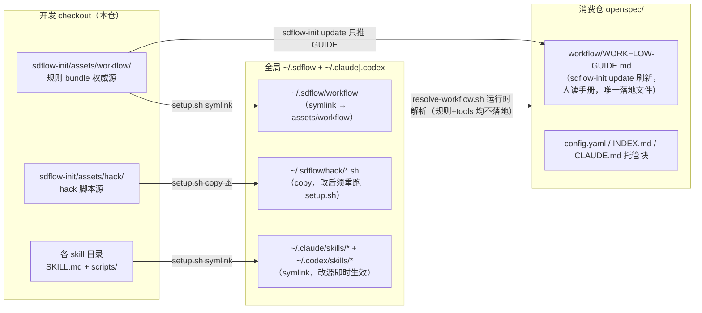
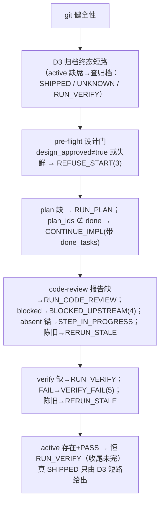
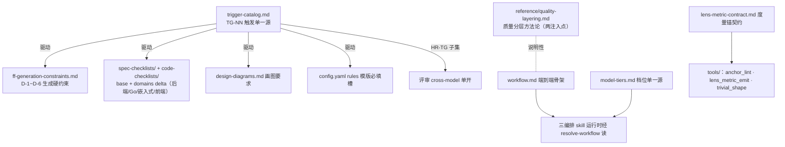
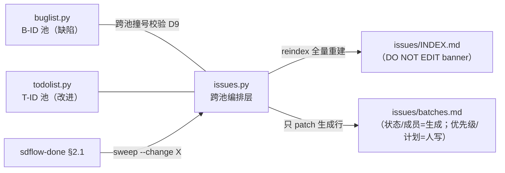
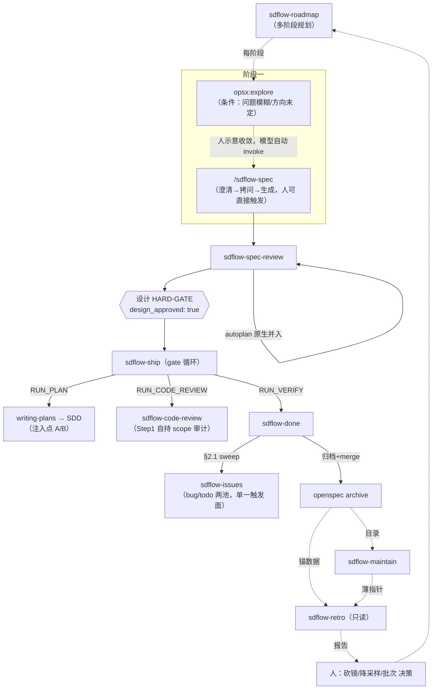

# sdflow 全模块参考：全部 skill 的设计与实现

> **本文是模块级参考**：仓库解剖 → skill 总表 → 四大编排器详解 → 规则 bundle → 数据类五件套 → 调用拓扑。
> 与既有文档分工：[workflow-overview.md](../workflow-overview.md) 讲阶段叙事、[workflow-map.md](../workflow-map.md) 讲字段×判据速查；本文讲**每个模块内部怎么设计、怎么实现**，并覆盖旧详解未收录的模块（ship / roadmap / init / recorder 三件套 / retro / maintain）。
> 数据基线：**混基线，如实登记**——大部分数字取自 git HEAD `fc1b98b` 快照；`add-sdflow-spec` 触及的两片已按**当前 HEAD** 重取：① 阶段一入口（分支 A `/sdflow-spec` / 分支 B 旧三步）；② recorder skill 名册合并后的 `sdflow-issues` 一行（SKILL.md 行数 / 脚本行数 / 用例数）。全部论断接地自源码（关键处附 file:line）。
> 本文是**活文档**（非冻结快照）：数字与实况漂了以实况为准，重取用 `wc -l` / `pytest <skill>/tests/` 实测，勿凭本文回写代码。

---

## 1. 仓库解剖

```
sdflow-skills/
├── setup.sh                    # 安装入口：含 SKILL.md 的目录 → 双运行时 symlink
├── VERSION                     # v0.9.0
├── <各 skill 目录>/          # 每个 = SKILL.md（必需）+ scripts/ + tests/ + assets/（可选）
│   └── sdflow-init/assets/workflow/   # ★ 整套规则 bundle 的唯一权威源（34 文件）
│   └── sdflow-init/assets/hack/       # ★ 全局 hack 脚本源（checkpoint/outside-voice/resolve-workflow）
├── openspec/                   # 本仓 dogfood 自己的工作流（changes/specs/issues/adr/roadmaps/retro）
└── docs/                       # 视图文档（非真相源）
```

**两类 skill**：

| 类型 | 成员 | 确定性来源 |
|---|---|---|
| 编排类（纯 Markdown） | sdflow-ship¹ · sdflow-spec-review · sdflow-code-review · sdflow-done¹ · sdflow-roadmap · openspec-upgrade · sdflow-upgrade | SKILL.md 指令驱动主 session 调度子代理；机械门外置到脚本 |
| 数据类（Markdown + Python） | sdflow-issues · sdflow-init · sdflow-retro · sdflow-maintain · sdflow-architecture · sdflow-devenv | `scripts/` owns 不变量 + pytest（用例数以 `pytest <skill>/tests/` 实测为准，勿在此写死） |

¹ ship/done 带自有脚本（ship_gate.py / roadmap_writeback_draft.py），介于两类之间。

**分发双链**（改哪类文件要跑什么，是日常开发最易踩的坑）：



- **规则与 tools 均不落消费仓**（`adr/0039` 消灭双链）：消费仓运行时经 `resolve-workflow.sh` 两步链解析——全局 canonical `~/.sdflow/workflow` → 不可达则 **exit 2 显式降级**（反静默）。本地 pin 分支（曾优先于全局 canonical）已随该 ADR 删除。
- **hack 是 copy 不是 symlink**：改 `assets/hack/` 后不重跑 `setup.sh` = 新 SKILL 调旧脚本（发布边界 = push → pull → **立即** setup）。

---

## 2. skill 总表

| skill | 分类 | SKILL.md 行数 | 脚本行数 | 测试用例 | 在闭环中的位置 | 被谁调用 |
|---|---|---|---|---|---|---|
| sdflow-roadmap | 规划 | 430 | 0 | 0 | 闭环之上（多阶段规划，每阶段→一次 change） | 人工 |
| sdflow-spec-review | 评审主审 | 187 | 0（外部化） | — | 阶段二·步4 | 人工（设计门前） |
| sdflow-ship | 元编排 | 47 | 842（ship_gate.py） | 20 文件 | 阶段三·总控 5.5→9 | 人工（过设计门后一次调用） |
| sdflow-code-review | 评审主审 | 250 | 0（外部化） | — | 阶段三·步8 | ship（RUN_CODE_REVIEW）/人工 |
| sdflow-done | 闭环 | 360 | 368（roadmap_writeback_draft.py） | 32 | 阶段三·步9 | ship（RUN_VERIFY）/人工 |
| sdflow-issues | 记录 | 559 | 1746 | 679 | 全阶段 + 收尾批次管理 | 人工 + **done §2.1 sweep 自动调** |
| sdflow-retro | 复盘 | 104 | 799（2 脚本） | 71 | 闭环之外（只读） | 人工 + maintain 薄指针 |
| sdflow-maintain | 维护 | 67 | 314（maintain_scan.py） | 38 | 归档后/合并上游后 | 人工 |
| sdflow-init | 铺设 | 111 | init.py（含 config-lint） | — | 消费仓 init/update | 人工 |
| sdflow-upgrade | 升级 | 27 | 0 | 0 | 运行 checkout 升级 | 人工 |
| openspec-upgrade | 升级 | 95 | 0 | 0 | openspec CLI 升级 | 人工 |
| （bundle tools/） | 机械门 | — | anchor_lint 231 + lens_metric_emit 198 + trivial_shape 220 | （tools/tests，仅源仓） | 两审的门 | spec/code-review |

---

## 3. 编排器四件套详解

### 3.1 sdflow-ship：gate 驱动的元编排器

**设计要点**：SKILL.md 仅 47 行（全仓最短），因为**判定逻辑全部下沉 `ship_gate.py`（842 行）**——「SKILL 薄、脚本厚」是刻意的：主 session 不承担步序记忆（盘面即状态），SKILL 只描述「每步前后 MUST 调 gate、照 verdict 跑」。

- **自身 fan-out = 0**：纯 chain 子 skill（writing-plans/SDD → sdflow-code-review → sdflow-done），扇出发生在被链 skill 内部。
- **零产物、零 git 写**（D8）：不 commit/merge/push，写锚由各子 skill 自己负责。
- **resume 语义**：零跨步内存状态，中断后重调即从盘面推导缺口续跑；gate 不辨产者（人工手跑某步的报告同样被认，人机同权）。

**ship_gate.py 判定态机**（`decide()` :647-828，顺序即优先级）：



实现上的三组关键机制：

| 机制 | 实现 | 防的坑 |
|---|---|---|
| frontmatter 解析（:295-386） | 手写 stdlib 零 yaml 依赖；只认首块、只认 `ship-gate:` 直接子键层、`#` 注释剥离、重复键/tab/内联标量分类为坏 frontmatter → live 读 fail-closed UNKNOWN(6)，归档读 fail-safe `none` | 深嵌套假过门、带引号值越域、消费仓无 PyYAML |
| TAG_RE（:492）`checkpoint\((?:([a-z0-9][a-z0-9-]*):)?task(\d+)-` | 命名空间组仅 `ns==change` 才计入；裸格式向后兼容；producer↔parser 一致性由 `test_producer_parser_contract` 钉死 | stacking 跨 change 污染假✅（adr/0008） |
| 失鲜分域（:222-261） | design 域盯四件套+specs/ 其后改动；code 域盯 `openspec/` 之外改动；`checkpoint(impl-review)` subject 豁免（阶段三合法尾流）；未提交报告=fresh | 拍板后偷改设计；「已知不覆盖」清单（rebase 伪保鲜等）诚实登记在 docstring :64-116 |

### 3.2 sdflow-spec-review：阶段二设计审

五步流（0 解析规则根 → 1 autoplan 原生广审落盘 → 2 规划镜头 + **一条消息并行 fan-out** → 3 合并去重+对抗裁决+anchor_lint 门 → 4 写报告+落度量锚+拍板回写 frontmatter）。

**fan-out 拓扑**（每子代理 fresh context、返回结构化 findings、禁 AskUserQuestion）：

| 镜 | 数量 | 职责 | model 档 |
|---|---|---|---|
| 领域镜 | 每命中领域 1 个 | 过 `spec-checklists/domains/<栈>`，附 file:line 证据 | 中 |
| 对抗镜 | 2（高风险 3） | 各从不同角度证明 spec 实现期爆炸，默认 refuted=true | 中 |
| 接地镜 | 固定 1 | grep/读真实代码核验 spec 所有代码事实 | 弱 |
| HR-TG cross-model | 条件（命中 HR-TG 子集） | outside-voice 单开领域专属跨模型审 | codex |
| design outside-voice | 1（有复用守卫） | 跨模型第二意见，autoplan 已有 codex findings 则复用不重开 | codex/claude-fallback |

**关键取舍**：置信分流**不照搬 <80 一刀切**（设计漏掉代价高，优化召回；低置信上抛一行不静默滤除）——与 code-review 相反。中途绝不 AskUserQuestion：≥2 方案/核验不了的事实写进报告「决策登记区」（`[自动决策]`/`[需拍板]`/`[已裁掉]` 三类条目），人类门一次拍板。拍板后主 session 立即 prepend `ship-gate.design_approved: true` frontmatter——这是 ship pre-flight 唯一机判依据。

### 3.3 sdflow-code-review：阶段三代码审

六步流（0 算 `DIFF_BASE=merge-base` + 档位/skew/探针 → 1 **自持 scope 审计**（fresh 中档子代理，四件套为意图源，scope-drift + 完成度五态）→ 2 **trivial_shape 前置豁免** + fan-out → 2.5 code outside-voice（always）→ 3 置信过滤 <80 + 对抗裁决 → 4 能修自动修/T10 三级裁/defer → 5 报告+锚+checkpoint）。

与 spec-review 的镜差异：**没有接地镜**（代码本身就是 ground truth），换成**历史镜**（git blame + 旧 review 意见，查重蹈覆辙，弱档）；**有 <80 硬过滤**（代码问题 CI 能兜一部分，优化精度；outside-voice codex findings 豁免数值滤——跨模型自评不可比）。

**定位铁律（P3c）**：每次全跑·独立冷·强制主审，**不是**「高风险才跑的抽查」。与 SDD 循环内的注入点 B 终审**并存不是重复**：第一遍 reviewer 冷但 controller 热（循环内即时修复），第二遍完全冷独立（兜「被 controller 说服放过」的真问题——实测抓到过致命 F1，是 load-bearing 层，勿优化掉）。

**阶段三无人类门的补偿**：T10 三级决策协议——①有客观判据（测试/断言可判）自动选+记理由 ②无判据派对抗镜复核推荐项 ③复核不过 defer 进 buglist/todolist；MUST NOT 以自评置信为唯一依据。

### 3.4 sdflow-done：串行门禁闭环

六步全串行、失败即中止；三个独立子代理**按步性质定档**（固定步骤写死、无运行时误分类风险）：

| 步 | 执行者 | 关键机制 |
|---|---|---|
| 0 对账 | 主 session | 检测默认分支（勿假设 main）；tasks.md 复选框对账（复选框在 done 才勾——实现期勾会触发设计门失鲜） |
| 1 verify | **强档子代理** | Do-Not-Trust 冷启：不信复选框/报告措辞，逐需求读代码核对；每 ✅ 附机验锚点；产 verify-report.md + `ship-gate.verify: PASS\|FAIL` |
| 2 hand-off | 主 session/中档 | 三段（完成/未完成延后/下一阶段）；§2.1 `issues.py sweep --change X`（一键分诊+reindex，非原子但重跑收敛）；§2.2 roadmap 回填草稿（脚本退出码 0/2/3/4/5/6/7 分档，判断留人） |
| 3 archive | **中档子代理** | fresh 上下文读真实代码核对每条 delta 再同步主 specs（spec 反映终审后实况而非过时 delta）；走 `openspec archive` CLI 禁手动 mv |
| 4 commit | **弱档子代理** | Conventional 中文 message；禁 push |
| 5 merge | 主 session | untracked 硬检查（任何 `??` 即 halt）→ `--ff-only`；冲突 abort；不自动 push |

档位经济学的明文论证（SKILL.md:345）：**turn 数 > 单 token 价**——弱档在判断味步上常多花 2-3× turn，总成本反高；所以 verify 用强档「不只为质量、也更省」。

---

## 4. 规则 bundle（sdflow-init/assets/workflow/，34 文件）

### 4.1 分层结构



### 4.2 TG 触发目录（单一源模式的样板）

同一批触发词**同时驱动五层**，各层只引用 `TG-NN` 编号、不复制定义。26 个 TG 分七组：A 技术栈（01-03）、B 数据/持久化（04-06）、C 接口/依赖（07/08/25）、D 行为/状态（09-12/26）、E 规模/架构（13-15）、F 质量（16-18）、G 需求/协作（19-24）。
**HR-TG 高风险子集** = {04,06,07,08,09,16,17,26}，入选判据：做错会运行期爆炸/数据损坏/安全泄漏且难回退——命中才为评审单开跨模型镜（成本控制：cross-model 不是常开的）。

**D 约束的稀缺性纪律**（ff-generation-constraints.md:36-57）：升为硬约束须四条全中——①生成时主动行为（grep/交叉核对，非可被动填的槽）②守高成本难逆失效 ③锚外部真相 ④与当前 change 相关。这是防「规则清单无限膨胀」的门槛。

### 4.3 model-tiers.md（14 行，全仓最小真相源）

强档=verify 终门/对抗裁决/final 终审（缺省 opus）；中档=领域镜·对抗镜/生成/实现/archive 对码（sonnet）；弱档=接地/历史镜/置信打分/commit message（haiku）。
两条铁律：**带门禁无人复核的步 MUST NOT 降档**；档位是相对机队的相对词、不绑产品名（adr/0006(c)），编排 skill 一句引用、MUST NOT 内联模型名。

### 4.4 quality-layering（为什么评审长这样的方法论底座）

核心命题：代码生成质量高 ≠ 少 review，而是**把标准前移进生成期已有的审查口**。SDD 生成期已焊三层 review（implementer 自审 → per-task fresh reviewer → final whole-branch reviewer），但查的都是通用 rubric——**真残差 = 领域规则 + scope-drift + PR 风险 + 冷独立**。于是：

- **注入点 A**：design 领域约束逐字进 plan 的 Global Constraints（prevention 前移）；
- **注入点 B**：final reviewer 的 rubric 附加命中栈的 `code-checklists/domains/<栈>`（领域审进循环，即时 fix + re-review）;
- **P3c**：sdflow-code-review 仍每次全跑（与 B 并存不重复——冷独立兜底）。
- **升级安全三重保险**：绝不编辑 superpowers 插件文件；注入发生在 dispatch 时、指令放自己仓；按行为措辞不绑死路径。

### 4.5 sdflow-init：铺设与升级

- **init**：建骨架 + 拷 bundle（默认只落 `tools/` + lens-metric-contract.md）+ 模版生成 config.yaml + 注入 INDEX/CLAUDE.md 托管块 + 装全局 FF-0 hook。
- **update**：重拉 bundle + 重注入托管块，**不动 config.yaml 用户内容**。
- 幂等注入按 marker token 定位（改名后旧区块仍被命中替换）、逐行 offset 定位（防 inline 嵌入 marker 锚错位）；settings 写入有 flock + 原子写；退役 hook 自愈（`RETIRED_HOOKS` 外科式摘除）。
- **config 合并刻意留给模型**（block scalar 脚本硬改易碎）——机械/判断切分线的又一实例。
- config-lint：手写 stdlib 行扫描（**禁 import yaml**，消费仓无 PyYAML），fail-closed。

### 4.6 sdflow-roadmap：闭环之上的规划层

三件套 = design（HOW+WHY，头部含「需求与目标态」伸缩章）/ roadmap（WHEN+每阶段验收）/ task-log（DID）。
与 `sdflow-spec` 同构的三相位结构（第零步重入探测 → A 澄清+gate-0+商业化信号检查 →
B 七维拷问按信号裁剪+memo 增量落盘 → C 生成三件套），wayfinder / grilling / domain-modeling /
office-hours 四个外部依赖已内化（`refactor-roadmap-internalize-deps`）；三态路由：
gate-0 过∧无商业化信号 → 直接生成，gate-0 过∧信号命中 → B 裁剪到维度①，gate-0 未过 →
B 按信号七维裁剪。memo（B 相位纪要，含 `## 未决项` 小节）+ 存量 footage（此前产出的包，
冻结兼容续跑）统称「历史存档」，三件套不引用。硬性规则：固定存 `openspec/roadmaps/{name}/`；
每个子任务粒度 = **恰好一次 `/opsx:new` 能完成**；产出直写，不经 OpenSpec change 壳承载；
只规划不实施；review 按商业化信号分档——默认 `/plan-eng-review`，信号命中才 `/autoplan` 三连；
收尾 checklist 四项软门。存量四件套包（含独立 requirements.md）冻结为合法历史形态，续跑兼容不强迁。
方法论出处 `references/long-flow-skill-paradigm.md`：「skill 是助产士非 orchestrator」，契约可验证性 A/B/C 三级、目标全升 C。

---

## 5. 数据类五件套详解

### 5.1 recorder 三件套（buglist / todolist / issues）：一个内聚子系统



**脚本 owns 的共同不变量**（三脚本各自内联同款 helper、禁跨 import，靠 AST 等价测试守）：

- `atomic_write`（tempfile + os.replace）；
- ID 全局唯一自增（dual-read 新旧目录取并集）；
- 总览表 ↔ 详细块双写一致（set-status 三步同步：表状态列 + 块状态行 + 追加历史）；
- 终态门禁：FIXED 必带 evidence+根因、WONTFIX 必带理由（bug 池）；DONE 必带关联 change/commit（todo 池）；
- recorder 新写索引使用 versioned frontmatter，`_reject_cell_unsafe` 已退役；`batches.md` 单行 registry 仍由独立 batch line guard 防 header/字段注入（ADR-0025）；
- fence-aware 解析 + scan 一致性自检（表↔块缺失/状态不一致/跨文件重复 ID）。

**issues.py 的编排层不变量**：跨池 read 走 subprocess CLI 不 import（解耦）；INDEX **禁读旧 INDEX** 全量确定性重建（幂等，D3/D7）；batches.md 只 patch `状态:`/`成员:` 生成行、绝不覆写人写行；完成判据=成员≥1 且全终态（0 成员显式排除防 vacuous-truth 假 DONE）；人标 DONE 但成员未全终态 → 只追加 `⚠️ 不一致` 不越权纠正。

**模型的分工**：是不是真 bug / 值不值得记 / 定优先级 / 该不该建批次——「把噪音挡在池子外，比记全更重要」。

### 5.2 sdflow-retro：成本×价值复盘（自改进闭环的数据引擎）

详见 [03-self-improvement-loop.md](./03-self-improvement-loop.md)。实现要点：

- **成本维**：git 历史 → `checkpoint(<inner>)` 前缀最长匹配归桶（spec-review/code-review/impl/grill/ff/done/other/unknown）→ 相邻提交时间差累加成阶段墙钟；大规模合并提交（≥3 change 目录）从边界剔除防污染归因；口径=阶段级 elapsed（含人读拍板时间，adr/0009 只能到 phase-grain）。
- **价值维**：扫归档报告的 `sdflow:lens-metric v1` 锚（fence-aware、坏文件 fail-safe 进 parse_failed 桶不静默丢）。
- **「只呈现不决策」的实现**：`semantic_summary` 明令模板禁出现「说明/意味着/应/建议/该砍」等决策词；`⚠️ 待复评` 区固定前缀、无命中也输出固定行（防长期无信号被静默吞）；指标卡只放计数不放平均值（防掩盖双峰分布）。

### 5.3 sdflow-maintain：目录一致性扫描

`maintain_scan.py`（314 行）纯读、fail-closed、零写：fence 未闭合 / 托管块 marker 不配对 / 目录不可读 → 一律报错**绝不输出「一致」**（防假一致——与防假✅同族）。四分节差异报告（新增未索引/已删未清理/过时引用/陈旧遮蔽）；修复只改 `openspec/INDEX.md` 一个文件且须经用户确认。与 init 共享的判据常量保自包含副本、靠 `test_marker_consistency.py` 机验一致（adr/0016：跨 skill 共享常量用一致性守卫而非物理单一源）。

---

## 6. 机械门脚本速查（who-calls-what）

完整字段/判据/退出码见 [workflow-map.md §4](../workflow-map.md)。本表按「调用方视角」重组：

| 调用方 | 调的脚本 | 何时 | 失败语义 |
|---|---|---|---|
| sdflow-ship | ship_gate.py | 每步前后 | 0 推进 / 3 拒 / 4 阻塞 / 5 verify 败 / 6 判定不能 |
| spec-review | resolve-workflow → outside-voice → anchor_lint → lens_metric_emit → checkpoint×2 | 步0/1/3/4 | anchor_lint 非 0 阻塞本步；emit 非 0 不落锚不手拼 |
| code-review | resolve-workflow → **trivial_shape** → outside-voice → buglist/todolist(defer) → lens_metric_emit → anchor_lint → checkpoint | 步0/2/2.5/4/5 | trivial 0=EXEMPT 免 fan-out；2=ERROR 保守照跑 |
| done | issues.py sweep → roadmap_writeback_draft → openspec archive CLI → untracked 硬检查 → merge --ff-only | 步2/3/5 | sweep 非原子重跑收敛；writeback 7 档退出码判断留人 |
| maintain | maintain_scan.py | 全程 | exit 2 fail-closed 绝不假一致 |
| retro | retro_report.py / lens_metric_aggregate.py | 全程 | view-only，坏文件进 parse_failed 桶 |

**fail-closed 家族**（判定不能宁可保守）：anchor_lint(2) · trivial_shape(2→当必跑) · resolve-workflow(2→显式降级) · config-lint(不可读→违规) · ship_gate(坏 frontmatter→6) · maintain_scan(2→绝不假一致)。

---

## 7. 端到端调用拓扑



---

*配套：[01-goals-and-rationale.md](./01-goals-and-rationale.md)（为什么这么设计）· [03-self-improvement-loop.md](./03-self-improvement-loop.md)（度量与改进闭环）· [04-optimization-proposal.md](./04-optimization-proposal.md)（优化建议）。*
