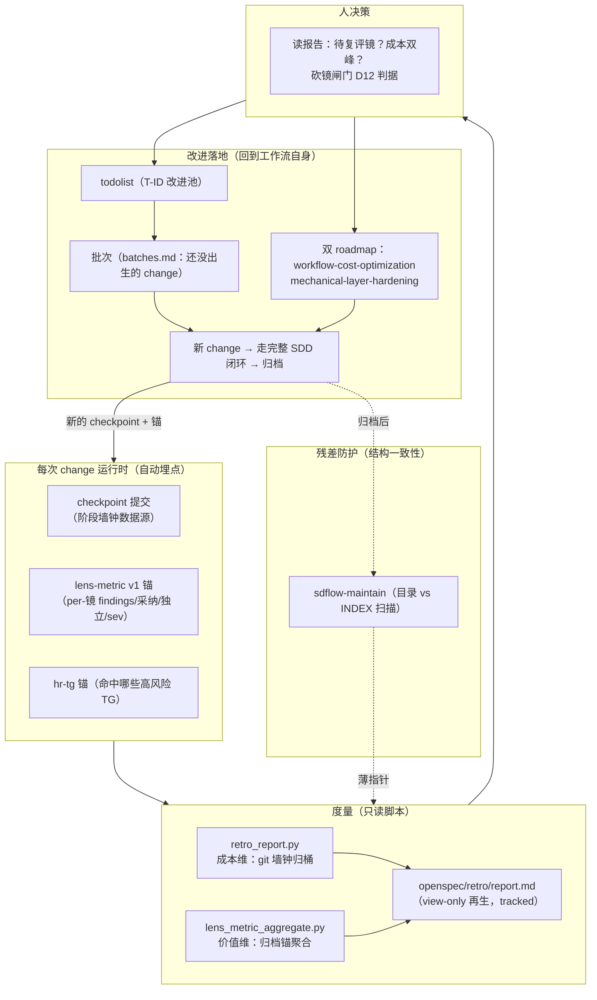

# sdflow 自评估与自改进闭环

> **本文回答**：这套工作流怎么知道自己「值不值、贵在哪、哪面镜该留该砍」，以及改进是怎么落回工作流本身的。
> 核心立场一句话：**度量回路供数不供裁决**——脚本确定性地算成本与价值，呈现给人；砍镜/降采样/优先级永远人决。

---

## 1. 闭环全景



闭环的四个环节各有一个专职机制：**埋点**（checkpoint 铁律 + lens-metric 契约）→ **度量**（retro 只读再生）→ **决策**（人 + 明码闸门判据）→ **落地**（issues 池 → 批次 → roadmap → change）。改进产物本身又走一遍 SDD 闭环——这是 dogfooding 的自指结构：8 天 31 个归档 change 里，绝大多数是对工作流自身的改进。

---

## 2. 埋点层：数据从哪来

### 2.1 成本维埋点：checkpoint 提交（铁律 ③ 的第二重身份）

每步收尾用 `checkpoint-commit.sh <step> "<描述>"` 过场提交，subject 固定格式 `checkpoint(<inner>)`。它同时是：碎粒度回退点（原始目的）+ **阶段墙钟的唯一数据源**——retro 按 `<inner>` 前缀最长匹配归桶到 8 个阶段（ff/grill/spec-review/impl/code-review/done/other/unknown），相邻提交时间差累加。

为什么只能到「阶段级」：adr/0009 实证 harness 不暴露子代理 `duration_ms`（全仓 grep 零捕获），per-镜计时是幻影字段不入契约。所以定下**度量粒度分界：价值到镜级、成本仅到阶段级**。口径上阶段墙钟=elapsed（含人读报告、拍板的时间）——这不是缺陷，人类注意力本来就是要度量的成本。

### 2.2 价值维埋点：lens-metric v1 锚

两个评审 skill 在报告落一行机读锚（受 config `metrics.enabled` 门控，消费仓默认关、本仓 dogfood 开）：

```
<!-- sdflow:lens-metric v1 layer="code-review" lens="adversarial" runner="claude"
     site="—" findings="9" 采纳="7" 裁掉="2" defer="0" 独立="3" sev="致0/高2/中4/低1" -->
```

关键设计：**「独立」= 唯一报过 ∧ 被采纳**（折叠到 lens 后计）——它度量的是「这面镜有没有不可替代性」，是砍镜判断的核心字段。锚由确定性 emitter（`lens_metric_emit.py`）生成而非模型手拼——「模型手数」曾被识别为信任边界（mlh 痛点②），emitter 输入=findings+roster（roster 保证零-finding 镜也落行，防「没发现=没跑」混淆）。产出侧再有 `anchor_lint.py` 校验字段/枚举/计数，形成 emit→lint 双端机械化。

---

## 3. 度量层：retro 报告的结构与实测结论

`openspec/retro/report.md`（跑 `python3 sdflow-retro/scripts/retro_report.py --root .` 再生覆盖，勿手改）结构：覆盖计数 → ⚠️待复评区 → 一览 → per-change 明细 → 聚合①阶段占比 → 聚合②成本双峰 → 聚合③per-镜价值表。

### 3.1 当前实测数据（截至 2026-07-09，覆盖 30 change / 有真锚 14 / 累计评审墙钟 ≈70.1 小时）

**阶段占比（聚合①）**：

| 阶段 | 占比 | 解读线索 |
|---|---|---|
| spec-review | **39%** | 大头；其中人类门 elapsed 主导（读报告+拍板） |
| impl | 31% | 实现 |
| ff / grill / other / unknown | 各 5-7% | |
| code-review | **5%** | 并行 fan-out + 无人类门，便宜 |
| done | ≈0% | 全机械化 |

**成本双峰（聚合②）**：大逻辑 change 评审占比低（~9%）、小 change 评审占比高（73%，极端案例 `gate-anchor-line-scoped` 100%——微 change 只有 code-review）。最重 change `checkpoint-tag-single-source` 12.6 小时，其中单次 spec-review 678 分钟=人在设计门读+拍的时间，**不是算力时间**。

**per-镜价值表（聚合③）关键行**：

| 镜 | 轮数 | findings | 采纳率 | 独立率 | 画像 |
|---|---|---|---|---|---|
| spec-review·对抗镜 | 7 | **71** | **90%** | 41% | 发现最多、质量最高 |
| code-review·对抗镜 | 11 | 67 | 76% | — | 次之 |
| spec-review·领域镜 | — | — | — | 50% | 不可替代性高 |
| spec-review·接地镜 | — | — | — | 42%（roadmap 引用 75%） | 便宜（弱档）且独立性强，fail-closed 保护 |
| code-review·历史镜 | 10 | — | 60% | **10%** | **最接近冗余镜画像**（首个候选淘汰对象） |
| code-review·outside-voice(codex) | 12 | — | — | — | 达待复评轮数阈值 |

### 3.2 度量已经反哺过决策的实例（回路真的转起来了）

- **P0 基线证伪 P2 墙钟杠杆**（cost roadmap D11）：原计划「机械镜降档省墙钟」，实测 spec-review 43% 被人类门 elapsed 主导、code-review 仅 5%，机械镜并行且非最慢镜——**P2 从「省墙钟」重定位为纯 token play**，墙钟真杠杆归 Leg3（批次降轮次）。这是「先测量后优化」避免无效功的直接案例。
- **成本双峰 → 批次策略**：小 change 评审占比 73% → 相关项合批、大扫除批（`batch-triage-strategy`），摊薄每轮固定成本。
- **档位「文档说 light 实跑 opus」**：P2 调研发现 model-tiers 早已映射 light 的镜，因子代理继承父模型实际全跑 opus——advisory 与 enforced 的差距被度量暴露（未修，见 04 篇优化建议）。

---

## 4. 决策层：明码闸门与反噬防护

### 4.1 砍镜闸门（cost roadmap D12）

> per-(层,镜) 出现轮数 ≥10 ∧ 独立率 <20% ∧ 采纳率 <50%，且**连续 2 个观察窗**满足，才进入「议砍」——议砍也只是人工议题，不自动执行。

当前判定：价值锚仅 14/30、轮数多数 <10 → **现阶段禁砍任何镜**（样本不足），接地镜独立率高须 fail-closed 保护。

### 4.2 度量反噬的三道防线

度量回路最大的风险是被反向优化（Goodhart）：短期低效但长期 load-bearing 的层被数字杀掉。防线：

1. **「只呈现不决策」焊进脚本**：`semantic_summary` 禁决策词（说明/应/建议/该砍）；待复评区只提示轮数达阈值、不给淘汰建议；指标卡不放均值（防掩盖双峰）。
2. **评审 skill 侧旁路禁令**：lens-metric 锚缺失仅拦报告完整性，MUST NOT 反向改写裁决结论；反馈回路的聚合归 retro、砍镜人决，评审 skill 自身 MUST NOT 自动执行。
3. **经验教训入 memory**：冷 code-review 层曾被质疑冗余，实测独家挖出致命 F1——「dogfood 任务 review 看着过 ≠ 真过」，明文标记为 load-bearing 勿优化掉。

---

## 5. 落地层：改进怎么回到工作流

### 5.1 三级池：todolist → 批次 → change

- **T-ID 池**：任何「以后可以改进」的想法即时落 todolist（当前 T1–T96，64 活跃、其中仅 4 项未分诊——分诊率 94%，池子没有腐烂）。
- **批次**（batches.md，26 个：20 PLANNED / 6 DONE）：「还没出生的 change」，有 PLANNED→IN_PROGRESS→DONE 生命周期；`sdflow-done` 收尾时 `issues.py sweep` 自动把本 change 的 OPEN 项分诊进批次并 reindex——**收尾即分诊**，防止债务在池底沉没。
- **change**：批次成熟 → 开 change 走完整 SDD 闭环。

### 5.2 双 roadmap：结构化承载两条改进主线

| roadmap | 目标 | 状态（07-10） |
|---|---|---|
| workflow-cost-optimization | 三腿：Leg1 范围（trivial 豁免 ✅）/ Leg2 墙钟→token（P0 基线 ✅、P2 档位强制 🔲、P3 接地镜流水线 🔲）/ Leg3 轮次（批次 ✅） | 3/5 阶段交付 |
| mechanical-layer-hardening | 两腿六阶段：把「模型跑 prose 协议/手数/字符串嵌 markdown」固化成脚本+结构化状态（adr/0006 落地） | P1/P2/P3/P5 ✅、P4 进行中、P6 端态已定未实现 |

roadmap 与 retro 的关系是「决策的两端」：retro 供数 → 人在 roadmap 里拍阶段与优先级 → 每阶段一个 change → 归档后 retro 又能测到新阶段的成本与价值。
`sdflow-done` §2.2 的 roadmap 回填草稿脚本把「归档时更新 roadmap 台账」降摩擦（机械定位 phase、判断留人勾行——三轮评审打回过度机械化后的收敛形态，adr/0015）。

### 5.3 结构一致性残差：sdflow-maintain

改进高频落地意味着目录/INDEX/引用容易漂移。`maintain_scan.py` 做只读 set-diff（新增未索引/已删未清理/过时引用/陈旧遮蔽），fail-closed「防假一致」；修复经人确认、只动 INDEX 一个文件。它是闭环的「清道夫」——不产生改进，但保证改进不把盘面搞脏。

---

## 6. 当前闭环的已知缺口（通往 04 篇的桥）

| 缺口 | 现状 | 影响 |
|---|---|---|
| 档位 advisory 未强制 | model-tiers 映射存在，子代理实际继承父模型（全 opus） | token 成本虚高；P2 未落地 |
| 价值锚覆盖率 14/30 | 锚契约上线前的旧报告无锚（不回填） | 砍镜闸门样本不足，判断推迟 |
| 成本只有 elapsed 口径 | 人读时间与算力时间混在阶段墙钟里 | 「优化流程」和「优化人的阅读负担」不可区分 |
| token 维度无度量 | 只有墙钟，没有 per-change token 消耗 | 「token 成本」目标缺直接数据（现靠墙钟代理） |
| 历史镜低独立率 | 10% 独立率、60% 采纳率 | 达闸门样本后的首个候选淘汰对象 |
| log_check.py 未建 | embedded-test-sop 模式 B 靠模型执行 yaml 规则 | 机械层残留的判断-机械混杂点 |

---

*配套：[01-goals-and-rationale.md](./01-goals-and-rationale.md) · [02-module-reference.md](./02-module-reference.md) · [04-optimization-proposal.md](./04-optimization-proposal.md)。数据源：`openspec/retro/report.md`（re-generatable）、`openspec/roadmaps/*/roadmap.md`、adr/0009、cost roadmap design.md D9/D11/D12。*
