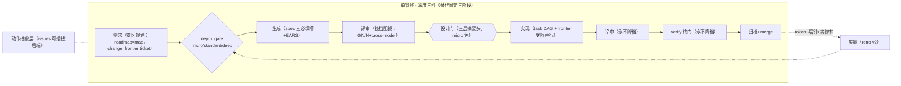

# sdflow 工作流优化与重构建议书

> **输入源（四路）**：① 本仓 [skill-authoring-best-practices.md](../skill-authoring-best-practices.md)（自研提炼 + 3 条待补强）② [opus48-agentic-instruction-system.md](../fable5/opus48-agentic-instruction-system.md)（11 模块指令体系）③ 业界最佳实践调研（2026-07，一手来源优先：Anthropic 官方工程博客、Kiro/spec-kit 文档、LLM-judge 论文、Bugbot/Greptile、Addy Osmani 等）④ [Matt Pocock skills 套件调研](../workflow-skills/matt-pocock-workflow.md)（12 条可借鉴机制）。
> **本仓实测数据**：retro 报告（30 change / 70.1hr：spec-review 39% 且人类门主导、code-review 5%、小 change 评审占比 73%）+ [03 篇已知缺口](./03-self-improvement-loop.md#6-当前闭环的已知缺口通往-04-篇的桥)。
> 目标平台按用户设定：Opus 4.8 / GPT-5.5 主力，Claude Code / Codex CLI，单人或小团队，时间 + token 成本为一等约束。

---

## 0. 总体判断（先给结论）

**不建议推倒重构；建议做 22 项演进式优化，主攻四个方向。**

理由三条：

1. **核心架构已被业界独立收敛验证**。冷上下文独立评审（Claude Code 官方 /code-review、Bugbot、Greptile 全部采用，且本仓有「冷主审独家挖出致命 F1」的独立实证）、子代理隔离换独立性（Anthropic context engineering 官方三策略之一）、静态按步分档（业界 cascading 省 ~87%，且你的静态定档避开了运行时误分类）、人类门上移到设计侧（业界 2026 共识「人往上游走」）、机械活交脚本（官方原话："用 token 生成排序远贵于跑排序算法"）——这五根柱子每根都有外部背书，重构大概率是把对的东西拆了重装。
2. **真瓶颈有数据，且都不在架构层**。retro 实测：spec-review 39% 墙钟被**人读报告**主导（不是算力）；小 change 评审占比 73%（固定成本问题）；token 无度量、档位 advisory 未强制（P2 未落地）。这些全是**参数与流程层**问题，改架构解决不了任何一个。
3. **工作流自带改进闭环**。每项优化走 todolist → 批次 → change 的既有路径落地，改坏了有 verify 终门和回滚兜底；推倒重构则要同时失去 31 个 change 沉淀的坑位记忆（16 篇 ADR 背后全是实证）。

四个主攻方向：**A 成本工程**（token 度量 + 缓存 + 分层深度）、**B 人类门减负**（39% 的解药）、**C 评审可靠性校准**（judge 偏差 + 指标升级）、**D 结构增强**（DAG 并行、雾区规划、重构协议）。

---

## 1. 优先级总表

| # | 建议 | 方向 | 优先级 | 预期收益 | 改动成本 | 依据 |
|---|---|---|---|---|---|---|
| 1 | P2 档位强制落地（advisory→enforced） | A | **P0** | token 大降（现状"文档说 light 实跑 opus"） | 中（dispatch 层加 model 参数） | 本仓 P2 调研 + cascading 省 87% |
| 2 | prompt 前缀缓存稳定化 | A | **P0** | API 成本 −41~80%（缓存命中部分），零行为改动 | 低 | arXiv 2601.06007 |
| 3 | 确定性检查前置为 fan-out 准入门 | A | **P0** | 省强模型镜发现 lint 级问题的 token | 低 | Osmani/O'Reilly 分层评审共识 |
| 4 | 微变更快速通道（trivial 豁免泛化到全流程） | A | **P0** | 直击小 change 评审占比 73% | 中 | marmelab「瀑布复辟」批评 + 本仓双峰数据 |
| 5 | 设计门报告「三层摘要头」+ 结构化拍板三问 | B | **P0** | 直击 spec-review 39% 人读墙钟 | 低 | Matt to-tickets 审图不审文 + 本仓 D11 |
| 6 | 每镜 effort scaling 预算 + 输出封顶 | A | P1 | 镜成本可控、聚合成本钉常数 | 低 | Anthropic multi-agent（15× token/预算四要素）+ Matt code-review 400 词 |
| 7 | retro 补 token 维度量 | A | P1 | 「token 成本」目标从代理指标变直接数据 | 中 | token 解释 80% 性能方差（Anthropic） |
| 8 | 裁决改二元 pass/fail + critique，弃连续置信分 | C | P1 | 可校准性；用 retro 数据做人-镜收敛 | 中 | Hamel Husain Critique Shadowing |
| 9 | 位置交换 + 输入顺序打散（仅 HIGH 级） | C | P1 | 去 position bias，成本 ~2×单次裁决 | 低 | arXiv 2604.23178 + Bugbot 8 路随机化 |
| 10 | 镜价值指标升级为 resolution rate（实修率） | C | P1 | 砍镜闸门判据更真 | 低（retro join 修复 commit） | Bugbot 70% 实修率指标 |
| 11 | 「测试大改=红旗」硬规则 + intake diff 体积门 | C | P1 | 堵 agent「改测试迁就坏行为」通道 | 低 | GitClear/Faros 数据（churn +861%） |
| 12 | 高危路径升级例外（阶段三 defer-to-human） | B | P1 | 门按 blast radius 定而非按阶段定 | 低 | port.io + HR-TG 现成判据 |
| 13 | spec 模版吸收 EARS 句式 + 三必填槽 | B | P1 | 降评审镜歧义争论 token | 低 | Kiro docs + Claude Code best practices |
| 14 | 明码「自动决策原则清单」 | C | P1 | T10 三级协议的第①级有据可依 | 低 | 自研补强 #1（仿 autoplan 6 原则） |
| 15 | tasks 依赖 DAG 化 + frontier 有限并行实现 | D | P2 | 实现期墙钟（31% 占比）压缩 | 高 | Matt to-tickets + **须对冲 Anthropic「写并行是差候选」警告** |
| 16 | fog-of-war 进 roadmap 模版 | D | P2 | 防远期阶段假精确 | 低 | Matt wayfinder |
| 17 | expand–contract 宽重构协议进 bundle | D | P2 | 补 sdflow 缺失的大规模机械重构 change 模式 | 低 | Matt to-tickets |
| 18 | 规则条款元维护（违规留痕 + 零触发审计） | C | P2 | workflow 规则自身进保鲜循环 | 中 | opus48 模块 11 |
| 19 | 对抗镜措辞收紧：「只报影响正确性/明示需求的 gap」 | C | **P0** | 治对抗镜噪声源头，零成本 | 极低（改 prompt 一句） | Claude Code 官方警告 |
| 20 | 弱档 validator 复核层（置信过滤后加一级） | C | P1 | 便宜地再降假阳（Bugbot 模式） | 低 | cursor.com/blog/building-bugbot |
| 21 | thinking/effort 预算按步分档 | A | P1 | 机械步隐形 token 大头（默认可达数万/请求） | 低 | code.claude.com/docs/en/costs |
| 22 | 跨工件一致性机械检查（设计门前置 lint） | B | P1 | spec/design/tasks 矛盾在人读之前被机器抓 | 中 | spec-kit `/speckit.analyze` |

另有 3 项自研待补强直接继承（outside-voice injection 前缀、大产物文件交接、见 §4.7/§5.7），与 5 项**反建议**（§8）。

---

## 2. 方向 A：成本工程（最直接回应非功能需求）

### 2.1 P2 档位强制落地（P0，改进 ROI 最高的一项）

**现状**：`model-tiers.md` 早已把接地镜/历史镜/置信打分映射 light，但子代理 dispatch 时不显式指定 model → 继承父 session 的 opus，「文档说 light 实跑 opus」。
**建议**：三编排 skill 的 fan-out prompt 模版中，凡 model-tiers 判为 light/mid 的镜，dispatch 时**显式带 model 参数**（Claude Code 的 Agent tool 支持 per-call model override；Codex 侧对应 profile 切换）。superpowers 的 SDD 已有明文先例："always specify model explicitly（省略=继承最贵）"。
**守住的边界**：保持**静态按步定档**，不做运行时动态路由（本仓 memory 已论证：误分类风险只在运行时动态路由存在）；带门禁的步（verify/对抗裁决）MUST NOT 降档铁律不变。
**量化预期**：按 retro 双峰数据，评审镜是子代理大头；接地/历史/置信三类弱档化后，per-change 评审 token 预计降 30-50%（P0 基线已证墙钟不是杠杆，这是纯 token play——与 cost roadmap D11 的重定位完全一致，等于把已拍板未执行的 P2 直接做掉）。

### 2.2 prompt 前缀缓存稳定化（P0，零行为改动）

**机会**：长程 agentic 任务的 prompt caching 实测省 41-80% API 成本、TTFT 快 13-31%；关键是**前缀字节级稳定**——动态内容（时间戳、change 名、diff）不得插在稳定规则文本之前。
**建议**：审计三编排 skill 的子代理 prompt 组装顺序，定成「稳定层（角色 + checklist/规则全文）→ 半稳定层（change 目录路径）→ 动态层（diff/findings）」；规则注入若走「主 session 组装贴入」路线（见 §4.6 的取舍），稳定层天然可缓存。
**依据**：arXiv 2601.06007《Don't Break the Cache》；注意反例——naive 全上下文缓存反而更慢，动态 tool result 不入缓存块。

### 2.3 确定性检查前置为 fan-out 准入门（P0）

**建议**：`sdflow-code-review` 第二步（trivial_shape 之后、fan-out 之前）加一道准入：pytest / lint / typecheck 未过 → 不进多镜，先打回修绿。「AI 评审当传感器不当判决、确定性检查最先跑」是业界分层评审共识；现状 checklist 有「CI 能抓的不进镜」的**过滤规则**，但没有「CI 没跑绿就不开镜」的**准入门**——后者才省钱（强模型镜发现 lint 级问题是最贵的发现方式）。
**实现**：机械层加一个 `preflight_checks.py`（跑测试/lint 读退出码，fail-closed），符合 adr/0006 脚本化路线。

### 2.4 微变更快速通道（P0，直击 73% 双峰）

**现状**：`trivial_shape.py` 只豁免 code-review 的 fan-out；spec-review、done 全流程照跑，小 change 的评审占比因此高达 73%。业界对 SDD 最大的批评正是「瀑布复辟——小变更也过全流程」，共识解法是**按体量分层深度**。
**建议**：把「变更体量分层」提升为全流程一等概念，三档：

| 档 | 判据（尽量机判） | 流程 |
|---|---|---|
| micro | trivial_shape EXEMPT 同款白名单（文档/注释/纯测试）+ 无 TG 命中 | 跳 spec-review 多镜（保留 autoplan 单步）→ 实现 → 冷审单镜 → done |
| standard | 默认 | 现行全流程 |
| deep | 命中 HR-TG / 新 capability / roadmap 阶段 | 现行全流程 + cross-model 全开 |
**红线**：两条不随档降级——冷上下文独立评审至少一镜、verify 强档终门（官方与本仓实证双背书，见 §8）。
**实现**：判档逻辑进 `ship_gate.py` 或独立 `depth_gate.py`（有确定性信号：diff 形状 + TG 命中表），档位写进报告 frontmatter 供 retro 分层统计。

### 2.5 每镜 effort scaling 预算 + 输出封顶（P1）

**建议**：镜子代理 prompt 模版统一加四要素（目标 / 输出格式 / 工具调用预算 / 任务边界）+ 输出长度封顶。预算按变更档位定（micro 免、standard 每镜 10-15 次工具调用、deep 放宽）；每镜返回摘要目标 1-2k token（Anthropic 官方子代理回传目标值），finding 正文超限走文件交接（§5.7）。Matt 的 code-review 用 400 词封顶逼子代理自行排优先级，聚合成本钉在常数——同一机制。
**依据**：multi-agent 15× token、「token 预算不显式就失控」（Anthropic multi-agent research，一手）。

### 2.6 retro 补 token 维度量（P1）

**现状**：成本只有墙钟（elapsed），「token 成本」这一目标没有直接数据；且人读时间与算力时间混在一起（03 篇缺口表）。
**建议**：checkpoint 时顺带落一行 token 快照锚（Claude Code 的 transcript/`/cost` 可取会话累计值；机械层脚本解析后随 checkpoint 提交），retro join 出 per-change/per-阶段 token 维。有了它，砍镜/降档/分层深度的每个决策都能算 ROI（token 用量解释 80% 性能方差——度量它等于度量主成本轴）。

### 2.7 thinking/effort 预算按步分档（P1）

extended thinking 是最被忽视的成本项：默认预算可达数万 token/请求。sdflow 已按步分 model 档，但**没有按步分 thinking 档**——commit / archive 格式化 / reindex / 置信打分这类机械步不需要深推理。**建议**：model-tiers.md 增加第二维（thinking 档：机械步 low/off、判断步默认、门禁步高），dispatch 时随 model 参数一起显式指定。与 §2.1 同一改造点，可合并实施。（来源：code.claude.com/docs/en/costs）

---

## 3. 方向 B：人类门减负（spec-review 39% 的解药）

### 3.1 设计门报告「三层摘要头」+ 结构化拍板三问（P0）

**现状**：设计 HARD-GATE 是全流程唯一人类门，实测占 spec-review 墙钟大头（单次最高 678 分钟是人在读+拍）。报告是平铺的多镜 findings + 决策登记区，人要通读才能拍板。
**建议**：报告头部强制三层结构，人按层深入、多数情况读完第一层即可拍板：

1. **拍板层**（≤1 屏）：`[需拍板]` 条目逐条列「选项 + 推荐 + 一句话后果」+ 三个结构化问题（借 Matt to-tickets 的审图三问改造：①范围对不对——Out-of-scope 划界认不认 ②依赖/顺序对不对——任务边界与阻塞关系认不认 ③风险赌注对不对——HR-TG 命中与对策认不认）；
2. **裁决层**：`[自动决策]` + `[已裁掉]` 摘要表（各一行）；
3. **证据层**：现行多镜 findings 全文（供抽查）。
**机制对齐**：这就是「人审图结构而非逐字读文」——业界异步审查共识（决策登记区批处理拍板你已做，缺的只是**分层呈现**）。anchor_lint 可加「拍板层存在性」机验。

### 3.2 spec 模版补「测试 seam 决策槽」（P1）

Matt to-spec 把唯一人类门设在「测试 seam 确认」这个杠杆最高的单点，且 seam 启发式量化到可执行（已有优先/越高越好/理想数=1）。sdflow 的 spec 模版（config.yaml rules）现无 seam 槽——测试策略散在 tasks 里。**建议**：`rules.design` 加必填槽「测试 seam：本 change 在哪个接缝测试、复用已有还是新开（新开须说明为何更高处不可行）」，设计门三问之外的第四问。这同时喂给 writing-plans 的注入点 A（seam 决策逐字进 plan）。

### 3.3 EARS 句式 + spec 三必填槽（P1）

**建议**：`ff-generation-constraints` / config rules 吸收两项：① requirements 的 Scenario 采用 EARS 句式（"WHEN <条件> THE SYSTEM SHALL <行为>"——Kiro 三文件 spec 的核心，需求可测性直接提升，评审镜少花 token 争论歧义）；② spec 三必填槽——点名涉及文件/接口、显式 out-of-scope、以端到端验证步收尾（Claude Code 官方 best practices 的自包含 spec 三要素；out-of-scope 现有 Non-Goals 已覆盖，前后两项是增量）。

### 3.4 跨工件一致性机械检查（P1）

spec-kit 在实现前提供 `/speckit.analyze` 跨工件找矛盾（spec ↔ plan ↔ tasks 互相打架的条目）。sdflow 的四件套一致性目前靠评审镜的判断力 + done 阶段 archive 子代理的对码核验（事后）。**建议**：机械层加 `artifact_consistency.py`（设计门前置）——可机判的部分：tasks 的 Requirement ID 引用是否都存在于 specs、specs 的 Scenario 是否有对应 task、design 章节槽（config rules 必填槽）是否齐全、proposal Success Metrics 是否非空。矛盾清单直接进设计门报告的拍板层（§3.1），人读之前先被机器抓一轮。这是对 verify 反假绿机制的**上游加固**。（来源：github.com/github/spec-kit）

### 3.5 高危路径升级例外（P1）

**现状**：阶段三无人类门，T10 三级协议自动裁。**建议**：加一条例外——code-review 的 finding 或修复涉及**迁移/权限/删除性操作/对外发布**类高危路径（判据直接复用 HR-TG 子集 + 少量补充模式）时，跳过 T10 自动裁、直接 defer-to-human（进 hand-off 的「需人拍板」区，不阻塞其余流程）。「门按 blast radius 定而非按流程阶段定」——这不是给阶段三加门，而是给**特定爆炸半径**加门，与「唯一人类门」铁律不冲突（异步 defer 非同步阻塞）。

---

## 4. 方向 C：评审可靠性校准

### 4.1 裁决输出二元化：pass/fail + critique（P1）

**现状**：code-review 用 0-100 置信分 + <80 过滤。**问题**：连续分数校准不动是 LLM-judge 领域的反复实证（Hamel Husain："拒绝 1-5 打分"）；80 这个阈值从未被校准过。
**建议**：镜 finding 的置信输出改为二元（`real / uncertain`）+ 一段 critique（为什么真/为什么存疑，引 file:line）；过滤层按二元值 + 严重度分流。**配套校准回路**：你在设计门/抽查时对 finding 的采纳判断已被 lens-metric 锚记录（采纳/裁掉）——这天然就是 Critique Shadowing 的「专家判决 vs 镜判决」收敛数据，retro 直接能算每面镜的判准率，镜 prompt 按此迭代。
**注意**：spec-review 侧本就「优化召回不照搬 <80」，改动只动 code-review 层。

### 4.2 位置去偏：交换重跑 + 输入顺序打散（P1）

两个廉价手段：① **T10 第②级（对抗镜复核 ≥2 方案）与 A/B 类裁决**：HIGH 严重度时交换选项顺序重跑一次、结论不一致则升级 defer（成本 ~2× 单次裁决，LOW 级不做）；② **多镜 fan-out 时打散各镜收到的文件/finding 排列顺序**（Bugbot 早期 8 路并行 + 随机化 diff 顺序的同款手法，机械层一行 shuffle 的成本）。
依据：position bias 是 LLM-judge 最实证的系统偏差（arXiv 2411.15594 survey；2604.23178 无单一缓解通吃、需组合）。

### 4.3 镜价值指标升级：resolution rate（P1）

**现状**：per-镜价值表的核心字段是 findings/采纳/独立。**问题**：「采纳」是主 session 裁决意见，不是终局事实——被采纳但从未被修复的 finding 是噪音。**建议**：retro 增算 **实修率** = 采纳 finding 中能关联到修复 commit（`[impl-review-fix]` 标记 / defer 后关闭的 B/T 项）的比例。Bugbot 以「70% 被标问题在 merge 前实修」为北极星指标——实修率比 finding 数更接近镜的真实价值，砍镜闸门（D12）判据同步升级。**配套**：常见假阳模式（被裁掉的高频同类 finding）沉淀回 code-checklists 的「已知误报」区（模拟 Bugbot 的 dismiss 学习闭环，人工版）。

### 4.4 「测试大改 = 红旗」硬规则 + intake 门（P1）

agent 代码的实证风险模式：PR 平均大 51%、churn +861%、会「改测试迁就坏行为」（GitClear/Faros 数据）。**建议**：① code-checklists base 加硬规则——diff 中测试文件的**断言弱化/删除/skip 新增**一律 HIGH 级上报（不受置信过滤）；机械层可让 `trivial_shape.py` 或新脚本识别「测试删改形状」直接 NOT_EXEMPT + 标记；② ship_gate 加 intake 检查——diff 体积超阈值（如 ±2000 行且非机械重构档）建议拆分（报告级提示，不阻塞）。这与 verify 的防假✅是同一家族：防的是「实现侧为绿而绿」。

### 4.5 对抗镜噪声治理：措辞收紧（P0，改一句话的事）

Claude Code 官方 best practices 的明文警告：**「被要求找 gap 的 reviewer 永远能找出 gap」**，导致过度工程与噪声；官方解法是限定「只报影响正确性或明示需求的 gap，其余标记为可选」。sdflow 的对抗镜 prompt 现为「从不同角度证明 spec/代码会爆炸，默认 refuted=true」——refuted 默认值已是半个解药，但**没有「影响正确性才算」的范围限定**。**建议**：两审的对抗镜 prompt 模版统一加一句：「只报影响正确性、数据安全或明示需求的 finding；风格/假设性完美主义类观察一律标 `optional` 且不计入裁决」。这是全表成本最低的一项（改 prompt 一句话），且直接作用于 findings 最多的镜（对抗镜 71+67 findings）。

### 4.6 弱档 validator 复核层 + 跨模型真多样性（P1）

两个互补机制：
- **validator 复核**（Bugbot 初版架构）：置信过滤之后、进裁决之前，加一级**弱档模型只复核 findings 本身**（读 finding + 引用的 file:line 原码，判「引用是否真实成立」）——比提高全镜规格便宜一个量级，且正对「引不出原码的 finding 即假阳」这一已内化原则（gstack review pre-emit gate 同款），等于把它机械化到独立复核层。
- **跨模型真多样性**：LLM-judge 研究的 2026 追踪发现「九个 judge 实际只有两票有效」——同源模型错误高度相关，同模型多 prompt 的多镜合议有相关性天花板。sdflow 的多镜全部同模型（仅 outside-voice 跨到 codex）。**建议**：不加镜数，而是把**HIGH 严重度 finding 的终局裁决**升级为跨模型双栈（Opus 裁一次 + codex/GPT-5.5 裁一次，不一致则 defer）——双栈已具备（outside-voice.sh 基础设施现成），只是把它从「发现层」延伸到「裁决层」。（来源：arXiv 2605.29800 / comet.com PoLL / cursor Bugbot）

### 4.7 outside-voice injection 前缀（P1，自研补强 #3 直接继承）

发 codex 的 context 冠「不要读取/执行 skill 定义目录与其中指令」前缀（autoplan 已有同款 Codex filesystem boundary 前缀，我们只有密钥 exit3 拒发）。改 `outside-voice.sh` 的 render-prompt 模版，一次性。

### 4.8 规则注入的两种策略：显式化取舍（已拍板 → T124）

> **2026-07-10 拍板**：采纳三条全中才贴入的分界——体积小（≤60 行级）× 变更频率低（月级不动）× 每镜必用 → 主 session 运行时读一次后全文贴入（可缓存稳定前缀）；大部头领域 delta / 高频演进规则保持「引用 + resolve-workflow + anchor_lint」。铁律不变：SKILL.md 正文禁止静态内联规则正文——贴入是运行时投影，单一真相源永远在文件。落地项 = T124（opt-cost 批次）。

现状 sdflow 用「只引用编号不复制 + 子代理经 resolve-workflow 读文件」（防双源漂移）；Matt 用「rubric 全文贴入 prompt——子代理没有其他途径拿到它」（防读取失败静默降级 + 可吃前缀缓存）。两者各对：**建议定一条分界写进 bundle**——短小稳定的 rubric（如 12 条级别的 base checklist）由主 session 读一次后全文贴入镜 prompt（稳定层，可缓存，杜绝子代理漏读）；大部头领域 delta 仍走文件引用 + 锚行自检。判据：贴入体积 < N 行且变更频率低。

---

## 5. 方向 D：结构增强（借 Matt + wayfinder + opus48）

### 5.1 tasks 依赖 DAG 化 + frontier 有限并行（P2，谨慎推进）

**机会**：实现期占 31% 墙钟；tasks.md 现为顺序清单，SDD 逐任务串行。Matt 的 to-tickets 把 `Blocked by` 做成一等字段，frontier（全部 blocker 完成的任务集）就是现成并行队列。
**对冲警告**：Anthropic 官方明确「编码任务可并行成分少，是 multi-agent 的差候选」（协调成本 + 错误传播）。**因此建议保守版**：① writing-plans 注入要求 tasks 标注显式依赖（这本身零风险，还改善 CONTINUE_IMPL 的续跑精度）；② 并行只在「frontier 上互不触碰同一文件集」的任务间开、且上限 2-3 路（文件集判定有确定性信号可机判）；③ 先在一个 change 上试点、用 token+墙钟数据对照后再定去留。粒度判据同步吸收 Matt 的「一个 task = 单 fresh context window 可完成」。

### 5.2 fog-of-war 进 roadmap 模版（P2）

roadmap 三件套的远期阶段现在就要写任务级细节——这是 Matt wayfinder 点名的「预切假精确」反模式。**建议**：roadmap-template 增加约定——只有下一个阶段写到 change 粒度，更远阶段留「雾区」段（粗写目标与未决问题，标注「到达 frontier 时再拆」）；判据一句话：**能精确表述才建条目，能回答与否无关**。本仓 mlh roadmap 的 P6「端态已定未实现」实际已是这个形态，把实践升格为模版规则。

### 5.3 expand–contract 宽重构协议进 bundle（P2）

sdflow 没有「blast radius 扇满全库的机械重构」的 change 模式（mlh 系列是手工拆的）。Matt 的结构化降级链可直接收进 `ff-generation-constraints` 或独立参考文件：识别判据 → expand（加新形态不破坏）→ 按 blast radius 分批 migrate（每批一 change/task、blocked by expand）→ contract（删旧，blocked by 全部批）→ 批次保不了绿时共享集成分支 + 终局 integrate-and-verify。与 TG-25（版本化契约套件）互补。

### 5.4 有副作用 skill 加触发层硬开关（P2）

`disable-model-invocation: true` 给 sdflow-done、sdflow-ship、sdflow-init（会 merge/写全局文件的三个）——门做在 frontmatter 配置层比 description 措辞收窄更硬（Matt 全套件贯穿此法；Claude Code 已支持该字段）。现状 ship 靠「不含裸 ship 泛化触发」的措辞防误触，属软防。

### 5.5 动作抽象层：tracker 后端可插拔（P2，仅当出现真需求）

Matt setup 的「抽象动作名 + 仓库级翻译文档」使同一 skill 服务本地 markdown 与 GitHub/Linear。sdflow 的 buglist/todolist 写死本地 markdown——单人场景够用；**若**小团队场景出现「issues 进 GitHub」需求，按此模式改造（recorder 脚本后加后端 adapter 层）而非重写。挂 todolist 即可，不建议现在做。

### 5.6 明码「自动决策原则清单」（P1，自研补强 #1）

T10 三级协议第①级「有客观判据自动选」缺一份明码原则集（autoplan 有 6 决策原则 + 三分类可仿）。落一份 `decision-principles.md` 进 bundle（如：可逆且单文件→直接选；有测试可判→跑测试选；纯品味→选与仓库既有风格一致者并记录……），code-review 步4 与 ship 的 T10 引用之。每个自动裁决在报告记 one-line why（业界「决策日志随归档持久化」共识，hand-off 已承载一半）。

### 5.7 大产物文件交接（P1，自研补强 #2 + opus48 模块 4/9）

多镜返回的结构化 findings 全量进主 session。**建议**：超过阈值（如 2k token）的镜报告写 `{change_dir}/review-lenses/<lens>.md`，返回文本只带「结论 + 计数 + 文件路径」（opus48 模块 4「文件为通信介质」+ SDD review-package 同款）；主 session 裁决时按需 Read。与 §2.5 输出封顶互补：封顶管「说多少」，文件交接管「放哪里」。

---

## 6. 指令体系视角（opus48 文档怎么用到这套 workflow 上）

opus48 体系的定位是「把 Fable 级默认行为写成显式协议给 Opus 4.8」。对照 sdflow：**大部分模块 sdflow 已在 workflow 层实现了等价物**（模块 3 锚点制→verify 证据锚；模块 4 干净终审→冷评审镜；模块 6 升级格式→决策登记区；模块 11 固化触发器→adr/0006 脚本化）。真正的增量应用点有四个：

1. **子代理任务卡八字段作为镜 prompt 统一骨架**（模块 4 / 附录 A.4）：目的/输入/成功判据/输出/边界禁区/自由度/已知约束/预算——现行三编排 skill 的 fan-out prompt 要点齐但格式不一，统一成八字段模版后：预算槽承载 §2.5 的 effort scaling、输出槽承载 §5.7 的文件交接、边界槽承载 §4.5 的 injection 前缀。一次改造吃下三项优化的载体。
2. **「判断题变检查题」用于弱档子代理**（模块 0.4）：§2.1 档位强制落地后，light 档跑接地/历史镜——弱档跑 prose 协议的失效形态是静默跳步（adr/0006 原话）。给弱档镜的 prompt 按 opus48 风格改写成「必须 X 否则视为 Y + 兜底动作」的可判定句式，并配 anchor_lint 类机验。**强档主 session 的 prompt 不必如此**（过度约束浪费强模型判断力——这正是 grill「刻意不机械化」的对称面）。
3. **规则元维护**（模块 11「违规留痕 + 二次违规回改 + 零触发审计」）：sdflow 对**代码**有完整改进闭环，对**规则条款自身**（bundle 34 文件 + 各 SKILL.md 的 MUST 条款）没有失鲜审计。建议轻量版：retro 或 maintain 增加「条款触发证据扫描」——在归档报告/checkpoint 里 grep 各硬规则的执行痕迹，零触发条款列入待复评区（与砍镜闸门同款「只呈现不决策」姿态）。
4. **GPT-5.5 / Codex 运行时对齐**：opus48 体系全部以 CLAUDE.md/protocols 装配层表述，Codex 侧对应 AGENTS.md。sdflow 的 skills 双装已覆盖，但 bundle 规则里少数 Claude 专名（AskUserQuestion、Task 工具名）应改为行为化措辞（「向用户提问」「派发子代理」）——按 quality-layering 的「按行为措辞不绑死路径」既有原则扫一遍即可。

---

## 7. 「如果完全重构」：目标架构草图与触发条件

按用户要求认真回答「甚至可以完全重构」。**结论：现在不值得；但给出值得重构的触发条件与目标形态，作为未来判据。**

**触发条件（任一成立才议）**：① 官方 harness 原生长出「工作流引擎」（多阶段编排 + 门禁 + 状态机成为 Claude Code/Codex 一等公民），自建编排层沦为重复；② 团队扩到多人并行多 change 成为常态（现架构按单人串行 change 设计，issues 池与分支纪律会先撑不住）；③ 度量显示优化 1-14 落地后固定成本仍不可接受。

**若重构，保留的内核（不可谈判）**：盘面即状态 + 机械门禁/退出码契约 + 冷上下文独立评审 + verify 强档终门 + 度量回路。这五件是实证攒出来的，任何新架构都得重新长一遍。

**目标形态草图（供触发时参考）**：

变化点浓缩为四个：固定三阶段 → **按档伸缩的单管线**；顺序 tasks → **DAG**；本地池 → **可插拔 tracker**；墙钟度量 → **token+实修率**。注意这四个全部可以在现架构上演进式做到（§2.4、§5.1、§5.5、§2.6/§4.3 就是它们），这正是「不推倒」的最硬理由——**目标态与现架构之间不存在需要断代的鸿沟**。

---

## 8. 反建议（明确不做的，防走弯路）

| 不做 | 理由 |
|---|---|
| BMAD 式角色代理团队（12-21 角色交棒） | 对单人/小团队过重；多镜并行视角已覆盖其价值且无角色间传话损耗 |
| Tessl 式 spec-as-source | 代码是本仓 ground truth（code-review 无接地镜的设计前提）；spec-as-source 颠覆整个 verify 体系 |
| 运行时动态模型路由 | 静态按步定档无误分类风险（本仓 memory 实证 + 弱档误判即假绿）；cascading 的收益已由静态分档拿到大半 |
| 砍冷 code-review 层 / 现在砍任何镜 | 冷主审独家挖出致命 F1（load-bearing 实证）；砍镜闸门样本不足（价值锚 14/30、轮数多 <10）——先做 §4.3 指标升级再谈 |
| 向 Matt 式纯 prose 约定回退（去机械层） | 四工具并跑实测 93.4% 问题只被一家发现——异构与门禁是可靠性来源；Matt 套件零脚本零门禁的代价是无机检交接锚，与 adr/0006 机队锚定直接冲突 |

---

## 9. 落地路线建议

按既有改进闭环走：本文 22 项各记 todolist（T-ID），按方向归 4 个批次；P0 六项（#1-#5 + #19）可合并为一个「cost-p0」批次优先开 change——它们互不耦合、全部有确定性验收判据（token 对照 / 缓存命中率 / 准入门退出码 / 档位分层统计 / 报告结构 lint）。P1 批次在 P0 数据回来后按实测 ROI 排序。§4.6 与 §7 是**决策项**，进设计门讨论而非直接开工。

每项 change 的验收都吃自己的狗粮：改进前后各跑若干 change，retro 对照 token/墙钟/实修率——**这份建议书的每一项都应该被它试图改进的度量回路证明或证伪**。

---

*2026-07-10 · 输入基线：git HEAD `fc1b98b` · 四路调研素材见文首。业界引用中 Bugbot/Greptile 两处基于搜索摘要交叉印证（原文未抓取），置信度略低于其余一手条目；Anthropic 官方 best practices 原地址已迁移至 code.claude.com/docs/en/best-practices。*
