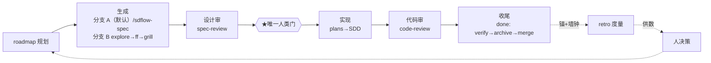

# sdflow-fable5：工作流系统深度调研文档集

> 2026-07-10 由深度调研产出（git HEAD `fc1b98b` / v0.9.0）。定位：**理解 + 评估 + 优化**三层——
> 与既有视图文档互补：[workflow-overview.md](../workflow-overview.md)（阶段叙事）、[workflow-map.md](../workflow-map.md)（字段×脚本速查）、[workflow-skills/](../workflow-skills/)（外部黑盒详解）讲「是什么」；本文档集讲「为什么、全模块、闭环、往哪改」。

## 阅读顺序

| # | 文档 | 回答的问题 | 适合谁 |
|---|---|---|---|
| 01 | [目标与设计动机演化史](./01-goals-and-rationale.md) | 要做成什么？为什么长成这样（坑→机制时间线、16 ADR、四条元规律）？ | 想理解设计哲学的人 |
| 02 | [全模块参考](./02-module-reference.md) | 每个 skill 各自怎么设计怎么实现？分发链、编排器内幕、规则 bundle、数据层 | 要改代码/写新 skill 的人 |
| 03 | [自评估与自改进闭环](./03-self-improvement-loop.md) | 工作流怎么度量自己（成本×价值）？改进怎么回灌？已知缺口？ | 关心「值不值」的人 |
| 04 | [优化与重构建议书](./04-optimization-proposal.md) | 结合 skill 最佳实践、Opus 指令体系、业界实践，往哪改？ | 拍板下一步的人 |

参考输入（04 的素材）：[Matt Pocock skills 套件调研](../workflow-skills/matt-pocock-workflow.md)（wayfinder→to-spec→to-tickets→implement→code-review 链路 + 12 条可借鉴机制）。

## 一图速览

## 既有文档失鲜提示（调研中发现，已于 2026-07-10 处置）

调研发现 `docs/workflow-skills/sdflow-{spec-review,code-review,done}.md` 与 `workflow-overview.md` §6.3 曾停留在旧 inline ship-gate 锚口径（07-07 mlh-p5 已迁 frontmatter），且分别缺 trivial_shape 豁免层 / lens-metric 层 / roadmap 回填助手与 sweep 一键化。**四份文档 + workflow-console.html 已同步更新至 frontmatter 口径并补齐缺失层**（编辑+对抗核查双代理流程，含 T75「归档 dual-read 仅存 verify 锚」精修）。规则真相源始终以各 SKILL.md 与 `ship_gate.py` 为准。
