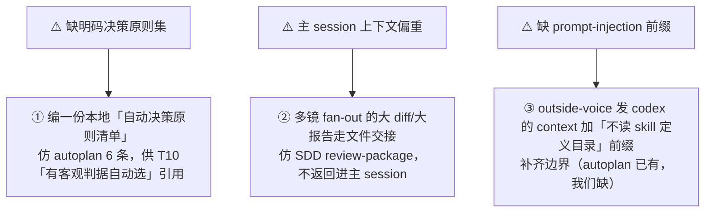

# 自建 Skill 最佳实践（提炼自 gstack / superpowers / grill）

> 属 [工作流总览](./workflow-overview.md) 的配套。把 [workflow-skills/](./workflow-skills/) 下 8 份详解里
> **可迁移的做法**提炼成一份给自建 skill 学习的清单——每条标**出处**、**要点**、**我们现状**（✅ 已内化 / ⚠️ 可补强）。
>
> **怎么读**：先看 §0 总纲（一条元规律串起全部），再按主题挑用；文末 §7 给三条可直接动手的补强。

---

## 0. 总纲：一条贯穿所有 skill 的元规律

> **把「不变量」焊进确定性载体（脚本 / 文件 / 被下游门读取的 git 产物），把「判断」留给强模型 + 冷启动子代理；
> 两者之间用「显式降级、绝不静默」焊死边界。**

gstack 与 superpowers 都是这条规律的实例；它也正是[总览 §8](./workflow-overview.md#8-外部-skill-的注入强制性建议式-vs-强制统一规律)（建议式 vs 强制）的来源。

---

## 1. 上下文与状态管理（最可迁移，superpowers 最强）

| 实践 | 出处 | 要点 | 我们现状 |
|---|---|---|---|
| **状态外化对抗 compaction** | [SDD](./workflow-skills/superpowers-subagent-dev.md) ledger `.superpowers/sdd/progress.md`；[autoplan](./workflow-skills/gstack-autoplan.md) Decision Audit Trail 增量写盘 | 「对话记忆熬不过 compaction……丢了位置的控制者曾重派整段已完成任务——观测到的最贵失败」。durable 状态进文件/git，不留对话 | ✅ ship「盘面即状态」、buglist/issues 落盘 |
| **大块产物以文件交接** | SDD `task-brief`/`review-package` 脚本；「output never enters your own context」 | dispatch 只描述**一个任务**、不贴历史（反例：42k 字符 99% 是粘贴的历史）；产物给**文件路径**，不进控制者上下文 | ⚠️ 部分——多镜 fan-out 返回结构化 findings，但可更多用「文件交接」压主 session 上下文 |
| **停即停、重调即续（幂等 resume）** | SDD 启动先 `cat` ledger、从第一个未完成处续；gstack 幂等 config touch | 从盘面/台账推导缺口，不靠记忆 | ✅ ship 零跨步内存、gate 从盘面续跑 |

---

## 2. 评审的独立性与防假绿（我们已内化最多，可再固化）

| 实践 | 出处 | 要点 | 我们现状 |
|---|---|---|---|
| **Fresh-context 子代理 = 独立性来源** | autoplan 每 phase「没看过任何前序审」的冷启动子代理；SDD 每任务 fresh implementer/reviewer | 独立性由「子代理冷上下文」给，**不由 `/clear` 给** | ✅ G1 铁律正是据此去掉 `/clear` |
| **Do-Not-Trust + evidence anchor** | SDD task-reviewer「Do Not Trust the Report」；[gstack review](./workflow-skills/gstack-review.md) pre-emit gate #1539「引不出触发 file:line 原码 → 强制降置信」 | 审的是代码真做了什么、不信报告措辞；每 finding 必引原码，引不出即假阳 | ✅ verify 防假✅（每 ✅ 附机验锚点）、code-review 锚行自检 |
| **置信校准 + 阈值过滤（但不静默丢）** | gstack review 每 finding 1-10、<阈值压 appendix | 数值化置信，低置信不进主报告但**可审计**（appendix 一行带过） | ✅ code-review <80 过滤 + outside-voice 豁免 |
| **禁 pre-judge findings** | SDD「never instruct reviewer to ignore/not-flag」，stop-words 自查（"do not flag"/"at most Minor"/"the plan chose"） | 不给 reviewer 预设结论，裁决环节判；**escalate-not-drop** | ✅「反静默压制」铁律 = 同一思想 |

---

## 3. 去人类门的安全网（autoplan 教科书级）

| 实践 | 出处 | 要点 | 我们现状 |
|---|---|---|---|
| **自动决策要有明码原则 + 审计留痕** | autoplan 6 决策原则 + 三分类（mechanical/taste/user-challenge）+ Decision Audit Trail | 去人类门 ≠ 拍脑袋——**编码决策原则**、每个自动决策记一行审计 | ⚠️ 有 T10 三级协议，但**缺一份明码的「决策原则清单」**（见 §7-1） |
| **分级人类门 + 批处理** | autoplan 只 2 道门（premise + user-challenge），其余自动，taste 攒到最终门一次问 | 只在真正需判断处停、且**批处理**（比中途弹窗看得全） | ✅ G2「决策登记进报告、设计门一次拍板」 |
| **显式降级、绝不静默** | gstack headless→BLOCKED（不静默自动决策）；native vs simulated 锚；resolve-workflow exit2→显式降级+转发 stderr | 每条降级路径都**打日志/写锚**，永不静默跳过 | ✅ 锚行 `mode="native\|simulated"`、outside-voice guard 原因码 |
| **下游放确定性门把「建议」变「强制」** | ship_gate 读锚放行 | 不控制上游 skill 内部，在下游读它本应产出的锚/产物；产不出就 REFUSE/循环 | ✅ ship_gate 全套锚（design-approved / code-review=pass / verify=PASS） |

---

## 4. 模型经济学（superpowers 讲得最透）

| 实践 | 出处 | 要点 | 我们现状 |
|---|---|---|---|
| **按角色/复杂度选 model + 必须显式指定** | SDD Model Selection「always specify model explicitly（省略=继承最贵）」 | 机械转写用 cheap、判断/门禁用强档；**turn count beats token price**（弱模型多花 2-3× turn 反更贵） | ✅ model-tiers + 各 skill「按本步性质逐步定」 |

---

## 5. 脚本 owns 不变量 + 契约措辞（我们本就是这哲学）

| 实践 | 出处 | 要点 | 我们现状 |
|---|---|---|---|
| **机械活交脚本、模型只做判断** | gstack `bin/*`、SDD scripts | ID 不撞号、双写一致、退出码契约交脚本 | ✅ 核心设计取向（buglist/issues/ship_gate） |
| **载重不变量用 MUST/STOP 措辞** | gstack「读不到 checklist 就 STOP」；[writing-plans](./workflow-skills/superpowers-writing-plans.md)「Announce at start」 | 硬不变量用祈使 STOP-words，与软建议**可区分**（外部注入难覆盖硬缝） | ✅ 红线/铁律措辞 |
| **单一真相源、引用不复制** | workflow 引规则不复制、trigger-catalog HR-TG 单一源 | DRY across docs | ✅ assets/workflow 唯一权威源 |
| **prompt-injection 边界** | autoplan 发 Codex 前冠「不要读/执行 SKILL.md」前缀 | 发内容给外部模型/工具时，围栏掉 skill 文件 | ⚠️ outside-voice.sh 有密钥 exit3 拒发，但**可补一条「不读 skill 定义目录」前缀**（见 §7-3） |

---

## 6. 探索/对话类 skill 的姿态（grill 独有）

| 实践 | 出处 | 要点 |
|---|---|---|
| **刻意不机械化，保对话开放性** | [grill](./workflow-skills/grill-with-docs.md)「stance not workflow」，零 fan-out、零门禁 | 判断力就是价值的步，别用机械门杀死它 |
| **稀疏产物的门槛** | grill ADR 三门槛（难逆+意外+真权衡）、CONTEXT.md 纯术语表 | 产物有明确「值不值得建」判据，防泛滥/跑偏 |
| **触发即反应** | 一次一题、能查码就查码、术语冲突立即揭穿、主张与代码不符即交叉引用 | 姿态编码成若干「触发→动作」，不是线性步骤 |

---

## 7. 落到「我们自建 skill」的三条可执行补强

对应上面标 ⚠️ 的缺口，最值得动手的三条：

| # | 补强 | 现状 | 参照 |
|---|---|---|---|
| 1 | 本地「自动决策原则清单」 | 只有 T10 三级协议、无明码原则集 | autoplan 6 原则 + 三分类 |
| 2 | 大产物文件交接 | 部分多镜返回进主 session | SDD `task-brief`/`review-package` |
| 3 | 发 codex 前的 injection 前缀 | 仅密钥 exit3 拒发 | autoplan Codex filesystem boundary 前缀 |

---

## 8. 一页速查

| 主题 | 一句话 |
|---|---|
| 状态 | 状态外化进文件/git，对抗 compaction；停即停、重调即续 |
| 交接 | 大产物给文件路径，dispatch 只描述一个任务、不贴历史 |
| 独立 | 独立性靠 fresh 子代理，不靠 `/clear` |
| 防假绿 | Do-Not-Trust + 每 finding 引原码 + 置信过滤（低置信可审计不静默丢） |
| 评审 | 禁 pre-judge findings；escalate-not-drop |
| 去门 | 明码决策原则 + 审计留痕；人类门分级 + 批处理 |
| 降级 | 每条降级显式打日志/写锚，绝不静默 |
| 强制 | 下游放确定性门读锚/产物，把「建议」变「强制」 |
| 模型 | 按角色选档、必须显式指定；turn count beats token price |
| 脚本 | 机械活交脚本、模型只做判断；载重不变量用 MUST/STOP |
| 对话类 | 刻意不机械化保开放性；稀疏产物设门槛；姿态=触发即反应 |

---

*配套 [workflow-overview.md](./workflow-overview.md) + [workflow-skills/](./workflow-skills/) 8 份详解。每条「出处」可点链接跳到对应 skill 的展开。*
