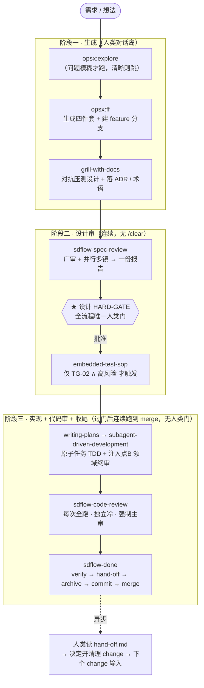
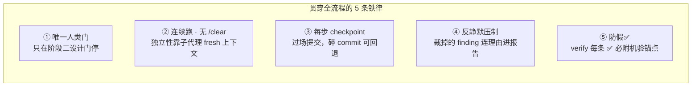
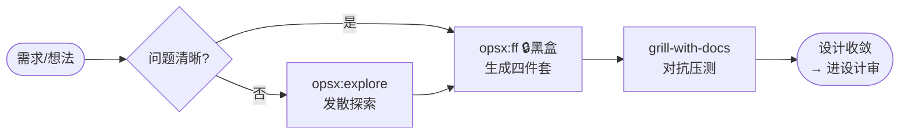
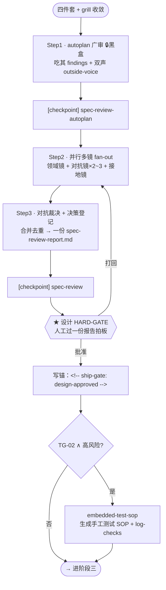
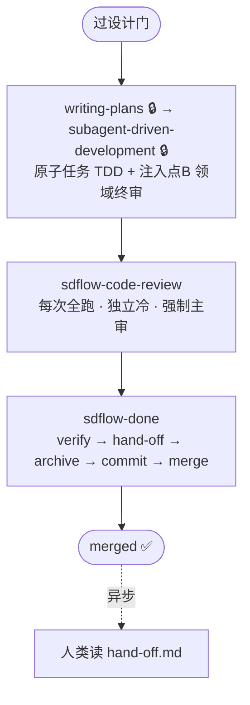
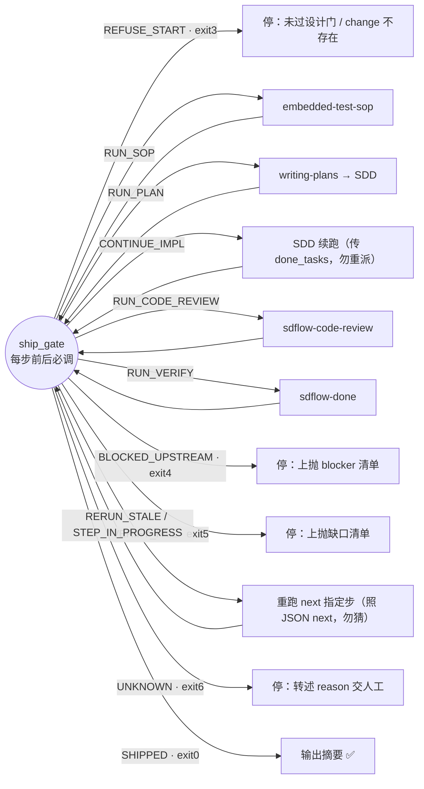
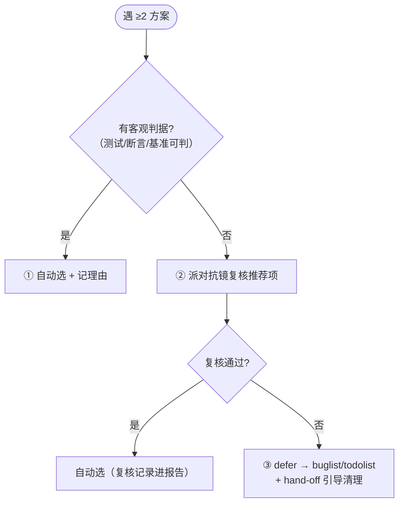
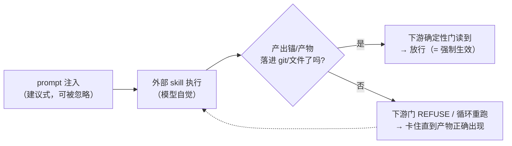

# Spec 工作流总览（人类向）

> **定位**：这份文档给**人**看——用流程图/状态图 + 表格把 sdflow OpenSpec 工作流「最底层的骨架」讲清楚：
> 从需求到 merge 一共几步、每步**目标**是什么、有哪些**注意事项**。
>
> **与真相源的分工**：机器/AI 向的规则真相源是 `sdflow-init/assets/workflow/workflow.md`（端到端）+ 各规则文件；
> 本文**不重复规则细节**，只做人读的可视化梳理。规则改动以真相源为准，本文随后同步。
>
> **展开文档（[workflow-skills/](./workflow-skills/)）**：主流程涉及的每个 skill 都有一份「详解」——
> 内部流程图 + 内部再调度的子 skill + **本 workflow 注入规则是建议式还是强制**。步骤表与 §5 表内均有「详解」链接直达。
>
> - **外部黑盒**（本文只画契约、详解展内部）：[gstack autoplan](./workflow-skills/gstack-autoplan.md) · [gstack /review](./workflow-skills/gstack-review.md) · [superpowers writing-plans](./workflow-skills/superpowers-writing-plans.md) · [superpowers subagent-dev](./workflow-skills/superpowers-subagent-dev.md)（`opsx:ff` 暂未展开）
> - **自制编排器**：[grill-with-docs](./workflow-skills/grill-with-docs.md) · [sdflow-spec-review](./workflow-skills/sdflow-spec-review.md) · [sdflow-code-review](./workflow-skills/sdflow-code-review.md) · [sdflow-done](./workflow-skills/sdflow-done.md)
> - **横向提炼**：[自建 Skill 最佳实践](./skill-authoring-best-practices.md)（从上述 skill 提炼可迁移做法 + 我们的补强项）

---

## 0. 一句话与全局形态

**一个变更（change）从需求走到 merge，穿过三个阶段、只停一次人类门。**

**三阶段一句话画像**

| 阶段 | 本性 | 人的角色 | 自动化载体 |
|---|---|---|---|
| 一 · 生成 | **人类对话岛** —— grill 是人对着设计死磕 | 深度参与（对抗、拍术语） | `opsx:ff` 生成骨架 |
| 二 · 设计审 | **连续自动审 + 一次拍板** | 只在 HARD-GATE 过一份报告拍板 | `sdflow-spec-review` 编排器 |
| 三 · 实现收尾 | **全自动跑到 merge** | 零门（异步读 hand-off） | `/sdflow-ship` gate 驱动链 |

---

## 1. 五条全局不变量（贯穿所有步骤的「注意事项」）

这些不是某一步的细节，而是**整条流水线共享的铁律**。读懂它们，才读得懂每步为什么这么设计。

| # | 铁律 | 目标（为什么） | 注意事项（踩过的坑） |
|---|---|---|---|
| ① | **唯一人类门** | 阶段二设计错 → 白做，值一个门；阶段三已实现、残差可追踪可另修，不值门 | grill 是「对话岛」不折叠；阶段三**禁 AskUserQuestion**，遇分歧走三级决策协议（见 §6） |
| ② | **连续跑 · 无 `/clear`** | `/clear` 唯一作用是给评审独立上下文；而评审本就 fan-out 到 **fresh-context 子代理**，独立性由此而来 | 子代理调度（subagent-dev / spec-review / code-review）**运行中仍禁 `/clear`**，必须跑完再进下一步 |
| ③ | **每步 checkpoint 提交** | 「逻辑步骤完成」是语义不是事件，不用 hook 驱动；碎 commit = 细粒度回退点 | 用 `~/.sdflow/hack/checkpoint-commit.sh <step> "<描述>"`；**grill 多轮中途不提交、只收敛后一次**；不 squash |
| ④ | **反静默压制（escalate-not-drop）** | 热主 session 带生成历史裁决，有一丝合成层偏置；焊死边界防「假装全过了」 | 裁掉的 reviewer finding **只能降级 / 批注、不得静默丢**，连理由落报告「已裁掉」区（可审计） |
| ⑤ | **防假✅** | 阶段三去人类门后 verify 是**唯一终门**，弱模型假 PASS = 放不完整的活过关 | 每条 ✅ 必附机验锚点（测试名 / commit / `文件:行`）；verify 用**强模型** + 「Do Not Trust the Report」冷启，禁降档 |

---

## 2. 阶段一 · 生成（人类对话岛）

| 步 | skill | 目标 | 产出 | 注意事项 |
|---|---|---|---|---|
| 1 | `opsx:explore` | 需求方向未定时**发散思考**，不实现 | 对话（可选落 OpenSpec 草稿） | **问题模糊才跑**，清晰直接跳；explore 模式**禁写代码**，只捕获思考 |
| 2 | `opsx:ff` 🔒 | 一把生成 **proposal / design / specs / tasks 四件套** | 四件套 + feature 分支 | **FF-0**：不在 feature 分支先 `git checkout -b feat/{change}`；结构①+约束② 已由 `config.yaml` + `trigger-catalog` 自动注入，prompt 无需内联；生成后 checkpoint |
| 3 | `grill-with-docs` [详解](./workflow-skills/grill-with-docs.md) | **对抗压测设计**：逐分支死磕、对齐术语、边界场景、代码与主张不符即揭穿 | design/ADR/CONTEXT 更新（标 `[grill-amendment]`） | 一次一题、等反馈再下一题；能查码就查码；ADR 只在「难逆 + 无背景会困惑 + 真权衡」三者全真时才落；**收敛后才 checkpoint**（多轮中途不提交） |

> 🔒 = 黑盒：`opsx:ff` 的生成内部（config 槽注入、模版填充）本文不展开，只认它的**产出契约 = 四件套 + 分支**。

---

## 3. 阶段二 · 设计审（连续，无 /clear）

**编排器 `sdflow-spec-review` 内部把「广审 → 并行多镜 → 一份报告」串成一次连续跑。**

| 步 | skill | 目标 | 产出 | 注意事项 |
|---|---|---|---|---|
| 4 | `sdflow-spec-review` [详解](./workflow-skills/sdflow-spec-review.md) | **设计门主审**：广审（[autoplan](./workflow-skills/gstack-autoplan.md)）+ 领域/对抗/接地多镜，合成**一份**报告 | `spec-review-report.md`（含决策登记区）+ 改动标 `[spec-review-amendment]` | 中途**不 AskUserQuestion**（决策登记进报告）；autoplan 已含 eng 镜 → 多镜**不重复跑 eng**；**必须读真实代码**（接地镜专司）；命中 HR-TG 单开领域 cross-model |
| 5 | **HARD-GATE** | 人工过**一份**报告拍板批准设计 | 批准动作 → 写 `<!-- ship-gate: design-approved -->` 锚 | **★全流程唯一人类门**；决策登记区已摊开「选项 + 推荐 + 两方后果」；拍板**发生后**主 session 立即原样写锚（这是 `/sdflow-ship` pre-flight 唯一机判依据） |
| 5.5 | `embedded-test-sop` | 嵌入式固件生成**手工测试文档 + log-checks** | `{change}-sop.md` + `log-checks.yaml` | **条件触发**：TG-02（嵌入式）∧（启动/复位/状态机/协议 等高风险 ∨ TG-18 有测试计划）；非嵌入式天然不触发 |

**决策登记区四类条目**（取代中途弹窗）

| 标记 | 含义 | 人类门时怎么处理 |
|---|---|---|
| `[自动决策]` | autoplan/裁决已定，附理由 | 默认接受，可覆盖 |
| `[需拍板]` | ≥2 方案 / 核验不了的事实 | 人工勾选 / 确认 |
| `[已裁掉]` | reviewer 原始发现 + 裁掉理由 | 复核「裁得对不对」（反静默压制） |

---

## 4. 阶段三 · 实现 + 代码审 + 收尾（gate 驱动，无人类门）

阶段三的**真正底座是 `ship_gate`**：编排器 `/sdflow-ship` 每步前后必调它，**照判定走，禁止凭 prose 记忆步序**。

### 4.1 编排步骤流

| 步 | skill | 目标 | 产出 | 注意事项 |
|---|---|---|---|---|
| 6 | `writing-plans` 🔒 [详解](./workflow-skills/superpowers-writing-plans.md) | 把 design 拆成**原子任务 TDD 计划** | `superpowers-plan.md` | design 领域约束**逐字**进 plan 的 Global Constraints；每任务 commit 步 MUST 用命名空间标签 `checkpoint-commit.sh <change>:task<N>-<slug>`（gate 完成判据主锚） |
| 7 | `subagent-driven-development` 🔒 [详解](./workflow-skills/superpowers-subagent-dev.md) | fresh 子代理**逐任务实现 + 逐任务审**，末尾整支终审 | 代码 + 逐任务 checkpoint | **注入点B**：领域清单 `code-checklists/domains/<栈>` 附给终审 reviewer（领域审前移进循环，即时 fix + re-review 闭环） |
| 8 | `sdflow-code-review` [详解](./workflow-skills/sdflow-code-review.md) | **每次全跑的独立冷主审**：并入 [gstack/review](./workflow-skills/gstack-review.md)（scope-drift + 完成度）+ 领域镜 + 对抗镜 + 历史镜 + 置信过滤 | `code-review-report.md` | **P3c**：非「高风险才跑」，是每次全跑（实测能抓循环内被说服放过的真问题）；与注入点B **并存不是重复**（前者循环内即时、后者事后独立兜底）；能修自动修 `[impl-review-fix]`、拿不准 defer |
| 9 | `sdflow-done` [详解](./workflow-skills/sdflow-done.md) | **闭环**：verify → hand-off → archive → commit → merge | verify-report + hand-off.md + 归档 + commit + merge | verify **防假✅**（每 ✅ 附锚点）；archive 走 `openspec archive` CLI **同步 delta 到主 specs**（禁手动 `mv`）；含 **issues sweep 子步**（分诊本 change OPEN 项入批次 → reindex）；merge 缺省 ff-only、**不自动 push** |

> 🔒 = 黑盒：`writing-plans` / `subagent-driven-development` 的内部循环（implementer/reviewer 派发、review-package、ledger）本文不展开，
> 只认其契约：**进** = design + plan；**出** = 带命名空间 checkpoint 标签的代码 commit。

### 4.2 底座：ship_gate 判定机（阶段三最底层）

`ship_gate` 从**盘面（产物 + 锚 + checkpoint 标签）**推导「下一步是谁」，每个执行完的步都**回到 gate 再问**——这就是「盘面即状态、gate 驱动非记忆」。

**12 个判定态 → 动作 → 退出码**

| 判定态 | 含义 | ship 动作 | exit |
|---|---|---|---|
| `REFUSE_START` | 未过设计门 / change 不存在 | 停，转述 reason（拍板已发生可人工补锚=显式越权留痕） | 3 |
| `RUN_SOP` | TG-02 命中且 sop 产物缺 | 跑 `embedded-test-sop` | 0 |
| `RUN_PLAN` | plan 缺 | `writing-plans` → `subagent-dev` | 0 |
| `CONTINUE_IMPL` | 实现未完成 | 把 `done_tasks` 传 SDD **勿重派** | 0 |
| `RUN_CODE_REVIEW` | 实现完成 | `/sdflow-code-review` | 0 |
| `RUN_VERIFY` | 进入收尾 | `/sdflow-done`（透传 merge 意图） | 0 |
| `BLOCKED_UPSTREAM` | 上游阻塞 | 停，原样上抛 blocker | 4 |
| `VERIFY_FAIL` | 核心缺口 | 停，原样上抛缺口 | 5 |
| `RERUN_STALE` | 产物过期 | 重跑 gate 指定的 `next` 步 | 0 |
| `STEP_IN_PROGRESS` | 步在跑 | 重跑 `next` 步（**同步重跑一次仍无锚 → 按 UNKNOWN 停**，熔断防死循环） | 0 |
| `UNKNOWN` | 无法判定 | 停，转述 reason | 6 |
| `SHIPPED` | 完成 | 输出 SHIPPED 摘要 | 0 |

> **resume / 人机同权**：ship **零跨步内存状态**——任何时刻中断，重调 `/sdflow-ship {change}` 即从盘面推导缺口续跑；
> 期间人工手跑某步产出的报告同样被 gate 认（gate 不辨产者），手改锚行 = 显式越权通道（git 留痕可审计）。

---

## 5. 外部 skill 黑盒边界一览

主流程把下列外部 skill 当黑盒；它们各自的输入/输出契约如下，供理解接缝。**每个的内部流程 + 内部再调度的子 skill + 本 workflow 注入是建议式/强制，见「详解」链接**。

| 黑盒 skill | 在流程里的角色 | 进（输入） | 出（产出契约） | 详解 |
|---|---|---|---|---|
| `opsx:ff` | 阶段一生成骨架 | 需求 + config.yaml + trigger-catalog | 四件套 + feature 分支 | （暂未展开） |
| gstack `autoplan` | spec-review Step1 广审 | 四件套 | findings + 双声 outside-voice（落 `gstack-review.md`） | [→](./workflow-skills/gstack-autoplan.md) |
| gstack `/review` | code-review Step1 scope-drift/完成度 | diff `BASE..HEAD` | scope-drift + 完成度缺口 findings | [→](./workflow-skills/gstack-review.md) |
| superpowers `writing-plans` | 阶段三 plan 生成 | design + 评审结论 | `superpowers-plan.md`（含命名空间 commit 步） | [→](./workflow-skills/superpowers-writing-plans.md) |
| superpowers `subagent-driven-development` | 阶段三逐任务实现 | plan | 带 `<change>:task<N>-` checkpoint 标签的代码 commit | [→](./workflow-skills/superpowers-subagent-dev.md) |

---

## 6. 支撑机制：三级决策协议 · checkpoint · 状态锚

### 6.1 阶段三三级决策协议（T10，取代「有把握自动选」）

阶段三无人类门，遇 ≥2 方案时**禁以自评置信为唯一依据**，按此三级：

### 6.2 checkpoint 提交（过场提交，非最终 commit）

| 维度 | checkpoint | 最终 commit（sdflow-done） |
|---|---|---|
| 触发 | 每步收尾显式调脚本 | 收尾阶段一次 |
| 内容 | 该步过场产物 | 归档 + spec 同步 + INDEX |
| 消息 | 固定 Conventional（脚本焊死） | 从 diff 生成 |
| 目的 | 碎回退点 + hook 安全网 | 正式闭环 |

### 6.3 ship-gate 状态锚（机判契约，写在报告里）

| 锚 | 谁写 | 触发点 | gate 用途 |
|---|---|---|---|
| `<!-- ship-gate: design-approved -->` | 主 session | 用户设计门批准动作 | pre-flight 唯一放行依据 |
| `<!-- ship-gate: code-review=pass -->` | code-review 编排器 | 报告收敛 | 判「可进 done」 |
| `<!-- ship-gate: verify=PASS -->` | verify 子代理 | 逐需求核对通过 | 判「可归档 merge」 |
| `<change>:task<N>-<slug>` | implementer | 每任务 commit | 实现完成判据主锚（gate 只认当前 change 标签） |

> ⚠️ 锚是**机器契约**，必须整行独立、fence-aware（不被代码块/描述句误配）。此类「子串检测自指坑」曾致设计门假过（B4），
> 详见 change `gate-anchor-line-scoped`（已 SHIPPED）。

---

## 7. 跑一个变更时的自检清单

- [ ] 问题清晰否？不清晰先 `opsx:explore`
- [ ] ff 是否在 feature 分支上生成（FF-0）？每步是否 checkpoint？
- [ ] grill 是否收敛后才提交（多轮中途不提交）？
- [ ] `sdflow-spec-review` 是否一份报告 + 决策登记区（无中途 AskUserQuestion）？读了真实代码、过了命中领域清单、对抗裁决？
- [ ] 设计是否过 HARD-GATE（用户批准）才进 `writing-plans`？（阶段二唯一人类门）
- [ ] `sdflow-code-review` 是否**每次全跑**（并入 scope+完成度、领域清单、对抗、置信过滤）？
- [ ] 阶段三是否连续跑到 merge（无 `/clear`、无人类门）？能修自动修、拿不准 defer？
- [ ] `sdflow-done` 的 verify 是否每条 ✅ 附锚点（防假✅）？是否产出 hand-off.md？

---

## 8. 外部 skill 的注入强制性（建议式 vs 强制）统一规律

> 这是理解 4 份「详解」文档的总纲：**本 workflow 往外部 skill 注入的规则/prompt，绝大多数是「建议式」，
> 真正的「强制」不靠控制外部 skill 内部，而靠在下游放一道读 git/文件的确定性门。**

**判据（三句话）**：

1. 这些外部 skill 都是 **prompt 驱动**（模型读指令跟随），本 workflow 的注入也在 **prompt 层** → **默认建议式**（执行它的模型可偏离/忽略，无特权分级）。
2. 只有当注入项背后有**确定性载体**——脚本、文件、或被下游门禁读取的 git 产物——才**转成强制**。
3. 关键手法：本 workflow **不控制外部 skill 内部**，而是**在下游放一道确定性门（`ship_gate` 读 git、设计门读锚、SDD 台账读文件）去读注入本应产出的锚/产物**——产不出就 REFUSE / 循环重跑。即 **注入处建议式 + 下游门处强制**。

**四个 skill 的注入定性汇总**

| 注入项 | 目标 skill | 建议式 / 强制 | 强制靠的下游载体 |
|---|---|---|---|
| 人类门登记进报告（不弹窗） | autoplan | 建议式（与其硬不变量张力，主 session 承接） | sdflow 编排层锚行自检 + 设计门 HARD-GATE |
| findings 落盘 + 进合并池 | autoplan / review | 编排层强制（非 skill 内部） | 主 session 落盘 + sdflow grep 锚行自检 |
| 必审 scope-drift + 完成度 | review | 建议式（本就内建、默认不阻断） | —（想阻断需 prompt 显式改停走） |
| checkpoint 命名空间标签 `<change>:task<N>-<slug>` | writing-plans / SDD | 建议式（无 commit-msg 校验） | **`ship_gate` 读 git 标签作完成判据 → 写错卡 gate** |
| design 约束逐字进 Global Constraints | writing-plans | 建议式（无校验漏抄不抓） | —（靠模型自觉 + 下游 reviewer lens） |
| 领域清单作终审 review lens（注入点 B） | SDD | 建议式（dispatch 一句话，漏填静默丢） | **事后 `sdflow-code-review` 每次全跑独立主审兜底** |
| `done_tasks` 别重派 | SDD | **强制** | 台账文件 `.superpowers/sdd/progress.md` + git |
| 设计已批（放行阶段三） | ship 链 | **强制** | `ship_gate` pre-flight 读 `<!-- ship-gate: design-approved -->` 锚 |

**一句话**：想让注入**强制**，就给它一个**确定性载体**（进 git 的 commit/标签、文件、被门读的锚）；只在 prompt 里写一句，永远只是**建议**。本 workflow 的健壮性正来自「把判断留给模型、把不变量焊进下游门」这条分工线。

**同一规律，自制编排器上更明显**：`sdflow-spec-review` / `sdflow-code-review` / `sdflow-done` **自己带机械门**——
**锚行存在性自检**（grep 三类 v1 锚缺失即报错阻塞，抓漏镜/漏 outside-voice）、**ship-gate 锚**（design-approved / code-review=pass / verify=PASS 被 `ship_gate` 读，缺则不放行）、**archive CLI validate**、**buglist FIXED 门禁 / issues 批次判据**、**`git --ff-only`**——这些是**强制**；而它们的**判断层**（对抗裁决、反静默压制、置信分流、verify「每 ✅ 附锚点防假✅」、model 档位）是**建议式**，靠强档主 session + 铁律 + 下游门兜底。唯一刻意**不机械化**的是 [`grill-with-docs`](./workflow-skills/grill-with-docs.md)（人类对话岛）——它几乎全建议式，严谨性靠**人类在场（不可轻跳）+ 下游设计门审计**。逐 skill 的建议式/强制拆解见各自「详解」的 §6。

---

*人类向总览 · 配套真相源 `sdflow-init/assets/workflow/workflow.md`（端到端规则）。外部 skill 内部细节见 [workflow-skills/](./workflow-skills/) 下 4 份详解。*
