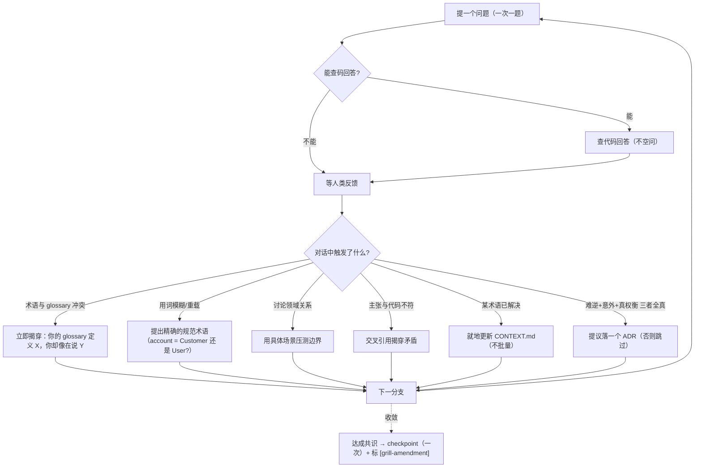

# 自制 skill 展开 · `grill-with-docs`

> 属 [工作流总览](../workflow-overview.md) 的展开。这是**阶段一生成的「人类对话岛」**（第 3 步）——
> 对抗压测设计、对齐术语、边界场景、代码与主张不符即揭穿；落 ADR / 术语表。
>
> **一句话**：`Interview me relentlessly about every aspect of this plan until we reach a shared understanding.`
> 逐分支死磕设计树，一次一题、等反馈再下一题；能查码就查码。

> **本文与前 7 份的最大不同**：grill **是一种 stance（姿态），不是机械流程**——没有固定步骤、没有必产物、没有门禁脚本。
> 因此它的「建议式 vs 强制」几乎**全是建议式**：它的严谨性由**人类亲自拷问**保证，由**下游设计门**兜底。

---

## 1. 位置与契约

| 维度 | 内容 |
|---|---|
| 谁调它 | 阶段一第 3 步（`opsx:ff` 生成四件套之后、设计审之前），非平凡变更 |
| 进（输入） | `{change_dir}` 的 design.md（+ proposal/specs/tasks）+ 真实代码（`sdflow-ship/scripts/ship_gate.py` 等） |
| 出（产物） | design/ADR/CONTEXT 更新（标 `[grill-amendment]`）；`docs/adr/NNNN-*.md`（按需）；`CONTEXT.md` 术语表（按需，lazily） |
| 本性 | **人类对话岛**——人对着设计死磕，不折叠、不自动化 |
| 收敛 | **收敛后才 checkpoint**（多轮中途不提交，只收敛后一次） |

> **grill 不可轻跳**：grill 是对 explore 的二次审视；「跳过类判定」别埋进长消息里——须显著呈现（见记忆 [[grill-not-skippable]]）。

---

## 2. 内部「流程」（其实是一套姿态 + 触发反应）

grill 没有 Step1/2/3。它是一个**循环对话** + 若干**触发即反应**的动作：

| 姿态/动作 | 目标 | 注意事项 |
|---|---|---|
| 一次一题 | 逐分支死磕、解依赖 | 每题给出推荐答案；**等反馈再下一题**，别一次抛一堆 |
| 能查码就查码 | 主张落到代码 ground truth | 别拿能查的东西空问用户 |
| Challenge against glossary | 术语一致 | 与 `CONTEXT.md` 已有定义冲突 → **立即揭穿** |
| Sharpen fuzzy language | 消除模糊/重载词 | 提精确规范术语（account→Customer/User） |
| Concrete scenarios | 压测领域关系边界 | 造 edge-case 场景逼精确 |
| Cross-reference code | 揭穿主张与代码矛盾 | 「你的代码取消整个 Order，但你刚说支持部分取消——哪个对？」 |
| Update CONTEXT.md inline | 术语解决即记 | **不批量**；CONTEXT.md 是**纯术语表**，禁塞实现细节/spec/scratch |
| Offer ADRs sparingly | 记「为什么」 | **三门槛全真才落**：① 难逆 ② 无背景会困惑 ③ 真权衡；缺一即跳 |

---

## 3. 产物格式（两个 lazily 创建的文档）

| 文档 | 是什么 | 关键规则 |
|---|---|---|
| `CONTEXT.md`（多 context 用 `CONTEXT-MAP.md`） | **术语表 glossary，仅此** | 有意见（多词选最佳、其余列 alias 避免）、显式 flag 冲突、定义一句话（定义 IS 不是 does）、只收本 context 特有术语（通用编程概念不收）、写示例对话 |
| `docs/adr/NNNN-slug.md` | 决策记录 | 顺序编号、可单段、价值在记「**做了什么决定 + 为什么**」；三门槛才落；lazily 建目录 |

---

## 4. 内部调度

grill **不派子代理、不调脚本**（对话岛，主 session 直接与人对话）。它只**读**真实代码（查码揭穿矛盾）、**写** design/ADR/CONTEXT，收敛后调 `checkpoint-commit.sh grill`。这是它与其他 7 份 skill 的结构性差异：**零 fan-out、零机械门**。

---

## 5. 人类门

**整个 grill 就是人类**——它不是「停一次的门」，而是**人类深度参与的持续对话**。唯一自动化收尾是收敛后的一次 checkpoint。在 workflow 里，grill 与设计 HARD-GATE 是**两个不同的人类接触点**：grill 是「人对抗设计」（生成阶段、不折叠），设计门是「人过报告拍板」（评审阶段、唯一 HARD-GATE）。

---

## 6. ★ 本 workflow 注入的规则/prompt —— 建议式 vs 强制

**统一判据**见[总览 §8](../workflow-overview.md#8-外部-skill-的注入强制性建议式-vs-强制统一规律)。grill 几乎**全建议式**——它没有锚行自检、没有 ship-gate 锚、没有产物 schema。它的「强制性」来自**人类在场**和**下游门**，不来自自身机制。

| 项 | 类型 | 靠什么 |
|---|---|---|
| 收敛后 checkpoint + 标 `[grill-amendment]` | **半强制** | `checkpoint-commit.sh` 脚本提交（机械）；但「收敛了没/该不该提交」靠判断 |
| **ADR 三门槛**（难逆+意外+真权衡） | **建议式（判据纪律）** | 无脚本校验；靠模型遵从「三者全真才落」，防 ADR 泛滥 |
| **CONTEXT.md 纯术语表**（禁塞实现） | **建议式** | 无 schema 校验；靠遵从格式规则 |
| 「一次一题 / 能查码就查码 / 揭穿矛盾」 | **建议式（姿态）** | 纯 stance，靠模型 + 人类共同维持 |
| **grill 不可轻跳** | **建议式（须显著呈现）** | 无机制阻止跳过；靠「跳过判定别埋长消息、显著呈现」纪律 + 用户把关（记忆 [[grill-not-skippable]]） |
| grill 的**设计严谨性**整体 | **下游门兜底** | grill 漏挖的设计缺陷，由下游 [`sdflow-spec-review`](./sdflow-spec-review.md) 的对抗镜/接地镜/outside-voice 捕获——设计门是真正的 HARD-GATE |

**结论**：grill 是全流程**唯一刻意「不机械化」的步**——因为它的价值恰在**人类对抗的判断力**，机械门会杀死对话的开放性。它的产物（更硬的 design + ADR + 术语表）没有锚/门保证质量；保证来自两处：**① 人类亲自死磕**（grill 不可轻跳，须显著呈现跳过判定）；**② 下游 sdflow-spec-review 设计门审计** grill 收敛后的设计（对抗镜专证「这份 spec 会在实现期爆炸」）。即 **grill 建议式，设计门强制**——这与「注入处建议式、下游门处强制」是同一条规律，只是这里「注入」换成了「人类对话的严谨度」。

---

## 7. 小结

- grill = **人类对话岛**：一次一题死磕设计、对齐术语、查码揭穿、按需落 ADR/术语表。
- **零 fan-out、零机械门**——刻意不机械化，保对话开放性。
- **几乎全建议式**；严谨性靠**人类在场**（不可轻跳）+ **下游设计门审计**兜底，与总览 §8 同一规律。
