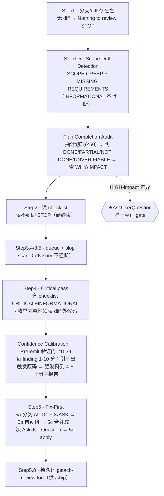

# 外部 skill 展开 · gstack `/review`

> **定位：非运行时依赖的第三方 skill 参考**——`sdflow-code-review` 编排器的 Step1（scope-drift + 完成度）
> 已改为自持 fresh 子代理实现（见 [sdflow-code-review 详解](./sdflow-code-review.md)），不再原生调用本 skill。
> 本文保留作为 `/review` 自身设计的参考资料。
>
> **一句话**：落地前（pre-landing）**本地 diff 结构性审查 + 就地修复（fix-first）**——专抓测试抓不到、prevention 焊不住的结构性缺陷。

> ⚠️ **重要事实（本仓 Codex checkout 的实际形态）**：本机安装的这个 `/review` 变体是
> **单模型、主 agent 单遍审 + fix-first，没有 specialist 子代理 fan-out、审查主体内不调 codex 第二意见**
> （checklist 里名义列了 7 类 specialist，但 `review/specialists/` 目录不存在，主体也无 dispatch 章节 → 降级）。
> **本 workflow 的「跨模型第二意见」不靠 /review 内建**，而靠外层 `sdflow-code-review` 自己的 outside-voice + 多镜。

---

## 1. 在本 workflow 中的位置与契约

| 维度 | 内容 |
|---|---|
| 谁调它 | **无**（本仓当前无 skill 运行时调用它；`sdflow-code-review` 第一步已改为自持子代理，见上方定位说明） |
| 进（输入） | 无 args schema；调用方 prompt 即「任务」。实际消费 `git diff $(git merge-base origin/<base> HEAD)`（含已提交 + 未提交） |
| 意图来源 | 多路兜底：conversation plan → `~/.gstack`/`~/.claude/plans` 等搜索 → commit messages → `TODOS.md` → `gh pr view` |
| 出（产物） | findings 行 `[SEVERITY] (confidence: N/10) file:line — desc`；报告头 `Pre-Landing Review: N issues`；就地 AUTO-FIX / ASK；写 `gstack-review-log`（供 `/ship` 识别本分支已过 Eng Review） |
| **从不做** | commit / push / 建 PR —— 「that's /ship's job」 |

---

## 2. 内部流程

| 步 | 目标 | 注意事项 |
|---|---|---|
| 1 | 有无可审 diff | 在 base 分支 / 无 diff → 停 |
| 1.5 · Scope Drift | 「只做了要求的事——不多不少？」 | 读 TODOS/PR/commit 提 stated intent，对比 `git diff --stat`；**默认 INFORMATIONAL 不阻断** |
| Plan Completion Audit | 计划项逐条核对落没落 | Path-concreteness（具体路径必须判 DONE/NOT DONE）+ Honesty rule（存疑选 UNVERIFIABLE）；**仅 plan-file 来源**的差异写 learnings |
| 2 · checklist | 读审查维度权威源 | **读不到就 STOP，不许无 checklist 继续** |
| 4 · Critical pass | 套 checklist 抓结构缺陷 | 枚举完整性须 Grep+Read **diff 外**代码；荐修复前 WebSearch 核实是否当前最佳实践 |
| Confidence gate | 杀假阳 | **每 finding 必引触发它的 file:line 原码**；引不出 → 强制降置信、压出主报告（专治「字段不存在」类） |
| 5 · Fix-First | 每 finding 都有动作 | critical 偏 ASK、informational 偏 AUTO-FIX；带 `test_stub` 一律 ASK；ASK 项**合并成一次**提问 |

### 检查的结构性维度（checklist）

| 层 | 维度 |
|---|---|
| **CRITICAL** | ① SQL & 数据安全（拼串 SQL / TOCTOU / N+1） ② 竞态并发（read-check-write 无唯一约束 / 非原子状态迁移） ③ **LLM 输出信任边界**（LLM 产 email/URL/结构化输出未校验就落库；LLM URL 无 allowlist → SSRF） ④ Shell 注入（`shell=True`+f-string / `eval`+LLM 代码） ⑤ 枚举/值完整性（新枚举值未被全部消费者处理） |
| **INFORMATIONAL** | Async/Sync 混用、字段名安全、死代码、LLM prompt 问题、完整性缺口、时间窗安全、边界类型强转、前端、CI/CD |
| **归 specialist 域（本变体未激活）** | 条件副作用、Test Gaps、魔法数、Crypto & 熵 |
| **scope + 完成度** | Step1.5 + Plan Completion Audit（见上） |

---

## 3. 严重度 / 置信 / 结论形态

- **严重度**：`CRITICAL` / `INFORMATIONAL` 二档（+ 名义 SPECIALIST，本变体未激活）；只决定**呈现顺序 + AUTO-FIX/ASK 倾向**，不决定 pass/block。
- **置信**：强制 1-10；3-4 压 appendix、1-2 仅 P0 才报；pre-emit 门引不出原码强制降级。
- **结论形态**：**无 pass/block 二值结论**（fix-first——审完直接改或问后改）；残余写 `gstack-review-log` 的 `status`：`clean` / `issues_found`。唯一硬门 = Plan Completion Audit 里 HIGH-impact 差异触发的 AskUserQuestion。

---

## 4. 人类门 / 内部调度 / headless 降级

**会 AskUserQuestion 的点**：① HIGH-impact plan 差异（A 停下补做 / B 照发+建 P1 TODO / C 有意丢弃）；② Step5c 批量 ask（所有 ASK 项**一次**问）；③ Greptile 误报逐条问。降级链同 gstack 全家（Conductor→prose、spawned→自动选、headless→BLOCKED、interactive 报错→prose fallback）。

| 内部调度（本变体实际用到） | 角色 |
|---|---|
| `checklist.md` | 审查维度权威源；读不到即 STOP |
| `greptile-triage.md` | Greptile 评论 fetch/filter/回帖（无 PR 静默跳） |
| `gstack-review-read` / `gstack-review-log` | 读历史（dedup 用户 skip 过的）/ 写本次结果供 `/ship` |
| `gstack-learnings-search/log` | 跨会话学习检索/记录（跨模型共识记 `cross-model` 标签） |
| `slop:diff` / `gstack-next-version` | AI 异味扫描 / queue 空位（均 advisory） |
| `/codex review` | **平级独立 skill，非本 skill 调用**（跨模型要另跑或靠外层编排） |

---

## 5. ★ 本 workflow 曾经的注入设计（历史，已不适用）—— 建议式 vs 强制

> 本节记录 `sdflow-code-review` **原生调用** `/review` 时代的注入关系，**已随 Step1 自持化失效**——
> 现无 skill 向 `/review` 注入任何规则/prompt。保留供理解第三方 skill 的注入面设计。

**统一判据**见[总览 §注入的强制性](../workflow-overview.md#8-外部-skill-的注入强制性建议式-vs-强制统一规律)。`/review` **无 args schema**（`openai.yaml` 只有 `default_prompt` + `allow_implicit_invocation`），调用方 prompt 就是「任务本体」→ 一切注入靠模型的一般指令遵循，**无结构化强制**；而 skill 自身用 MUST/STOP 锁死的硬不变量外部难覆盖。

| 注入项（来自 sdflow-code-review） | 注入方式 | 建议式 / 强制 | 靠什么 |
|---|---|---|---|
| 「必须含 scope-drift + 计划完成度缺口」 | prompt 注入 | **建议式（且本就内建）** | 恰是 /review 原生 Step1.5 + Plan Completion Audit → 注入=强化既有；但默认 **INFORMATIONAL 不阻断**，想让它「阻断」需 prompt 显式改停走语义 |
| 「结论并入 sdflow 合并池」 | 编排层消费 | **非 /review 强制** | /review 输出硬编码进 `gstack-review-log`，无重定向参数 → 靠**外层 sdflow-code-review** 消费其输出再合并（编排器模式），非让 /review 改写持久化目标 |
| 「不可用则降级 simulated + 显式日志」 | sdflow 侧规则 | **强制（在 sdflow 侧）** | sdflow-code-review Step1 写 `mode="native\|simulated"` 锚行 + 出报告后 grep 自检 |
| 「跳过 checklist / 直接 commit」（假想的冲突注入） | — | **不可覆盖** | 撞 skill 硬不变量：「读不到 checklist 就 STOP」「never commit/push——that's /ship's job」「引不出原码就强制降级」（MUST/STOP 措辞） |

**结论**：外部 prompt 的影响力只落在 /review **没用 MUST/STOP 锁死的软缝**——主要是「多审什么维度」「结论如何额外呈现/转交」；而「读不到 checklist 就停」「引不出原码就降级」「不 commit」是措辞强制的硬缝，注入推不翻。本 workflow 让 /review 的结论「进合并池 + 并入独立冷主审」**不是靠强制 /review 内部**，而是把它当 **Step1 子步、由 sdflow-code-review 编排器在更高层消费**——这正是「注入处建议式、编排层兜底」的范式。

---

## 6. 小结

- 本机 `/review` 实为**单模型单遍 + fix-first**；跨模型/specialist 在本 checkout 未激活。
- 它原生就做 **scope-drift + 计划完成度审计**——`sdflow-code-review` 的 Step1 曾借道它执行，`absorb-gstack-review`
  change 起改为自持 fresh 子代理实现，本 skill 不再是运行时依赖。
- 本文作为**非运行时依赖的第三方 skill 参考**保留，记录 `/review` 自身的设计（结构性审查维度、置信校准、
  fix-first 结论形态），供未来对照或复用其思路时查阅。
