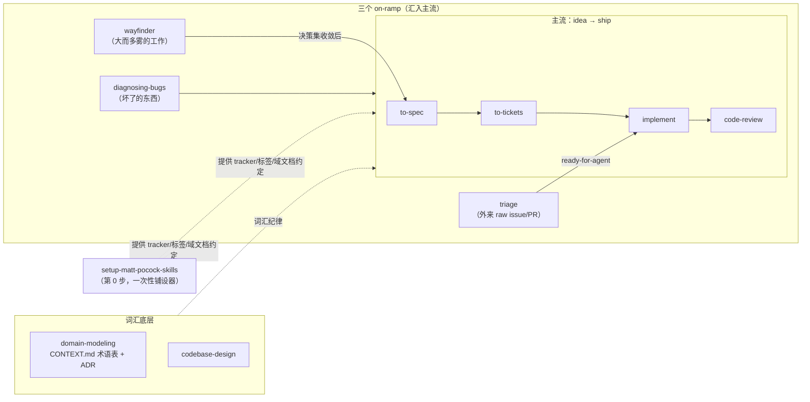

# Matt Pocock skills 套件：wayfinder → to-spec → to-tickets → implement → code-review

> **定位**：Matt Pocock 工程 skills 套件的端到端调研——推荐工作流链路、每个 skill 的内部设计、与 sdflow 多镜评审型工作流的事实差异、可借鉴清单。属 [workflow-overview.md](../workflow-overview.md) 的外部 skill 详解系列。
>
> **调研基线**：本机安装 `~/.claude/skills/{wayfinder,to-spec,to-tickets,implement,code-review,setup-matt-pocock-skills,ask-matt,triage}/`（2026-07-10）；消费仓约定实例 = 本仓 `openspec/matt/*.md`（setup 已跑过，tracker 改道 `openspec/matt/`）。
> **调研方法**：6 个只读深读代理逐 skill 提取 + 6 个对抗核查代理逐份证伪（4 份 accurate、2 份 minor-issues 共 3 处订正，已并入本文）+ 1 个链路映射代理交叉读全套件。全部论断接地 file:line。

---

## 0. 套件全景（ask-matt 的组织图）

`ask-matt` 是套件的**路由器元 skill**（"You don't remember every skill, so ask"，自身不执行工程动作），它把套件组织成：

三条一眼可见的总体特征（与 sdflow 对照的锚点）：

1. **主体单线程 + 单会话单工单**：wayfinder 每 session 只解决一张 ticket、implement 逐票跑「票间清空上下文」；全套件唯一的 fan-out 是 code-review 的恰好 2 个并行子代理。
2. **状态载体是 issue tracker 字段**（`Status:`/`Blocked by:`/label/assignee），不是 git 锚；评审输出留在对话里不落盘。
3. **人类门多而小、全部在上游规划侧**（seam 确认、拆票批准、triage 定向），执行侧（implement）零门——`ready-for-agent` 标签的语义就是「AFK-ready，agent 可无人值守拿走」。全套件**没有一处用 AskUserQuestion 工具**，所有停顿都是 prose 提问。

---

## 1. 端到端链路流转

| 环节 | 输入 | 处理要点 | 输出（文件 / 状态字段） | 人类门 |
|---|---|---|---|---|
| **wayfinder** | 模糊大想法（chart 模式）或 map 编号（work 模式） | chart：grilling+domain-modeling 钉 destination → 广度 grill 出迷雾 → 建 map + 可精确表述的 tickets（两遍：先建节点拿 id、再布 blocking 边）；work：认领→解一张→resolution comment→close→map 追加一行指针 | `map.md`（Destination/Notes/Decisions-so-far/Not-yet-specified/Out-of-scope 五区）+ `issues/<NN>-<slug>.md`（`Type:` research/prototype/grilling/task、`Status:` claimed/resolved、`Blocked by: NN`） | destination 命名、HITL 票型（grilling 等）实时对话；铺图 session 禁止顺手解题 |
| **to-spec** | 当前对话上下文 + 代码库理解（**明令不 interview，只综合**） | 探索 repo（domain 词汇 + 尊重 ADR）→ 勾画测试 seam（已有优先/越高越好/理想数=1）→ **与用户确认 seam** → 按 7 节模版写 spec 发布 | `PRD.md`（Problem/Solution/长编号 User Stories/Implementation Decisions/Testing Decisions/Out of Scope/Further Notes），发布即打 `ready-for-agent`（无需再 triage——豁免而非禁令） | 仅 1 处：seam 确认 |
| **to-tickets** | 对话中的 plan/spec，或传参引用（fetch 全文+评论） | 拆 tracer-bullet **垂直切片**（每片打穿 schema/API/UI/tests 全层、独立可 demo、**尺寸=一个 fresh context window**）；宽重构走 expand–contract 例外协议；先草拟后 **quiz 用户**（粒度/阻塞边/合拆三问，迭代到批准）；按依赖序发布（blocker 先发使边可实引） | `tickets.md` 或一票一 issue（Parent/What to build/Acceptance checkbox/Blocked by；tracker 无原生 blocking 时降级为正文 `Blocked by:` 行），默认打 `ready-for-agent` | 仅 1 处：拆解批准（审图结构而非逐字） |
| **implement** | "spec or tickets"（用户口头指认；一次一张 frontier 票） | 在**预先约定的 seam** 上用 /tdd；typecheck+单测文件高频跑、全量套件**只在最后跑一次**；完成后调 /code-review；commit 到当前分支（不 push/PR） | 代码 commit。**不关票、不翻 Status**（全文 15 行无状态操作） | **零门**（入口 `disable-model-invocation` 即唯一门） |
| **code-review** | 用户指定固定点的三点式 diff（`git diff <fp>...HEAD`）+ 提交清单 | fan-out 前 fail-fast（rev-parse 校验 ref + 非空 diff）；spec 来源四级解析梯（commit msg 引用→传参→约定目录→问人）；**双轴 2 子代理并行**：Standards（仓库成文标准 + 12 条 Fowler 坏味基线全文贴进 prompt）/ Spec（缺失/scope creep/实现错，每条引 spec 原句）；各限 400 词 | 对话内报告（## Standards + ## Spec 并排 + 每轴一行摘要），**禁止合并/重排/跨轴选 winner**；零落盘、零状态回写 | fixed point 未给则问；spec 找不到则问（说没有则跳 Spec 轴并注明） |

**triage 标签状态机**：五个 canonical 角色（needs-triage/needs-info/ready-for-agent/ready-for-human/wontfix）只在 `/triage` on-ramp（外来 issue/PR）上全量运转；**主流程只用 `ready-for-agent` 一个**——to-spec/to-tickets 产物「构造上就是 agent-grabbable」，ask-matt 明令不要再 triage 它们。本地 tracker 上标签物理载体 = issue 文件顶部 `Status:` 行（注意：wayfinder 票的 `Status:` 装的是另一套词 claimed/resolved——两套词共用一个字段名，是已观察到的契约模糊点）。

**已观察到的硬编码不一致**：code-review SKILL.md:13 写死 `docs/agents/issue-tracker.md` 路径，而本仓实例在 `openspec/matt/issue-tracker.md`（靠 CLAUDE.md 注入块指路）——说明「skill 引用铺设产物」的路径解析仍有脆弱点。

---

## 2. 逐 skill 设计档案

### 2.1 wayfinder（127 行，套件最重）——迷雾中的规划器

- **定位**：规划「超出单个 session 容量」的模糊大块工作；产**决策**不产交付物（"Plan, don't do"）；`disable-model-invocation: true`。
- **核心概念体系**：destination（终点，决定 scope）/ frontier（当下可走的边界 = open ∧ unblocked ∧ unclaimed）/ **fog of war**（表述不清的部分粗写留雾区，禁止预切成假精确的 ticket）/ Out-of-scope（越界票 close 进此区、**永不毕业**）。
- **判据精华**：切 ticket vs 留雾区的标准是「**能否现在精确表述问题**」而非「能否回答」——表述已锋利就建票（哪怕被阻塞），表述不清就留雾。
- **并发模型**：不派子代理；并行 = 人开多个 session + **assignee 即锁**（认领是动工前第一动作，open+unassigned=可取）。
- **上下文纪律**：map 是 index 不是 store（决策只活在 ticket 里，map 只留一行 gist+链接）；每 session 只装低分辨率总览、按需 zoom 取票全文；ticket 显式 sized to one 100K token session；**单 session 硬顶一张票**；铺图 session 不解题。
- **行为信号哲学**："The pull to just do the work is usually the signal you've reached the edge of the map and it's time to hand off"——把 agent 想动手的冲动征用为阶段边界探测器。

### 2.2 to-spec（75 行）——对话的序列化器

- **定位**：把已讨论内容综合成 spec 发布，**明令 Do NOT interview**——探索与提问是上游（wayfinder/对话）的活，本 skill 是纯综合步。
- **唯一人类门设在杠杆最高点**：不审全文，只确认「测试 seam 在哪」——seam 启发式量化到可执行（已有 seam 优先/越高越好/全库理想数量=1）。
- **抗腐烂**：spec 禁写文件路径/代码片段（易过期）；唯一例外是 prototype 产出的「决策编码型」片段（状态机/reducer/schema/type shape），须裁到 decision-rich 部分——区分「编码决策的代码」与「实现代码」。
- **User Stories 要求 "A LONG, numbered list… extremely extensive"**——正文覆盖度靠模版措辞压出来。

### 2.3 to-tickets（114 行）——依赖图编译器

- **定位**：spec → tracer-bullet 垂直切片 DAG。`Blocked by` 是一等字段，**frontier 就是现成的并行派发队列**（无阻塞票天然互不依赖）。
- **粒度判据 = agent 执行模型**：每片 sized to fit「一个 fresh context window」——任务粒度与执行容器对齐，而非人天。
- **宽重构例外协议（expand–contract）**：识别（blast radius 扇满全库、无垂直切片能独立保绿）→ expand 加新形态 → 按 blast radius 分批 migrate（每批一票、blocked by expand）→ contract 删旧（blocked by 全部批）；批次保不了绿再降一级：共享集成分支 + 全部 block 一张 integrate-and-verify 票（"green is promised only there"）——**给不变量的例外场景也给结构化协议**。
- **人类门审图不审文**：固定三问（粒度/阻塞边/合拆），把人审花在最影响并行执行正确性的维度。

### 2.4 implement（15 行，套件最薄）——组合式薄节点

- 正文仅 5 句：按 spec/tickets 实现 → 预约定 seam 上 /tdd → typecheck/单测高频 + 全量最后一次 → /code-review → commit 当前分支。
- **薄的机制**：TDD 纪律与评审标准都不在本文件里，以 `/tdd`、`/code-review` 的 skill 名引用——每个关注点只有一个权威 skill，链条节点只写「何时调它」不写「它怎么做」；下一环写死在正文末尾（链条自推进，零编排器）。
- **反面事实**：对上下游零文件契约（不关票、不翻状态、靠用户口头指认输入）——极强通用性，代价是无机检交接锚。

### 2.5 code-review（89 行）——正交双轴评审

- **双轴设计**：Standards（怎么写的）与 Spec（写没写对）两个并行 fresh 子代理互不污染；聚合层**明令禁止 merge/rerank/跨轴选 winner**，并把 why 写进 skill 本体（"Reporting them separately stops one axis from masking the other"）。
- **保底 rubric + 冲突消解预焊**：12 条 Fowler 坏味构成零文档仓库也生效的评审下限；两条消歧规则 fan-out 前定死——仓库成文标准 override 基线、坏味永远是 judgement call 非 hard violation；工具链已强制的一律跳过（不与 linter 重复劳动）。
- **prompt 组装纪律**：坏味基线**全文贴进**子代理 prompt——"the sub-agent has no other access to it"（显式承认子代理不继承上下文）。
- **成本设计**：每子代理报告 ≤400 词（逼子代理自行排优先级、聚合成本钉常数）；fan-out 前 fail-fast 校验共享输入（"A bad ref or empty diff should fail here — not inside two parallel sub-agents"）。
- **轴级优雅降级**：spec 缺失→跳 Spec 轴+终报注明，不 abort 不假装审过。

### 2.6 setup-matt-pocock-skills（127 行 + 5 个 seed 模版）——一次性铺设器

> 深潜详解（流程解剖 / 抽象操作层翻译对照 / 本仓实例注入点亲验 / 脆弱点 / sdflow 借鉴边界）另见 [setup-matt-pocock-skills.md](./setup-matt-pocock-skills.md)。

- **产出**：三份约定文档（issue-tracker / triage-labels / domain）+ CLAUDE.md 或 AGENTS.md 的 `## Agent skills` 托管块（一节一行摘要+指针）。
- **抽象层设计（最大亮点）**：下游 skills 只说抽象动作（"publish to the issue tracker" / "apply the ready-for-agent label" / Wayfinding 六操作 Map/Child/Blocking/Frontier/Claim/Resolve），本 skill 生成的约定文档把动作**翻译**成本仓具体命令（gh / glab / 建 `.scratch` 文件）——skill 与后端完全解耦，每后端内还带降级链（无原生 sub-issue→正文 `Part of #<map>` 行；GitLab blocking 是付费功能→文本行）。
- **canonical 角色名固定、字符串可映射**：triage 状态机以 5 个不变角色运转，仓库只改映射表右列——「协议名 vs 实现名」分离。
- **交互协议**：三个决策**一次问一个**、每节先给零基础 explainer、默认值由探测驱动（remote 指向谁提谁）、写盘前草稿可编辑、CLAUDE.md/AGENTS.md 二选一绝不双开、两者皆无时问人不代选。
- **懒创建哲学**：域文档缺失时消费方**静默继续**、不提议创建——创建推迟到 /domain-modeling 在术语/决策真正被解决时才做（避免铺设期仪式性空文档）。
- **逃生舱也是契约**：Other tracker（Jira/Linear）让用户一段话描述、记为散文照读——可插拔后端的兜底不是报错而是降为 prose。

---

## 3. 与 sdflow 多镜评审型工作流的事实差异

（只列事实，优劣评估见 [../sdflow-fable5/04-optimization-proposal.md](../sdflow-fable5/04-optimization-proposal.md)。）

| 维度 | Matt 套件 | sdflow |
|---|---|---|
| 并行拓扑 | 主体单线程、每 session 一票；唯一 fan-out = code-review 恰好 2 子代理 | 评审步一次 fan-out N 镜（领域+对抗+接地/历史+outside-voice）；实现步 SDD 逐任务 fresh 子代理 |
| 评审独立性来源 | **轴正交**（Standards vs Spec 两种失败模式）+ 聚合禁 rerank | **镜多样**（角度不同的 N 个 fresh 子代理）+ 对抗裁决 + 置信过滤 |
| 状态载体 | tracker 字段（`Status:`/label/assignee/`Blocked by:`），评审输出不落盘 | git 产物（checkpoint 标签、报告 frontmatter 锚、archive 树），ship_gate 从盘面推导 |
| 任务粒度 | ticket = 垂直切片 = 一个 fresh context window；跨 session 逐票 | change 为单位，change 内拆 task，一次 `/sdflow-ship` 连续驱动到 merge |
| 人类门 | 多个小门散布上游（seam 确认/拆票批准/triage 定向），全 prose；执行侧零门 | 收敛为一个设计 HARD-GATE（批处理拍板决策登记区）；阶段三零门 + T10 三级协议 |
| 评审输出处置 | 双轴报告并排呈现给人，skill 不自动修 | 能修自动修 `[impl-review-fix]`、自动裁、defer 进 issues 池 |
| 机械层 | 零脚本、零门禁、零测试（全套件纯 Markdown）；靠 frontmatter `disable-model-invocation` 与 prose 约定 | 14 个确定性脚本 + 374 测试用例 + fail-closed 家族 + 退出码契约 |
| 自改进机制 | 无显式度量；经验沉淀=CONTEXT.md 术语表+ADR+triage 的 out-of-scope 知识库 | lens-metric 锚 + retro 成本×价值报告 + 双 roadmap 回灌 |
| 触发防护 | `disable-model-invocation: true` 贯穿（仅 code-review 例外可自动触发） | 靠 description 触发精度 + 触发词收窄（如 ship 不含裸"ship"） |
| 跨会话连续性 | tracker 即共享地图（map 低分辨率总览 + zoom）；/handoff 桥 | 盘面即状态（gate 从 git 推导缺口续跑）+ hand-off.md |

---

## 4. 可借鉴清单（喂给优化建议书的 12 条）

按「机制 → 对 sdflow 的适用点」整理：

| # | 机制（出处） | 对 sdflow 的适用点 |
|---|---|---|
| 1 | **fog-of-war 分层**：按「能否精确表述」切 ticket vs 雾区，禁止预切假精确任务（wayfinder） | roadmap/tasks.md 过早细化的解药：远期阶段留雾区粗写，到 frontier 才拆 change/task |
| 2 | **frontier + assignee 即锁**：依赖 DAG 上的乐观锁并发协议，无中心编排者（wayfinder/to-tickets） | tasks.md 的 task 依赖若显式化为 DAG，SDD 可按 frontier 并行派发多 implementer 而非严格顺序 |
| 3 | **ticket 尺寸 = 一个 fresh context window**（to-tickets） | writing-plans 拆任务的粒度判据可从「原子任务」精化为「单 fresh 上下文可完成」 |
| 4 | **expand–contract 宽重构协议**：不变量例外场景的结构化降级链（to-tickets） | sdflow 缺大规模机械重构的 change 模式；mlh 类 roadmap 可直接借此协议拆批 |
| 5 | **人类门审图不审文**：固定三问聚焦图结构（粒度/依赖边/合拆）（to-tickets） | 设计门决策登记区可增加「结构三问」维度，减少逐字读报告的人类墙钟（实测 spec-review 39% 是人读时间） |
| 6 | **seam 确认 = 单点高杠杆人类门**（to-spec） | 「测试 seam 拍板」可作为设计门决策登记区的一等条目（sdflow 现无显式 seam 决策槽） |
| 7 | **双轴正交 + 聚合禁 rerank**（code-review） | sdflow 裁决层把多镜 findings 全局归并；可试「轴内排序、轴间并列」防对抗镜的严重度分布掩盖领域镜 |
| 8 | **每镜输出 ≤400 词预算**（code-review） | sdflow 多镜返回结构化 findings 无长度上限；封顶可压主 session 聚合成本 |
| 9 | **rubric 全文入 prompt + 明示原因**（code-review） | sdflow 已用「只引用编号不复制」相反策略（靠 resolve-workflow 读文件）；两者取舍值得在优化书里显式对比 |
| 10 | **动作抽象层 + 仓库级翻译文档**（setup） | sdflow 的 buglist/todolist 落点写死本地 markdown；抽象成动作名+翻译层可支持 GitHub Issues 等后端 |
| 11 | **`disable-model-invocation: true` 触发层硬门**（贯穿） | sdflow 靠 description 措辞控触发；有副作用的 skill（done/ship）可加此 frontmatter 硬开关 |
| 12 | **懒创建 + 缺失静默继续**（setup/domain） | sdflow-init 铺设期建齐骨架；对低频文件可改懒创建，减少仪式性空文档 |

**反向确认（sdflow 已做对、Matt 套件缺席的）**：机械门禁与退出码契约、防假✅/假绿体系、度量回路、fresh 多镜对抗、归档即真相源——这些在 Matt 套件中无对应物，是 sdflow 相对的结构性长处；优化时不应向"纯 prose 约定"回退。

---

## 5. SKILL.md 写作风格特征（对 skill-authoring 的参考）

- **长度谱系**：implement 15 行 → to-spec 75 → code-review 89 → to-tickets 114 → setup/wayfinder 127；中位 6-7KB，全部单文件一次读完。
- **frontmatter 极简**：只有 name/description + 多数带 `disable-model-invocation: true`；无 allowed-tools、无 bash preamble、无脚本目录——与 gstack 的重 preamble 形成两极。
- **语气**：概念先行的短 essay 体（fog of war / frontier / tracer bullet / smart zone 隐喻词汇体系），第二人称祈使句；先立概念再给流程（wayfinder 用 5 个概念节铺垫后才到 Invocation）。
- **三层加载**：SKILL.md 常驻 → 同目录参考文件按需读（triage 的 AGENT-BRIEF.md、setup 的 5 个 seed 模版）→ **运行时才解析的消费仓约定文档**（`docs/agents/*.md`），统一句式指过去（"should have been provided to you — run /setup-matt-pocock-skills if not"）。
- **skill 间组合靠斜杠名引用**（implement 调 /tdd、/code-review；wayfinder 调 /grilling、/domain-modeling）——组合替代内联，杜绝规则双源。

---

*调研产出（2026-07-10）。三处对抗核查订正已并入正文：①to-spec 的 "no need for additional triage" 是豁免非禁令；②to-tickets blocking 边在无原生依赖的 tracker 上降级为正文约定行；③wayfinder 的 /prototype 仅挂在 Prototype 票型的 UI/logic code 分支。配套：[../sdflow-fable5/](../sdflow-fable5/)（本仓工作流调研文档集）。*
