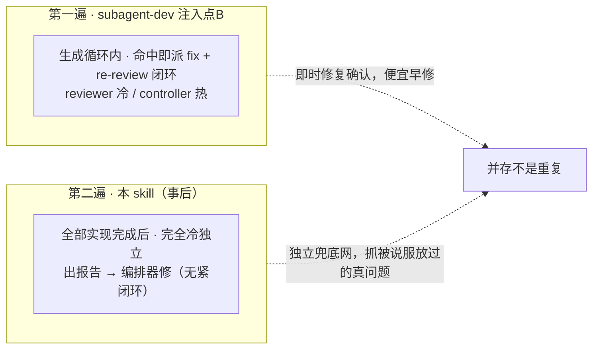
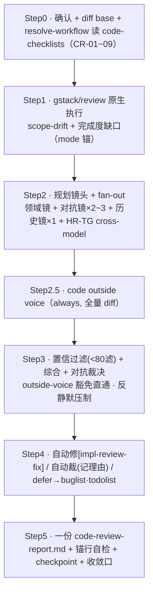

# 自制 skill 展开 · `sdflow-code-review`

> 属 [工作流总览](../workflow-overview.md) 的展开。这是**阶段三代码审的主审编排器**（第 8 步）——
> **每次全跑 · 独立冷视角 · 强制主审**，出**一份** `code-review-report.md`。
>
> **一句话**：Step1 [gstack/review](./gstack-review.md)（scope-drift + 完成度）→ Step2 并行多镜（领域/对抗/历史）→
> Step3 置信过滤 + 对抗裁决 → Step4 自动修/裁/defer → Step5 一份报告。

> **定位（P3c，须知情）**：本 skill **不是**「高风险才跑的边际残差」——那是旧 `quality-layering §五` 的结论，**已被否决**。
> 它是**每次全跑的独立强制主审**，实测能抓生成循环内被 controller 说服放过的真问题。

---

## 1. 位置与契约

| 维度 | 内容 |
|---|---|
| 谁调它 | 阶段三第 8 步；`/sdflow-ship` 判 `RUN_CODE_REVIEW` 时 |
| 进（输入） | `{change_dir}` + `DIFF_BASE..HEAD`（`DIFF_BASE = git merge-base origin/<base> HEAD`）+ 真实代码 |
| 出（产物） | `code-review-report.md`（命中范围 + Findings≥80 + 已裁掉区 + 裁决 + 修复/defer 台账）；改动标 `[impl-review-fix]`；写 `<!-- ship-gate: code-review=pass\|blocked -->` 锚 |
| 两条铁律 | **G1** 不依赖 `/clear`；**P3e** 阶段三无人类门（不 AskUserQuestion，能修自动修/≥2 方案自动选记理由/拿不准 defer） |

**与注入点 B 的关系（别把本 skill 优化掉）**：

---

## 2. 内部流程

| 步 | 目标 | 注意事项 |
|---|---|---|
| 1 | scope-drift + 完成度 | 原生执行 gstack/review，写 `mode="native\|simulated"` 锚；降级须显式日志不静默 |
| 2 | 并行多镜 | 领域镜（CR-01~09 + domains）/ 对抗镜（证明运行期爆：竞态/泄漏/错误路径）/ 历史镜（git blame + 旧 review 意见）；linter/typechecker 能抓的不进镜 |
| 2.5 | 跨模型第二意见 | **always** 跑 code-voice（不受清单约束、不占镜位）；10 次后按采纳率复评是否降采样 HR-only |
| 3 | 置信过滤 + 裁决 | 每条 0-100 **滤 <80**（可下放弱档打分）；**outside-voice 豁免**：runner=codex 跳过 <80 直通；**反静默压制**：<80 滤除也一行带过，不静默丢 |
| 4 | 自动修/裁/defer | 能修自动修 `[impl-review-fix]`；≥2 方案按 **T10 三级**（有客观判据自动选/无则派对抗镜复核/复核不过 defer）；**裁决分桶**（codex/claude-fallback 各记采纳/裁掉/defer） |
| 5 | 出报告 + 收敛 | **锚行存在性自检**（grep 三类 v1 锚，缺失即报错阻塞；findings=N 与实收数 diff）；checkpoint；建议进 `/sdflow-done` |

---

## 3. 镜头 + model

| 层 | 档位 |
|---|---|
| 主 session（裁决/自动裁/出报告） | **强档**（门禁，弱档=假绿） |
| 领域镜 / 对抗镜 | 中档 |
| 历史镜 / 置信过滤（打分机械） | 弱档 |

> 与 sdflow-spec-review 唯一结构差异：**代码即 ground truth**（直接读 diff，不设接地镜），换成**历史镜 + 置信过滤**。

---

## 4. 内部调度的子 skill / 子代理 / 脚本

| 被调 | 类型 | 角色 |
|---|---|---|
| [`gstack/review`](./gstack-review.md) | 原生执行（Step1） | scope-drift + 完成度审计，结论进合并池 |
| 领域/对抗/历史镜 | fresh-context 子代理 | 一条消息全派出，返回结构化 findings，禁 AskUserQuestion |
| `outside-voice.sh` | 确定性脚本 | code-voice（always）+ HR-TG（命中）跨模型；退出码契约同 spec-review |
| 官方 `/code-review` | 插件能力**内部借用** | P3d 弃用为独立 step；仅供历史镜/置信过滤内部借用，不再独立 gh 回帖 |
| `buglist.py`/`todolist.py` | 脚本 | defer 落档（本 change 引入的代码 bug / 改进关注点） |
| `resolve-workflow.sh` / `checkpoint-commit.sh` | 脚本 | 规则解析 / 过场提交 |

---

## 5. 人类门

**无**（阶段三无人类门 P3e）。撞到 ≥2 方案不弹窗，走 T10 三级决策协议（自动选记理由 / 派对抗镜复核 / 拿不准 defer）；defer 项进 buglist/todolist，由 hand-off 异步引导另开清理 change。

---

## 6. ★ 本 workflow 注入的规则/prompt —— 建议式 vs 强制

**统一判据**见[总览 §8](../workflow-overview.md#8-外部-skill-的注入强制性建议式-vs-强制统一规律)。

| 项 | 类型 | 靠什么 |
|---|---|---|
| **锚行存在性自检**（三类 v1 锚 + findings=N diff） | **强制（本 skill 机械门）** | Step5 机械 grep，缺失即报错阻塞 |
| **code-review=pass/blocked 锚** | **强制（下游门读）** | `ship_gate` 读此锚判「可进 done」；blocked=不放行 |
| **outside-voice.sh 调用契约** | **强制（退出码脚本）** | preflight/exec/exit 码；豁免规则 runner 标签驱动分桶 |
| **buglist FIXED 门禁 / issues reindex 判据** | **强制（脚本）** | defer 落档走 `buglist.py`（FIXED 必带根因+证据）、批次判据走 `issues.py` |
| checkpoint 提交 | **强制（脚本）** | `checkpoint-commit.sh impl-review` |
| 「gstack/review 原生执行 + 含 scope+完成度」 | **半强制** | mode 锚 + 主 session 遵从；scope+完成度本是 gstack/review 内建 |
| **每次全跑（P3c）非高风险才跑** | **建议式（架构纪律）** | 无脚本强制「这次必须跑」；靠 workflow 排序 + `ship_gate` 的 `RUN_CODE_REVIEW` 判定驱动 |
| **置信 <80 过滤 / 对抗裁决 / T10 三级** | **建议式** | 强档主 session 判断；打分可下放弱档但无机械校验阈值 |
| **反静默压制 / 裁决分桶** | **建议式** | 靠主 session 遵从铁律；分桶计数无脚本强制 |
| 注入点 B 与本 skill「并存不重复」 | **建议式（设计约束）** | 靠维护者不「优化掉」任一层；无机制阻止误删 |

**结论**：与 spec-review 同构——**流程完整性**由机械门兜底（**锚行自检**抓漏镜、**code-review=pass 锚**卡下游、**checkpoint/buglist/issues 脚本**）；**判断质量**（置信过滤、对抗裁决、T10、反静默压制）是**自觉纪律**。特别地，「**每次全跑**」本身不是脚本强制，而由 **workflow 排序 + `ship_gate` 的 `RUN_CODE_REVIEW` 判定**驱动——gate 在盘面缺 `code-review=pass` 锚时不放行，等价于「不跑就卡住」，这是**下游门把建议式变强制**的又一例。

---

## 7. 小结

- 结构 = gstack/review + 多镜 + code-voice → 置信过滤 + 对抗裁决 → 自动修/裁/defer → 一份报告。
- **机械兜底**：锚行自检、code-review=pass 锚（gate 读）、outside-voice.sh、buglist/issues 脚本、checkpoint。
- **自觉纪律**：每次全跑、置信过滤、对抗裁决、T10、反静默压制——靠强档主 session；「每次全跑」的强制性由 ship_gate 判定兜底。
