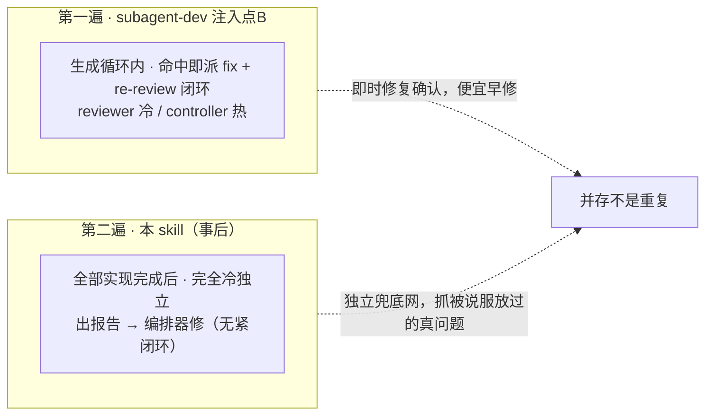
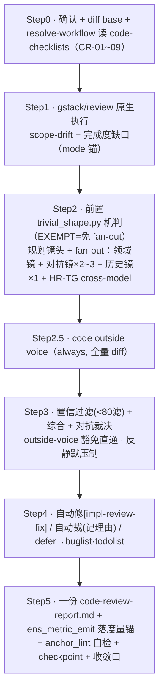

# 自制 skill 展开 · `sdflow-code-review`

> 属 [工作流总览](../workflow-overview.md) 的展开。这是**阶段三代码审的主审编排器**（第 8 步）——
> **每次全跑 · 独立冷视角 · 强制主审**，出**一份** `code-review-report.md`。
>
> **一句话**：Step1 [gstack/review](./gstack-review.md)（scope-drift + 完成度）→ Step2 并行多镜（领域/对抗/历史，前置 trivial_shape 机判豁免）→
> Step3 置信过滤 + 对抗裁决 → Step4 自动修/裁/defer → Step5 一份报告。

> **定位（P3c，须知情）**：本 skill **不是**「高风险才跑的边际残差」——那是旧 `quality-layering §五` 的结论，**已被否决**。
> 它是**每次全跑的独立强制主审**，实测能抓生成循环内被 controller 说服放过的真问题。

---

## 1. 位置与契约

| 维度 | 内容 |
|---|---|
| 谁调它 | 阶段三第 8 步；`/sdflow-ship` 判 `RUN_CODE_REVIEW` 时 |
| 进（输入） | `{change_dir}` + `DIFF_BASE..HEAD`（`DIFF_BASE = git merge-base origin/<base> HEAD`）+ 真实代码 |
| 出（产物） | `code-review-report.md`（命中范围 + Findings≥80 + 已裁掉区 + 裁决 + 修复/defer 台账）；改动标 `[impl-review-fix]`；报告**头部 YAML frontmatter 首块**写机判锚 `ship-gate:` → `code_review: pass\|blocked`（下划线字段名、小写值；已有首块 frontmatter 则合并键入该块、不新开第二块，无则 prepend 文件最顶端） |
| 两条铁律 | **G1** 不依赖 `/clear`；**P3e** 阶段三无人类门（不 AskUserQuestion，能修自动修/≥2 方案自动选记理由/拿不准 defer） |

> **两套锚，别混述**（与 spec-review 文档同一分工）：
> ① **ship-gate 机判锚** = 报告头部 frontmatter 首块的 `ship-gate.code_review: pass|blocked`——`ship_gate.py` 读它判「可进 done」；解析真相源 = `sdflow-ship/scripts/ship_gate.py` 的 `FIELD_ENUMS` + `parse_ship_gate_frontmatter`（只认文件首块、只认 `ship-gate:` 直接子键层；live 读坏 frontmatter fail-closed UNKNOWN(6)，归档读 fail-safe none）。
> ② **正文 4 类 v1 锚**（step1-broad-review / hr-tg / outside-voice / lens-metric）= 报告完整性锚，由 `anchor_lint.py` 机验（见 Step5）。两套锚各司其职，**不是一套**。
>
> **历史注记（旧格式已退役）**：机判锚旧格式为正文 inline HTML 注释 `<!-- ship-gate: code-review=pass|blocked -->`，2026-07-07 起（change `mlh-p5-gate-frontmatter`）迁至头部 frontmatter——旧 inline code-review 锚已**完全退役**（live 与归档均不再识别，T75 已删该锚常量）；归档 dual-read 兜底仅存于 verify 锚的归档读半场（gate 从不读归档内的 code-review-report.md，上文「归档读 fail-safe none」是 parser 通用契约、该归档调用方只读 verify）。

**与注入点 B 的关系（别把本 skill 优化掉）**：

---

## 2. 内部流程

| 步 | 目标 | 注意事项 |
|---|---|---|
| 1 | scope-drift + 完成度 | 原生执行 gstack/review，写 `mode="native\|simulated"` 锚；降级须显式日志不静默 |
| 2前 | trivial_shape 机判豁免 | fan-out 前跑 `trivial_shape.py --base "$DIFF_BASE"`：**exit 0=EXEMPT**（diff 仅无逻辑面白名单形状——代码内注释 / README·CHANGELOG·docs·VERSION 等约定文档路径 / 仅新增 `tests/`；多镜结构上零产出）→ **免本步 fan-out**，报告 Step2 段注明豁免 + 判器 JSON `reason`（Step1 scope-drift 恒跑守卫伪装逻辑）；**1=NOT_EXEMPT**（有逻辑面 / 命中行为面路径 bundle·SKILL.md·workflow.md·ship_gate.py，即便纯 markdown）/ **2=ERROR** → 保守照常 fan-out；**判器缺失/不可执行视同 NOT_EXEMPT**（不静默免）。默认开、仅机判无逻辑面才关，非「高风险才跑」 |
| 2 | 并行多镜 | 领域镜（CR-01~09 + domains）/ 对抗镜（证明运行期爆：竞态/泄漏/错误路径）/ 历史镜（git blame + 旧 review 意见）；linter/typechecker 能抓的不进镜 |
| 2.5 | 跨模型第二意见 | **always** 跑 code-voice（不受清单约束、不占镜位）；「10 次后按采纳率复评降采样」条款已泛化到 per-(层,镜)、判据升采纳率+独立率双列，surfacing 由 `/sdflow-retro` 机械触发，砍/降采样人决（详见 SKILL.md 第五步「反馈回路」） |
| 3 | 置信过滤 + 裁决 | 每条 0-100 **滤 <80**（可下放弱档打分）；**outside-voice 豁免**：runner=codex 跳过 <80 直通；**反静默压制**：<80 滤除也一行带过，不静默丢 |
| 4 | 自动修/裁/defer | 能修自动修 `[impl-review-fix]`；≥2 方案按 **T10 三级**（有客观判据自动选/无则派对抗镜复核/复核不过 defer）；**裁决分桶**（codex/claude-fallback 各记采纳/裁掉/defer） |
| 5 | 出报告 + 收敛 | 度量锚经 `lens_metric_emit.py` **exit 0 才落**；`anchor_lint.py --layer code-review` 机验**四类 v1 锚**（非 0 即阻塞）；checkpoint；建议进 `/sdflow-done`——两道脚本门细节见下 |

**Step5 两道脚本门细节**：

- **度量锚落锚**（受 config `metrics.enabled` 门控，缺省/`false` 整体跳过）：用 Step4 裁决计数构造的 roster+findings 调
  `lens_metric_emit.py --layer code-review`——**exit 0 才**把 stdout（逐镜 lens-metric 锚行）落进报告；exit ≠0（fail-closed）→
  本段不落、报告注明 emitter 报错原因，MUST NOT 手拼锚行顶替。分类正确性 + roster 完备性 + findings 誊写准确仍是主 session 信任边界。
- **锚行自检** = `anchor_lint.py --report {change_dir}/code-review-report.md --layer code-review --trigger-catalog $RULES_ROOT/trigger-catalog.md`：机验四类正文 v1 锚
  （step1-broad-review / hr-tg / outside-voice / lens-metric）存在性 + lens-metric 字段/枚举/sev/`layer==--layer`/计数 int≥0；
  退出码非 0（1=违规 / 2=fail-closed）即本步报错阻塞，MUST NOT 静默吞。由**同一落锚的主 session 自跑、非独立外部门**——
  只挡「同会话内忘记跑这步」，挡不住「整段跳过」；数值一致性（findings/采纳/独立与实收数吻合）是主 session 信任边界、非机械可验。
- **旁路声明**：lens-metric 锚缺失/取值违规**仅拦报告完整性**，MUST NOT 反向改写已裁决 findings 的采纳结论或「建议进 `/sdflow-done`」结论。
- **反馈回路（泛化 per-(层,镜)）**：每条 lens-metric 锚（domain/adversarial/history/outside-voice 各 site/broad 均适用）是复评判据的
  原始数据；判据 = **采纳率 + 独立率双列**（单看采纳率会误留「高采纳但全冗余」的镜）。聚合与「出现轮数 ≥10」的机械显著提示由
  `/sdflow-retro` 做，本 skill 不聚合、不复评、不主动 surfacing；是否砍镜/降采样/收紧触发**一律人决，本 skill MUST NOT 自动执行**。

---

## 3. 镜头 + model

| 层 | 档位 |
|---|---|
| 主 session（裁决/自动裁/出报告） | **强档**（门禁，弱档=假绿） |
| 领域镜 / 对抗镜 | 中档 |
| 历史镜 / 置信过滤（打分机械） | 弱档 |

> 与 sdflow-spec-review 唯一结构差异：**代码即 ground truth**（直接读 diff，不设接地镜），换成**历史镜 + 置信过滤**。

---

## 4. 内部调度的子 skill / 子代理 / 脚本

| 被调 | 类型 | 角色 |
|---|---|---|
| [`gstack/review`](./gstack-review.md) | 原生执行（Step1） | scope-drift + 完成度审计，结论进合并池 |
| 领域/对抗/历史镜 | fresh-context 子代理 | 一条消息全派出，返回结构化 findings，禁 AskUserQuestion |
| `trivial_shape.py` | 确定性脚本（Step2 前置） | 无逻辑面白名单机判豁免：`--base "$DIFF_BASE"`，**0=EXEMPT** 免 fan-out / **1=NOT_EXEMPT** 照跑 / **2=ERROR** 保守照跑；判器缺失视同 NOT_EXEMPT |
| `outside-voice.sh` | 确定性脚本 | code-voice（always）+ HR-TG（命中）跨模型；退出码契约同 spec-review |
| `lens_metric_emit.py` / `anchor_lint.py` | 确定性脚本（Step5） | 度量锚归约（**exit 0 才落**，禁手拼）/ 四类 v1 锚机验门（`--layer code-review`，非 0 阻塞） |
| 官方 `/code-review` | 插件能力**内部借用** | P3d 弃用为独立 step；仅供历史镜/置信过滤内部借用，不再独立 gh 回帖 |
| `buglist.py`/`todolist.py` | 脚本 | defer 落档（本 change 引入的代码 bug / 改进关注点） |
| `resolve-workflow.sh` / `checkpoint-commit.sh` | 脚本 | 规则解析 / 过场提交 |

---

## 5. 人类门

**无**（阶段三无人类门 P3e）。撞到 ≥2 方案不弹窗，走 T10 三级决策协议（自动选记理由 / 派对抗镜复核 / 拿不准 defer）；defer 项进 buglist/todolist，由 hand-off 异步引导另开清理 change。

---

## 6. ★ 本 workflow 注入的规则/prompt —— 建议式 vs 强制

**统一判据**见[总览 §8](../workflow-overview.md#8-外部-skill-的注入强制性建议式-vs-强制统一规律)。

| 项 | 类型 | 靠什么 |
|---|---|---|
| **锚行自检**（四类 v1 锚，`anchor_lint.py --layer code-review`） | **强制（确定性脚本门）** | Step5 调脚本，非 0（1=违规/2=fail-closed）即报错阻塞；数值一致性仍属主 session 信任边界 |
| **frontmatter `ship-gate.code_review: pass\|blocked` 机判锚** | **强制（下游门读）** | `ship_gate` 读报告**头部 frontmatter 首块**判「可进 done」；blocked=BLOCKED_UPSTREAM 不放行；坏 frontmatter live 读 fail-closed UNKNOWN(6) |
| **trivial_shape 无逻辑面豁免**（Step2 前置） | **强制（退出码脚本）** | exit 0 才免 fan-out；1/2/判器缺失一律照跑（保守偏 NOT_EXEMPT） |
| **lens-metric 度量锚经 emitter 落锚** | **强制（脚本 fail-closed）** | `lens_metric_emit.py` exit 0 才落、禁手拼；受 config `metrics.enabled` 门控 |
| **outside-voice.sh 调用契约** | **强制（退出码脚本）** | preflight/exec/exit 码；豁免规则 runner 标签驱动分桶 |
| **buglist FIXED 门禁 / issues reindex 判据** | **强制（脚本）** | defer 落档走 `buglist.py`（FIXED 必带根因+证据）、批次判据走 `issues.py` |
| checkpoint 提交 | **强制（脚本）** | `checkpoint-commit.sh impl-review` |
| 「gstack/review 原生执行 + 含 scope+完成度」 | **半强制** | mode 锚 + 主 session 遵从；scope+完成度本是 gstack/review 内建 |
| **每次全跑（P3c）非高风险才跑** | **建议式（架构纪律）** | 无脚本强制「这次必须跑」；靠 workflow 排序 + `ship_gate` 的 `RUN_CODE_REVIEW` 判定驱动 |
| **置信 <80 过滤 / 对抗裁决 / T10 三级** | **建议式** | 强档主 session 判断；打分可下放弱档但无机械校验阈值 |
| **反静默压制 / 裁决分桶** | **建议式** | 靠主 session 遵从铁律；分桶计数无脚本强制 |
| 注入点 B 与本 skill「并存不重复」 | **建议式（设计约束）** | 靠维护者不「优化掉」任一层；无机制阻止误删 |

**结论**：与 spec-review 同构——**流程完整性**由机械门兜底（**anchor_lint 锚行自检**抓漏镜、**frontmatter `code_review: pass` 机判锚**卡下游、**trivial_shape 豁免判器**控成本、**checkpoint/buglist/issues 脚本**）；**判断质量**（置信过滤、对抗裁决、T10、反静默压制）是**自觉纪律**。特别地，「**每次全跑**」本身不是脚本强制，而由 **workflow 排序 + `ship_gate` 的 `RUN_CODE_REVIEW` 判定**驱动——gate 在盘面缺 `code_review: pass` frontmatter 时不放行，等价于「不跑就卡住」，这是**下游门把建议式变强制**的又一例（trivial_shape 豁免也同律：exit 0 的机判才免跑，判器缺失回落照跑）。

---

## 7. 小结

- 结构 = gstack/review + 多镜（前置 trivial_shape 机判豁免）+ code-voice → 置信过滤 + 对抗裁决 → 自动修/裁/defer → 一份报告。
- **机械兜底**：anchor_lint 锚行自检（四类 v1 锚）、frontmatter `code_review` 机判锚（gate 读）、trivial_shape 豁免判器、lens_metric_emit（exit 0 才落）、outside-voice.sh、buglist/issues 脚本、checkpoint。
- **自觉纪律**：每次全跑、置信过滤、对抗裁决、T10、反静默压制——靠强档主 session；「每次全跑」的强制性由 ship_gate 判定兜底。

---

*接地基线（2026-07-10）：`sdflow-code-review/SKILL.md`（trivial_shape 前置 :62-70 · 第五步 emit+anchor_lint :118-148 · frontmatter 模板 :174-192）· `sdflow-ship/scripts/ship_gate.py`（`FIELD_ENUMS` :288-292 · `parse_ship_gate_frontmatter` :295-386）· `sdflow-init/assets/workflow/tools/trivial_shape.py`（docstring 退出码）· 口径对照 [workflow-map.md §3](../workflow-map.md)。*
