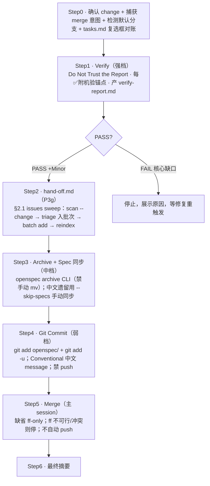
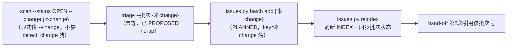

# 自制 skill 展开 · `sdflow-done`

> 属 [工作流总览](../workflow-overview.md) 的展开。这是**阶段三收尾闭环**（第 9 步）——
> 把 reconcile → **verify** → **hand-off** → archive → commit → merge 串成一条收尾流水线。
>
> **一句话**：各步独立子代理、按本步性质选 model——**verify 强档**（唯一终门），archive 中档，commit 弱档，merge 留主 session。

---

## 1. 位置与契约

| 维度 | 内容 |
|---|---|
| 谁调它 | 阶段三第 9 步；`/sdflow-ship` 判 `RUN_VERIFY` 时（透传 merge 意图） |
| 进（输入） | `{change_name}` + 实现代码 + 四件套 |
| 出（产物） | `verify-report.md` + `hand-off.md` + 归档 `archive/{date}-{change}/` + 主 specs 同步 + INDEX + commit + ff-merge |
| 关键改进（v3） | ① 归档**必须**走 `openspec archive` CLI 同步 delta 到主 specs（旧版手动 mv 漏了）；② 默认分支自动检测（勿假设 main）；③ merge 缺省执行（ff）；④ verify 必产报告；⑤ 步骤固定 + 各步独立子代理按性质选 model |

---

## 2. 内部流程（串行门禁，失败即中止）

| 步 | 目标 | 注意事项 |
|---|---|---|
| 0 | 确认 + 对账 | **勿假设 main**（`git symbolic-ref` 检测默认分支）；**复选框对账**：SDD 实现常没勾 change 自己的 tasks.md → 勾真实完成的、未完成留 `[ ]` + 说明（**别假勾过 archive**） |
| 1 · Verify | 唯一终门，判 PASS/FAIL | **P3h 禁降档**：强档 + 「Do Not Trust the Report」冷启；**每 ✅ 必附机验锚点**（测试名/commit/文件:行），无锚点降 gap；只核心缺口 FAIL，Minor 判 PASS 注明；**必产 verify-report.md** + `<!-- ship-gate: verify=PASS\|FAIL -->` 锚 |
| 2 · hand-off | 异步人类再入口 + 下个 change 种子 | verify **之后**（引其权威）/ archive **之前**（随归档留档）；三段（完成/未完成延后/下一阶段）；**不直接搬运 verify 的 ✅**（复核锚点存在性）；§2.1 sweep 先跑 |
| 3 · Archive | 归档 + delta 同步主 specs | **必用 CLI**（同步 delta + INDEX + 校验），**禁手动 mv**；中文遗留 spec → `--skip-specs` + 手动同步；**读真实代码核对每条 delta**（非照搬，审查可能改过方案） |
| 4 · Commit | 暂存 + 提交收尾变更 | `git add openspec/` + `git add -u`；Conventional 中文 message；**禁 push** |
| 5 · Merge | 缺省 ff 合并 | 缺省 `--ff-only`（勿硬编码 `--no-ff`）；ff 不可行/冲突 → 停下交用户；**不自动 push** |

### §2.1 issues sweep 子步

> **范围边界**：sweep 只圈**源==本change ∧ 非终态 ∧ 批次空**；孤儿项（源="")不归本 sweep，交独立通用清理流程兜底（Q2 保守：永远只建 1 个批次、禁跨 change 合并）。

---

## 3. Model 按本步性质（步骤固定 + 各步独立子代理）

| 步 | 性质 | 档位 | 理由 |
|---|---|---|---|
| verify | **唯一终门** + grep 代码判 PASS/FAIL | **强档** | 中档/弱档假 PASS = 放不完整活进归档；门不能省（P3h 禁降档） |
| archive | spec 同步 + 读代码核 delta | **中档** | judgment 活 |
| commit | git add + 从 diff 生成 message | **弱档** | 纯机械；失败也就重生成；独立上下文无副作用 |
| merge | 单向 git | **主 session** | 缺省执行、留主 session 可见 |

> **无运行时误分类**：步骤固定（非动态路由），写 skill 时一次定死，混用 model 无耦合。

---

## 4. 内部调度的子 skill / 子代理 / 脚本

| 被调 | 类型 | 角色 |
|---|---|---|
| verify / archive / commit 子代理 | 独立子代理（各自上下文） | 按本步性质选档；verify 冷启不信报告 |
| `openspec archive` CLI | 官方 CLI | 归档 + 同步 delta→主 specs + INDEX + 校验 |
| `buglist.py`/`todolist.py` | 脚本 | sweep 的 `scan`/`triage`（显式 `--change`） |
| `issues.py` | 脚本 | `batch add`（新建批次）/ `reindex`（重建 INDEX + 同步批次状态） |

---

## 5. 人类门

**无强制人类门**（阶段三无人类门）。唯一「停」是 verify **FAIL（核心缺口）** → 中止、展示原因、等修复重触发；以及 merge 的 ff 不可行/冲突 → 停下交用户决策。merge 缺省执行，仅当调用时**明确 opt-out**（「不要 merge」等）才跳过。

---

## 6. ★ 本 workflow 注入的规则/prompt —— 建议式 vs 强制

**统一判据**见[总览 §8](../workflow-overview.md#8-外部-skill-的注入强制性建议式-vs-强制统一规律)。sdflow-done 是**收尾闭环**，机械载体最密集（CLI、脚本、git、ship-gate 锚）。

| 项 | 类型 | 靠什么 |
|---|---|---|
| **verify=PASS/FAIL 锚** | **强制（下游门读 + 闭环）** | `ship_gate` 读此锚判 SHIPPED / VERIFY_FAIL；FAIL 不归档 |
| **归档走 openspec archive CLI** | **强制（CLI 校验）** | CLI 做 delta 同步 + INDEX + validate；手动 mv 漏 spec 会被 validate 抓 |
| **issues sweep 脚本链** | **强制（脚本）** | `scan/triage/batch add/reindex` 确定性；FIXED 门禁必带根因+证据；批次完成判据（成员≥1 且全终态） |
| **复选框对账**（勾真实完成的） | **半强制** | `openspec archive` 会警告 "N/M incomplete"（机械提示），但「诚实勾」靠子代理遵从（可假勾骗过 -y） |
| **verify 每 ✅ 附机验锚点（防假✅）** | **建议式（强框架）** | 无脚本逐条校验每个锚点真存在；靠**强档 + Do-Not-Trust 冷启**约束，禁降档是纪律。真实事故：曾把没落实的需求标 ✅ 静默放过（design §7.3.1/adr/0001） |
| **verify 强档 / archive 中档 / commit 弱档** | **建议式** | 无机制强制控制者真按档选；靠遵从 model-tiers（分类会过期=软成本） |
| **hand-off 不直接搬运 verify 的 ✅** | **建议式** | 靠主 session/子代理复核锚点存在性，无校验 |
| **merge 缺省 ff-only、不自动 push** | **半强制** | `git merge --ff-only` 本身会拒绝非快进（git 强制）；「不 push」靠遵从（prompt 禁 push） |

**结论**：sdflow-done 的**产物正确性**由机械门层层兜底——**verify 锚**（ship_gate 读、FAIL 不归档）、**archive CLI**（validate 抓漏同步）、**issues 脚本**（FIXED 门禁 + 批次判据）、**`git --ff-only`**（拒绝非快进）；而**verify 的「防假✅」本身是建议式**——没有脚本能逐条验证每个 ✅ 的锚点真成立，它靠**强档 + Do-Not-Trust 冷启 + 禁降档纪律**顶住。这是全流程去人类门后**最关键的一处「靠模型自觉」**，也是为什么 verify 铁律禁用弱档。

---

## 7. 小结

- 结构 = 对账 → verify（强档终门）→ hand-off → archive（CLI 同步）→ commit（弱档）→ merge（ff）。
- **机械兜底**：verify 锚（gate 读）、archive CLI validate、issues 脚本门禁、`git --ff-only`。
- **最关键的建议式**：verify「每 ✅ 附锚点防假✅」无脚本逐条校验——靠强档 + Do-Not-Trust + 禁降档，是去人类门后的唯一终门底线。
