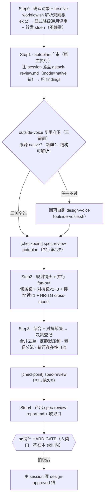

# 自制 skill 展开 · `sdflow-spec-review`

> 属 [工作流总览](../workflow-overview.md) 的展开。这是**阶段二设计审的主审编排器**（第 4 步）——
> 把 `autoplan` 广审 + 本项目多镜合成**一份** `spec-review-report.md`，交阶段二唯一人类门（设计 HARD-GATE）拍板。
>
> **一句话**：Step1 autoplan（广审，原生）→ Step2 并行多镜（领域/对抗/接地）→ Step3 对抗裁决 + 决策登记 → 一份报告。
> 取代旧「autoplan + spec-review 各出报告 + 人工手动合并」。

> **与外部黑盒的关系**：它**内部调度** [autoplan](./gstack-autoplan.md)（Step1）+ [outside-voice.sh](#4-内部调度的子-skill--子代理--脚本)（跨模型第二意见）。
> autoplan 的「建议式 vs 强制」见其文档；本文讲 **sdflow-spec-review 自身**的机械兜底与自觉纪律。

---

## 1. 位置与契约

| 维度 | 内容 |
|---|---|
| 谁调它 | 阶段二第 4 步；或 `/sdflow-ship` 的 pre-flight 之前（设计门属人类点，ship 不跨） |
| 进（输入） | `{change_dir}` 四件套（proposal/design/specs/tasks）+ 真实代码 |
| 出（产物） | `spec-review-report.md`（决策登记区 + 各镜 findings + 裁决）；`gstack-review.md`（autoplan 落盘）；design/specs 改动标 `[spec-review-amendment]`；拍板后写 `<!-- ship-gate: design-approved -->` 锚 |
| 两条连续性铁律 | **G1** 不依赖 `/clear`（独立性靠子代理 fresh 上下文）；**G2** 中途不 AskUserQuestion（决策登记进报告，设计门一次拍板） |

---

## 2. 内部流程

| 步 | 目标 | 注意事项 |
|---|---|---|
| 0 | 确认对象 + 解析规则根 | `resolve-workflow.sh` exit2 → **显式降级 + 转发 stderr**，绝不静默当「本项目无此层」 |
| 1 | autoplan 广审、吃 findings | **原生执行**（指令进主 session，禁派子代理转述）；主 session 汇总落盘 `gstack-review.md` 写 `mode="native"` 锚 + 侧信道佐证；**串行纪律 T20**：MUST 待本步 checkpoint 完成才 fan-out |
| 1·守卫 | 复用还是自跑 outside-voice | 三前置：①来源（simulated 视同无效）②新鲜度（早于最新改动视同缺失）③结构（解析不出 codex 段/0 条）。任一不过 → 打印原因码 + 回落自跑 design-voice |
| 2 | 规划并 fan-out 多镜 | **防重叠 1.4**：autoplan 已含 eng 镜 → 领域镜**不重复跑 eng**；HR-TG 命中单开领域 cross-model，写 v1 锚行 |
| 3 | 对抗裁决 + 决策登记 | **反静默压制**（Q3）：裁掉的 finding 连理由进「已裁掉」区；**置信分流**：高采信/中标需确认/低仍上抛一行，**不照搬 <80 数值一刀切**（设计漏掉代价高，优化召回）；**锚行存在性自检**：grep 三类 v1 锚缺失即报错阻塞 |
| 4 | 出报告 + 拍板回写 | 拍板**发生后**主 session 立即写 `<!-- ship-gate: design-approved -->`（ship pre-flight 唯一机判依据） |

**决策登记区**：`[自动决策]`（默认接受可覆盖）/ `[需拍板]`（≥2 方案或核验不了的事实）/ `[已裁掉]`（原始发现 + 裁掉理由）/ `TENSION`（voice 与主审分歧，两方视角 + 推荐 + 后果）。

---

## 3. 镜头规划 + model

| 镜 | 数量 | 干什么 | 档位 |
|---|---|---|---|
| 主 session | 1 | 协调 / 对抗裁决 / 决策登记 / 出报告 | **强档**（门禁，弱档=假绿） |
| 领域镜 | 每命中领域 1 | 过 `spec-checklists/domains/<栈>` R 项 | 中档 |
| 对抗镜 | 2~3（高风险 3） | 各从一角度「证明 spec 实现期会爆」（隐藏假设/失败模式/乐观边界） | 中档 |
| 接地镜 | 1 | grep/读真实代码核验 spec 里所有代码事实 | 弱档 |

---

## 4. 内部调度的子 skill / 子代理 / 脚本

| 被调 | 类型 | 角色 / 契约 |
|---|---|---|
| [`autoplan`](./gstack-autoplan.md) | 原生执行（进主 session） | Step1 广审；其 eng 镜与本 skill 多镜不重复 |
| 领域/对抗/接地镜 | fresh-context 子代理 | 一条消息内全部派出，返回结构化 findings（问题/证据 file:line/置信/严重度/建议），**禁 AskUserQuestion** |
| `outside-voice.sh` | 确定性脚本（退出码契约） | preflight `ready`→codex；exit0=findings（runner=codex）、exit124→fallback、exit3→拒发不 fallback（密钥）；畸形/非零→claude-fallback（只读子代理） |
| `resolve-workflow.sh` | 脚本 | 解析规则根（本地 pin 或全局 canonical）；不硬编码 `openspec/workflow/` |
| `checkpoint-commit.sh` | 脚本 | 步末过场提交（P2c 两次） |

---

## 5. 人类门

**全流程唯一人类门在本 skill 之后**——设计 HARD-GATE（用户过一份报告拍板）。本 skill 内部**中途不 AskUserQuestion**（G2）：撞到 ≥2 方案/核验不了的事实 → 写进决策登记区，继续跑完。人工设计门时一次性摊开选项 + 推荐 + 两方后果拍板。

---

## 6. ★ 本 workflow 注入的规则/prompt —— 建议式 vs 强制

**统一判据**见[总览 §8](../workflow-overview.md#8-外部-skill-的注入强制性建议式-vs-强制统一规律)。sdflow-spec-review 自己**既是被 workflow 约束的对象、又是往子镜注入的编排者**。它比外部 skill 多一层**机械兜底**（锚行自检、ship-gate 锚、checkpoint 脚本）。

| 项 | 类型 | 靠什么 |
|---|---|---|
| **锚行存在性自检**（Step3 grep 三类 v1 锚缺失即报错阻塞） | **强制（本 skill 内机械门）** | Step3 机械 grep，缺失即本步报错——机械失职拦截，非人类门 |
| **拍板回写 design-approved 锚** | **强制（下游门读）** | `ship_gate` pre-flight 读此锚放行阶段三；不写=REFUSE_START |
| **outside-voice.sh 调用契约** | **强制（退出码脚本）** | preflight/exec/exit 码确定性分支；密钥 exit3 拒发 |
| checkpoint 提交（P2c ×2） | **强制（脚本）** | `checkpoint-commit.sh` 固定 Conventional message |
| 「autoplan 原生执行、不派子代理转述」 | **半强制** | 报告写 `mode="native"` 锚 + 侧信道佐证；靠锚 + 主 session 遵从，非纯脚本 |
| **反静默压制**（escalate-not-drop） | **建议式（自觉纪律）** | 无脚本校验每条裁掉的都留了理由；靠主 session 遵从 SKILL.md 铁律 |
| **对抗裁决 / 置信分流 / 决策登记** | **建议式** | 强档主 session 判断，无机械校验；「不照搬 <80」也是纪律 |
| **model 档位选择**（主 session 强档等） | **建议式** | 无机制强制控制者真用强档；靠遵从 model-tiers |
| 防重叠 1.4 / 串行纪律 T20 | **建议式** | 靠主 session 遵从（T20 若历史并行，报告须注明——补偿式纪律） |

**结论**：sdflow-spec-review 的**流程完整性**由三道机械门兜底——**锚行自检**（漏跑某镜/outside-voice 会被 grep 抓）、**ship-gate 锚**（不拍板不放行）、**checkpoint 脚本**；而**判断质量**（对抗裁决、反静默压制、置信分流、防重叠）是**自觉纪律**，靠强档主 session + SKILL.md 铁律，无逐条机械校验。这是刻意分工：**机械的交脚本焊死，判断的交强模型 + 下游门兜底**。

---

## 7. 小结

- 结构 = autoplan 广审 + 多镜 fan-out + 对抗裁决 → 一份报告 → 设计门拍板。
- **机械兜底**：锚行存在性自检、design-approved 锚（下游 gate 读）、outside-voice.sh 退出码、checkpoint 脚本。
- **自觉纪律**：反静默压制、对抗裁决、置信分流、防重叠、model 档位——靠强档主 session，无逐条校验。
