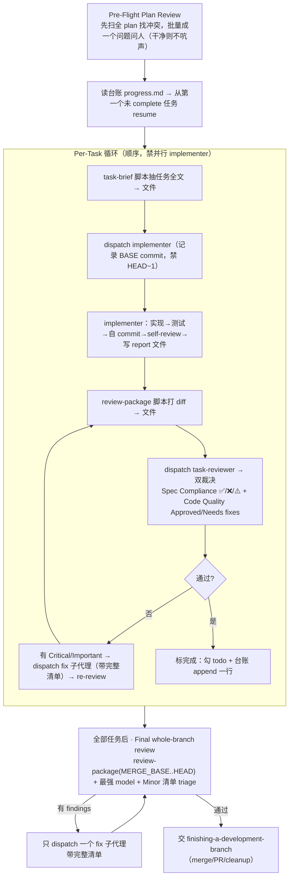
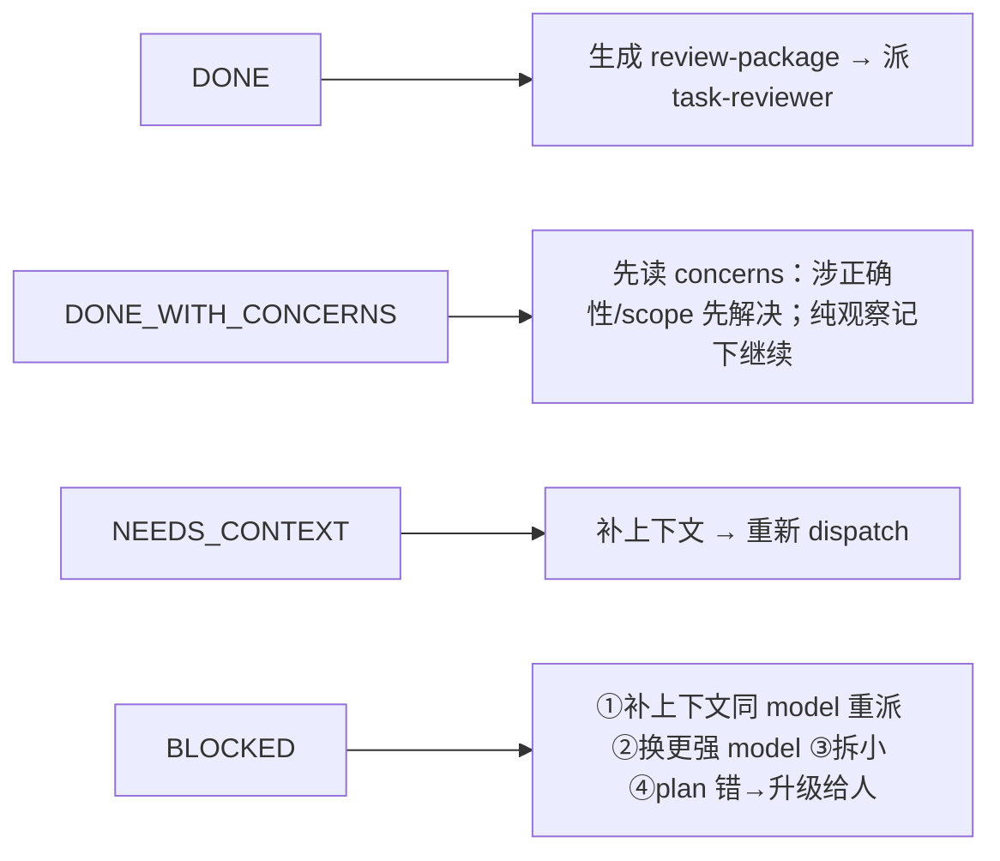
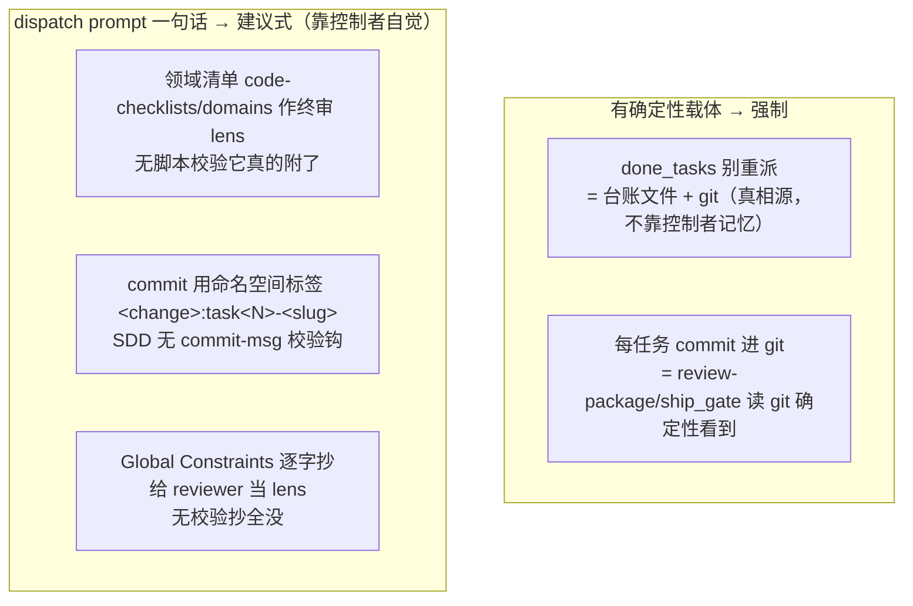

# 外部 skill 展开 · superpowers `subagent-driven-development`（SDD）

> 属 [工作流总览](../workflow-overview.md) 的黑盒展开。SDD 是**阶段三**的第 7 步——
> 由 `writing-plans` 收尾交接、`/sdflow-ship` 的 `RUN_PLAN`/`CONTINUE_IMPL` 链驱动，逐任务把 plan 实现出来。
>
> **一句话**：`Fresh subagent per task + task review（spec + quality）+ broad final review = 高质量、快迭代`。
> 控制者（主 session）只做协调与 curate 上下文，把大块产物以**文件**交接，**绝不让子代理继承 session 历史**。

---

## 1. 在本 workflow 中的位置与契约

| 维度 | 内容 |
|---|---|
| 谁调它 | `writing-plans` 的 Execution Handoff 交接；`/sdflow-ship` 的 `RUN_PLAN`（新起）/ `CONTINUE_IMPL`（传 `done_tasks` 续跑，勿重派） |
| 进（输入） | 一份 `superpowers-plan.md`（带编号 Task + Global Constraints 段） |
| 出（产物） | 分任务的一串 git commits（每任务 implementer 自 commit）+ 台账 `.superpowers/sdd/progress.md` + 终审通过后交 `finishing-a-development-branch` |
| 前置纪律 | 隔离工作区（`using-git-worktrees`）；**禁**未经用户同意在 main/master 开工；**任务间不停下问人**（连续执行） |

---

## 2. 内部主循环

| 环节 | 目标 | 注意事项 |
|---|---|---|
| Pre-Flight | 跑前扫 plan 冲突 | 任务间/与 Global Constraints 矛盾、plan 强制但 rubric 视为缺陷的 → **批量一次问人**，别边跑边打断 |
| task-brief | 任务原文不经控制者上下文 | 精确值（数字/魔法串/签名/测试用例）**只在 brief 里** |
| implementer dispatch | 构造最小充分上下文 | dispatch 五要素：定位一行 + brief 路径 + 前序接口 + 歧义裁定 + report 契约；**记 BASE commit** |
| implementer 干活 | 实现 exactly 规格 | 写测试(TDD)→自 commit→self-review 四维自查（completeness/quality/YAGNI/testing） |
| task-reviewer | 一个任务的冷审 | **双裁决**（Spec Compliance + Code Quality）；「Do Not Trust the Report」；不重跑 implementer 已跑测试 |
| ⚠️ 项 | reviewer「无法从 diff 验证」的 | **控制者自己逐条解决**（握跨任务上下文）；确认真缺口 → 当 spec 审失败退回 |
| fix + re-review | 修 Critical/Important | fix 子代理带**完整清单**、re-run 覆盖测试；Minor 记台账指给终审 |
| Final review | 整分支广审 | **最强 model**；plan alignment/架构/production readiness；有 findings → **只一个** fix 子代理带完整清单 |

---

## 3. 派的子代理 / 角色

| 角色 | 模版 / model | 输入（文件交接） | 职责 | 产出 |
|---|---|---|---|---|
| **implementer** | `implementer-prompt.md` / 按复杂度选（机械→cheap） | BRIEF + 场景 + 前序接口 + REPORT 路径 | 实现、测试、**自 commit**、self-review | commits + REPORT 全文 + ≤15 行摘要 |
| **task-reviewer** | `task-reviewer-prompt.md` / mid-tier 起 | BRIEF + REPORT + DIFF(package) + 逐字 Global Constraints | 冷审一个任务的 diff | 双裁决（Spec + Quality） |
| **fix 子代理** | 走 implementer 契约 | 完整 findings + 被点名的覆盖测试 | 修 Critical/Important、re-run 测试 | fix report（含命令+输出）append 进同一 REPORT |
| **final code-reviewer** | `requesting-code-review/code-reviewer.md` / **最强 model** | 整分支 package + plan + Minor 清单 | 全分支广审 | Strengths + Issues + `Ready to merge? Yes/No/With fixes` |

**Red Flags（禁）**：并行 dispatch 多 implementer（冲突）；让子代理读整份 plan（给 brief）；self-review 替代真实 review；接受缺任一裁决的 review。

---

## 4. 状态 / 进度机制（对抗 compaction）

**台账 `.superpowers/sdd/progress.md`**（`sdd-workspace` 脚本兜底建目录 + 自忽略）——**对抗 context compaction** 的核心：
- 「对话记忆熬不过 compaction……丢了位置的控制者曾重派整段已完成任务序列——观测到的最贵失败。」
- **resume**：启动先 `cat` 台账，标 complete 的是 DONE 不重派，从第一个未 complete 处续跑；「compaction 后信台账和 `git log`，别信自己的记忆」。

**四种 implementer status**：

> `Never` 忽略升级、`Never` 无改动就同 model 硬重试。

---

## 5. Model 选择（各角色按复杂度，必须显式指定）

| 角色/任务 | 档位 |
|---|---|
| 机械实现（孤立函数、清晰规格、1-2 文件；或 plan 已含完整代码=转写） | cheap |
| 集成/判断（多文件协调、模式匹配、调试） | standard |
| 架构/设计 + **final whole-branch 终审** | most capable |
| review 任务 | 按 diff 大小/复杂度/风险配同等判断力 |

> **必须显式指定 model**：省略会继承 session model（往往最贵最强），静默废掉本节。**Turn count beats token price**——最便宜的模型常多花 2-3× turn，反更贵；reviewer 与「读散文实现」的 implementer 以 mid-tier 为底。

---

## 6. ★ 本 workflow 注入的规则/prompt 如何影响 SDD —— 建议式 vs 强制

**统一判据**见[总览 §注入的强制性](../workflow-overview.md#8-外部-skill-的注入强制性建议式-vs-强制统一规律)。SDD 的设计哲学正是**把关键状态外化成文件/git**（对抗 compaction），**判断类纪律留给控制者模型**——于是注入项精确地落到两类：

| 注入项 | 建议式 / 强制 | 靠什么 |
|---|---|---|
| 「`done_tasks` 已完成集别重派」 | **强制** | 台账文件 `.superpowers/sdd/progress.md` + git = 确定性载体，resume 读文件不靠记忆 |
| 「每任务 commit 进 git」 | **强制** | implementer 契约自 commit；review-package 靠 `git log/diff BASE..HEAD` 读；commit 存 git → 下游门确定性看到 |
| 「final 终审附 `code-checklists/domains/<栈>` 作 review lens」（注入点 B） | **建议式** | 无脚本强制终审 dispatch 携带某清单——lens 由控制者手填进 prompt 文本，漏填=静默丢。**下游兜底**：事后 `sdflow-code-review` 每次全跑独立主审（注入点 B 漏了它补——两层并存不是重复） |
| 「commit 用命名空间标签 `<change>:task<N>-<slug>`」 | **SDD 内建议式** | SDD 无 commit-msg 校验；靠控制者写进 dispatch + implementer 遵守。**下游强制**：`ship_gate` 读 git 的标签作完成判据 → 写错就卡 gate 循环 |
| 「Global Constraints 逐字抄给 reviewer」 | **建议式** | 最重的纪律，但**无校验**抄全没；只有 SKILL.md 大量 stop-words 自查提示降低违背概率 |

**评审 prompt 构造纪律（都属建议式，靠控制者遵从）**：禁开放式指令、禁重跑已跑测试、**禁 pre-judge findings**（「若你写的 prompt 含 'do not flag'/'at most Minor'/'the plan chose' → stop」）、diff 以文件交接（禁 `HEAD~1`）、dispatch 只描述一个任务（禁贴历史）。

**结论**：一句话区分——**文件（台账/report/diff package）+ 进 git 的 commit = 有确定性载体 = 强制**；**dispatch prompt 里的自然语言指令（附清单、打标签、抄约束、别 pre-judge）= 无载体、无校验 = 建议式**。外部若要让某要求**强制**，必须给它一个确定性载体（台账条目、脚本、或**读 git 的外部门禁如 ship_gate**）——仅在注入 prompt 里写一句不足以保证执行。这也正是本 workflow 把 `ship_gate` 放在 SDD 下游读 git 的根本原因。

---

## 7. 小结

- SDD = **逐任务 fresh 实现 + 双裁决审 + fix 闭环 + 整支终审**，状态外化进台账/git 对抗 compaction。
- 注入分两类：**有确定性载体的（done_tasks、commit 进 git）= 强制**；**dispatch 一句话的（域清单 lens、命名空间标签、逐字约束）= 建议式**。
- 建议式项的强制性由**下游**补：注入点 B 漏 → `sdflow-code-review` 独立主审兜；命名空间标签写错 → `ship_gate` 读 git 卡住循环。
