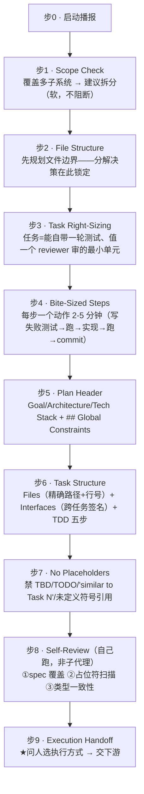

# 外部 skill 展开 · superpowers `writing-plans`

> 属 [工作流总览](../workflow-overview.md) 的黑盒展开。`writing-plans` 是**阶段三**的第 6 步——
> 把 design + 评审结论拆成原子任务 TDD 计划 `superpowers-plan.md`，随后交 `subagent-driven-development` 执行。
>
> **一句话**：把一份 spec 拆成「假设执行工程师对本代码库零上下文、且品味存疑」的、逐步到 **2-5 分钟原子步**的实现计划，
> 落成一个 Markdown plan 文件。

> ⚠️ **一句最关键的定性**：writing-plans 是**纯文本产物生成器**——它有三道「自觉性护栏」
> （No Placeholders 红线、Self-Review 三查、可选低敏 reviewer），但**没有任何一道是机械校验**。
> 注入的要求 = 注入的文字，落没落、格式对不对，最终**全押在模型自觉**上。

---

## 1. 在本 workflow 中的位置与契约

| 维度 | 内容 |
|---|---|
| 谁调它 | `/sdflow-ship` 判定 `RUN_PLAN` 时（阶段三 · 实现），派发 args 触发 |
| 进（输入） | 一份 spec / design + 评审结论（若覆盖多子系统，应在 brainstorming 已拆成 sub-project spec） |
| 出（产物） | 一个 plan Markdown → `docs/superpowers/plans/YYYY-MM-DD-<feature>.md`（用户偏好可覆盖路径；本 workflow 用 `{change_dir}/superpowers-plan.md`） |
| 启动播报 | 强制：「I'm using the writing-plans skill to create the implementation plan.」 |
| 收尾 | Execution Handoff（人类门）→ 交 `subagent-driven-development`（推荐）或 `executing-plans` |

---

## 2. 内部流程

| 步 | 目标 | 注意事项 |
|---|---|---|
| 1 · Scope Check | 确认 spec 是单子系统量级 | 多子系统 → **建议**拆分（不强制停） |
| 2 · File Structure | 定任务前先划文件边界 | 一文件一职责、变一起的放一起、跟既有模式、prefer 小而聚焦 |
| 3 · Task Right-Sizing | 定任务粒度 | 锚点 = 「reviewer 能否独立否掉这个任务而放过邻居」；把 setup/scaffold/doc 折进需要它的任务 |
| 4 · Bite-Sized | 每步单动作 | TDD red-green + commit 拆成 5 个独立 checkbox 步 |
| 5 · Header | 固定头 + Global Constraints | 头含 REQUIRED SUB-SKILL 引导 + checkbox 语法说明 |
| 6 · Task Structure | 每任务固定模板 | **Interfaces 块是跨任务传签名/类型的唯一通道**（implementer 只看自己任务）；每步含实际代码块 + 命令 + Expected |
| 7 · No Placeholders | 每步有实际内容 | 「Similar to Task N」也禁（工程师可能乱序读）；code 步必须有代码块 |
| 8 · Self-Review | 写完自查 | **是模型自查、非子代理**；只查 spec 覆盖/占位符/类型一致三项；「fix and move on」不问人 |

---

## 3. 内部调度：plan-document-reviewer（可选/配套）

**重要张力**：SKILL.md 正文**没有任何一处 dispatch 这个 reviewer**——写完后的检查明写「is a checklist **you run yourself** — not a subagent dispatch」。`plan-document-reviewer-prompt.md` 是一个**独立配套模板**，若派发才用。

| 若派发 | 内容 |
|---|---|
| 类型 | `general-purpose` 子代理，输入 `[PLAN_FILE_PATH]` + `[SPEC_FILE_PATH]` |
| 审四轴 | Completeness / Spec Alignment / Task Decomposition / Buildability |
| **校准（关键）** | **刻意压低敏感度**：「Minor wording, stylistic preferences, 'nice to have' 都**不算** issue」「**Approve unless serious gaps**」 |
| 产出 | `Status: Approved \| Issues Found` + 带定位的 Issues + 不阻断的 Recommendations |

> 因为 reviewer 被刻意调低敏感度 → 即便派了，它也**不会**因「commit 格式串没按注入要求写」「领域清单没作 review lens」这类而 block（这些正落在它被要求忽略的 wording/nice-to-have 区间）。

---

## 4. 人类门

| 点 | 性质 |
|---|---|
| **Execution Handoff** —— 执行方式二选一（Subagent-Driven 推荐 / Inline Execution） | **硬人类门**（存 plan 后必问） |
| Scope Check 拆分建议 | 软点，不阻断 |

> 注：writing-plans **不含** pre-flight 批量提问机制（那属下游执行 skill）；Self-Review 也是「fix and move on」不问人。
> 在本 workflow 阶段三无人类门的语境下，Execution Handoff 的「选执行方式」被固定为 Subagent-Driven（由 `/sdflow-ship` 的 `RUN_PLAN → writing-plans → subagent-dev` 链固化），不再实际弹问。

---

## 5. Global Constraints 机制（本 workflow 强依赖它）

Header 模板要求：把 spec 的 project-wide 要求（版本下限、依赖上限、命名/文案规则、平台要求）**每条一行、精确值逐字照抄（copied verbatim）**进 `## Global Constraints`；核心句——「**Every task's requirements implicitly include this section.**」（每个任务不重复写，但语义上默认叠加）。

> 这是**纯文本约定**：靠下游 executor 读 header 时自觉带上，SKILL **不提供任何机械注入/校验**保证每个任务真的遵守了它。

---

## 6. ★ 本 workflow 注入的规则/prompt 如何影响 writing-plans —— 建议式 vs 强制

**统一判据**见[总览 §注入的强制性](../workflow-overview.md#8-外部-skill-的注入强制性建议式-vs-强制统一规律)。writing-plans **零机械校验**，所以本 workflow 对它的注入**全部建议式**——真正的强制**必须在 writing-plans 之外**（下游 ship_gate 读 git、SDD 台账）。

| 注入项（来自 /sdflow-ship RUN_PLAN 派发 args） | 注入方式 | 建议式 / 强制 | 靠什么（关键：强制发生在下游） |
|---|---|---|---|
| 「每任务 commit 步写 `checkpoint-commit.sh <change>:task<N>-<slug>`」 | 写进 plan Step5 | **writing-plans 内建议式** | commit 步本是模板固定步 + No Placeholders 逼真命令 → 落地概率高；但**精确格式串无机械兜底**。**下游强制**：`ship_gate` 读 git 的命名空间 checkpoint 标签作**完成判据主锚**——plan 没写对 / implementer 没执行对 → gate 判 `CONTINUE_IMPL`/`UNKNOWN` **不放行** |
| 「design 领域约束逐字进 Global Constraints」 | 写进 plan header | **建议式** | 与原生「copied verbatim」同向叠加 → 大概率照做；但**无校验**，漏抄不会被抓 |
| 「final 终审附 `code-checklists/domains/<栈>` 作 review lens」 | prompt 注入 | **建议式，且无原生挂载点** | writing-plans 正文根本没有「final 终审」环节 → 这条其实属**下游 SDD 的注入点 B**（见 [subagent-dev 文档](./superpowers-subagent-dev.md#6-本-workflow-注入的规则prompt-如何影响-sdd--建议式-vs-强制)）；在 writing-plans 层完全不受保障 |

**三道自觉性护栏**（提高落地概率，但都非机械校验）：`No Placeholders`（逼真命令而非「commit here」）、`Self-Review` 三查（只覆盖 spec 覆盖/占位符/类型一致，**不查注入的自定义格式**）、低敏 reviewer（只抓 serious gaps，忽略 wording）。

**结论**：writing-plans 把一切变成 plan 里的文字，**注入要求 = 注入文字**；落没落全押模型自觉。本 workflow 之所以敢依赖 checkpoint 命名空间标签，**不是因为 writing-plans 保证写对**，而是因为**下游 `ship_gate` 读 git 会兜底**——写错就卡在 gate、循环重跑，直到标签正确出现。**注入处建议式，下游门处强制**。

---

## 7. 小结

- writing-plans = **纯文本 plan 生成器**，三道自觉护栏、**零机械校验**。
- 唯一硬人类门是 Execution Handoff（本 workflow 里被链固化为 Subagent-Driven）。
- 我们对它的注入**全建议式**；checkpoint 标签的强制性来自**下游 ship_gate 读 git**，不来自 writing-plans 本身。
