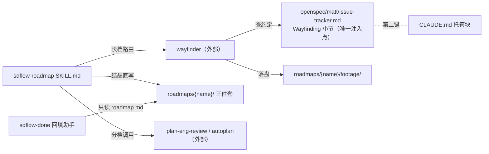
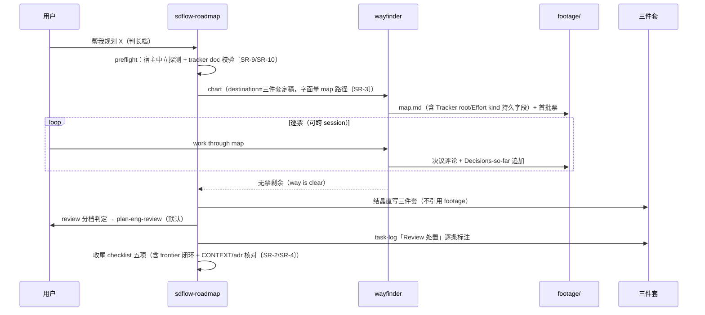
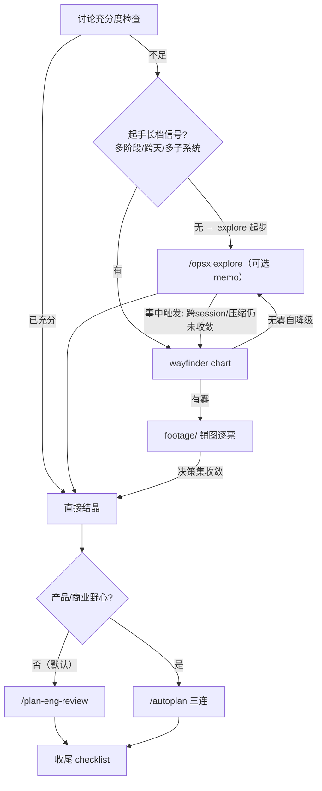

# Design: rebuild-sdflow-roadmap-v2

## Context

sdflow-roadmap 现行形态（五阶段：讨论 → 开 `plan-{topic}` change 壳 → 产四件套 → autoplan 三连审 → 归档）在两个真实案例上实测：壳产物 52/55 行 vs 文档包 1333 行；requirements.md 在全部归档中零实施引用（仅 plan change 自身 tasks 勾选项与 1 条导航行）；design.md 被实施 change 引为「整体架构/立论权威源」9 处；脚本侧仅 `roadmap_writeback_draft.py:349` 读 `roadmap.md`、`:276` 产 task-log 完成总结骨架，**零处读 requirements.md**（已 grep 核验）。2026-07-10 探索会（三个接地调研代理 + 主 session 亲验）拍板本次重构方向；wayfinder 侧的落盘约定注入点已亲验为 `openspec/matt/issue-tracker.md:22-31` 单点。

## Goals / Non-Goals

**Goals：**

- 三件套（design/roadmap/task-log）取代四件套，PRD 角色降为 design.md 伸缩头部章
- roadmap 文档包产出去 change 壳，recorder 式直写
- 长讨论由 wayfinder 承载（footage/ 落盘），memo 降级为短档可选
- roadmap.md 近细远雾；review 按野心分档
- 存量两包迁移 + 全仓「四件套」表述同步

**Non-Goals：** 见 proposal.md Non-Goals（5 条，各附可证伪假设）——wayfinder→ff 衔接契约（T126/T127）、wayfinding 机械校验、回填助手改动、recorder 后端可插拔、产品型展开段深化。

## Decisions（决策记录，TG-23）

### D1 · 合并方向：requirements 并入 design（三件套），而非反向或二件套

- **候选**：A 保持四件套；B requirements 并入 design（选中）；C 全并入 roadmap.md（二件套）。
- **理由**：消费侧不对称是决定性证据——design.md 有 9 处归档实质引用（如 `archive/2026-07-07-mlh-p1-issues-sweep/design.md:3`「整体架构/立论权威源」），文件名保留则引用零断链；requirements.md 零实施消费者。**证据 scope 修正〔spec-review-amendment SR-1〕**：「零消费」仅在**本仓**成立（n=2 工作流型自相似样本）——接地镜跨仓实测：skill 全局 symlink 分发下消费仓存在 8+ 存量四件套包，且有实质消费实锤（zhws_ops_api 归档 staff-review-report.md:62 对 requirements.md 判 stale 并行动；10-michi `specs/ppt-standardization-roadmap/spec.md:16` 有 MUST 场景要求四文件存在）。故 BREAKING 作用域限定为**仅新产出**：存量包（本仓两个之外的一切消费仓包）冻结在四件套合法形态、skill 续跑必须兼容（见 specs R1 兼容 Scenario）；本仓两包迁移仍执行（P2）。review 分档默认值同样来自偏斜样本（消费仓含产品型 roadmap）——试点期观察，单审若漏产品盲区再升轴（登记 Q-B）。C 会把稳定考古层（决策档案）和高频进度层（阶段状态）搅进同一 diff，且 roadmap.md 已是最长活文档。requirements 迁移按**全节清点表**处置〔grill-amendment Q3：原「两块载重+Non-Goals」清单漏 §2 核心需求表（wco 的 R1-R4 表定义三腿结构，load-bearing 单一源）与 §4 受众/§6 参考〕——逐节标注 并入 / 已被吸收（注明吸收处）/ 弃置（git 史兜底）；预标去向：§1.3 愿景、§2 核心需求表、§3 Non-Goals、§5 验收总纲 → 并入 design 头部章；§4 受众 → 一句带过并入头部章首段；mlh §6 参考 → 实施时按内容判。原则：**默认并入，确认已被吸收才弃，弃必记去向**。包内节级引用一次修补。
- **三镜与主次**：系统镜——单一源块从 4 处降 ≤2 处，漂移面收窄（mlh-p2 F8 类矛盾的结构性消除）；用户镜——写作与收口更新省一个文件的同步；开发循环镜——一次性文本修补（SKILL.md:4,48,138,182,211,222,265,277,340 + 4 份模板导航块 + 3 处仓级表述，全部已 grep 穷举）。**主判定：系统镜为主**——同步面收窄是实证痛点的直接根治，迁移成本一次性且可穷举。

### D2 · 去 change 壳：recorder 式直写

- **候选**：A 保壳（现状规则 4）；B 直写（选中）。
- **理由**：壳的四项收益逐项落空——归档快照≈0（文档包本就长期留存）、verify 对纯文档近空转（SKILL.md 自认 verify 不查内容质量）、review 处置载体本就在 task-log.md、retro 度量损失已由用户明示不在意。直写先例已立：buglist/todolist/issues 三 recorder 直写 `openspec/issues/`。roadmap 文档包性质 = 长期活文档（issues 池同类），非一次交付即冻结的 change 交付物。
- **软门迁移**：「review 处置完才算完」从 archive 时刻移到 skill 收尾 checklist——两个世界均无机械门（verify 不扫处置小节），载体与强度不变，仅触发时机前移。
- **主判定：用户循环镜为主**——去掉的是纯仪式（开壳/verify/archive 三步），系统性损失经逐项核查为零或已被接受。

### D3 · footage 落盘：tracker doc 条件分流（方案 B）+ 调用语辅助（C 兜底）

- **候选**：A 全局改（Wayfinding 约定整体迁 roadmaps/）；B 条件分流（选中）；C 仅调用时注入路径。
- **理由**：B 用 wayfinder 自己设计的唯一注入点（`openspec/matt/issue-tracker.md` Wayfinding 小节，wayfinder/SKILL.md:25 明示查此处），单文件改动生效；票号 NN 本就 per-effort 作用域（issue-tracker.md:10,27）、frontier 本就只扫本 effort `issues/`（:29）、map 标签在本地 tracker 为「文件名即 map.md」——重定向零机制破坏。A 会迫使非 roadmap 讨论也进 roadmaps/ 污染目录契约；C 违背 wayfinder 设计（后续 work-through session 只带 map 路径调起时读 tracker doc 会得到不一致约定）。C 作辅助：sdflow-roadmap 发起 effort 时在调用语顺带声明 map 路径，双保险但以 tracker doc 为准。
- **主判定：系统镜为主**——注入点唯一性是这个方案成立的结构性理由，其余两案都制造第二真相源或路径不一致。
- **身份持久化补强〔spec-review-amendment SR-3〕**：「隶属声明/skill 发起」两个信号都不跨 session 存活——落地为三件：①调用语钉死**字面量**（kebab-case 名 + 完整 map 路径，非语义描述）；②map.md 头部持久化 `Tracker root:` / `Effort kind: roadmap` 字段，续跑一律从 map 字段派生路径（防双根分裂）；③wayfinder 命名步只精化表述、slug 由 sdflow-roadmap 先定（防命名权竞争）。codex 曾提「包内自声明替代 tracker doc」——机制不可达（wayfinder 只读 tracker doc），但其精神已被 map 持久字段吸收（首次落点靠 tracker doc 分流，之后身份活在包内 map）。

### D4 · 长讨论引擎：直接依赖 wayfinder（不做「借形不借体」平行实现）

- **候选**：A 直接调用 matt 套件（选中）；B 抄 map/fog-of-war 形态做 sdflow 自有轻量版。
- **理由**：用户已拍板依赖无问题（workflow 本就依赖 grill-with-docs → grilling/domain-modeling 同源）；B 需永久维护一份平行实现，违背单一源纪律。wayfinder 内建自降级（chart 第 2 步无雾即停）天然接住小讨论误入。域文档层已对齐（matt domain.md 与 grill 共用 `openspec/CONTEXT.md` + `openspec/adr/`），衔接零额外工作。
- **主判定：开发循环镜为主**——不养平行实现是长期维护成本的决定项。
- **共享真相源写入纪律〔spec-review-amendment SR-4〕**：路径对齐 ≠ 写入时机无险——wayfinder chart 硬性调用 grilling+domain-modeling，后者的协议是「术语/ADR 当场写入」，而 roadmap 讨论期决策**尚未定稿**（adr/0010 中途被推翻即先例）。约束两条：①wayfinder 票内 domain-modeling 调用 SHALL 声明「roadmap 探索期，决策未定稿」语境；②收尾 checklist 第⑤项强制核对讨论期 CONTEXT.md/adr 增量与终稿一致性（见 specs R6）。演练（任务 4.1）同理先记基线 diff、收尾 revert 演练噪声。

### D5 · review 分档：默认 plan-eng-review 单跑

- **候选**：A 默认 autoplan 三连（现状）；B 默认 eng 单跑、野心才三连（选中）。
- **理由**：现状 SKILL.md 已承认「纯技术重构无产品野心 → CEO review 可跳」「简单项目 → 单跑 eng」；本仓两个真实 roadmap 均为工作流型，三连审的 CEO/design 轴基本空转。分档判据可观察（外部用户/变现/获客信号）。风险（单审漏产品盲区）由消费期实施 change 的 spec-review 兜底，成本后移可接受（见 proposal 假设 3）。
- **主判定：用户循环镜为主**——review 是流程中最重的 token/时间项，分档直接砍默认成本至 1/3。

### D6 · memo 降级：footage 取代长档 memo，短档 memo 可选保留（包根落位不动）

- **理由**：memo 策略表的存在动机（讨论过程对抗 compaction）被 footage 结构性解决——map+tickets 就是持久化的结构化 footage，且有 Decisions-so-far 索引，优于线性 memo。短档讨论（单 session）无跨 session 风险，memo 保留为可选（不写则 design 决策章写厚，现状规则不变）。
- **落位拍板〔grill-amendment Q2〕**：memo 保持包根 `memo.md` 既有落位、不迁入 footage/（曾候选 B「物理统一考古层」，用户拍板保守不动：memo 是 sdflow-roadmap 自家产物、footage 一词亦源自本 skill SKILL.md:50 血统类比——调研核实 matt 套件零 memo 概念，迁移虽不触套件行为，但既有落位无迁移必要）。规则 3 措辞相应写实为**两段式**：「三件套不引用 `footage/`，也不引用包根 `memo.md`」——考古层语义统一、物理位置各安其位。

### D7 · 近细远雾：roadmap.md 阶段分层

- **理由**：实证——mlh roadmap.md 六阶段全写满五节（254 行），task-log.md:86 记录 adr/0010 判据中途被目标态复核推翻；远期细节写得越满、推翻时废稿越多。fog-of-war 判据（「能否现在精确表述」而非「能否回答」）来自 wayfinder/SKILL.md:88，已在 matt 调研可借鉴机制表列为第 1 条。补细时机 = 前序阶段全交付、该阶段进入待实施（spec Scenario 已定义）。
- **与回填助手的相容性**：`roadmap_writeback_draft.py` 按 adr/0015 适配现状散文、仅按 `assoc["roadmap"]` 定位 `roadmap.md`（:349）生成草稿供人确认——远期阶段薄写不影响其读点（回填只发生在已实施阶段，那些必然已补全五节）。

## 组件清单与依赖图（BASE-25，TG-14）

| 组件 | 角色 | 本次变更 |
|---|---|---|
| `sdflow-roadmap/SKILL.md` | 规划工作流编排指令 | 主体重写（三件套/直写/分档/footage/近细远雾/收尾 checklist） |
| `sdflow-roadmap/references/` | 模板骨架（6 → 5 个，接地镜实数修正：含 long-flow-skill-paradigm.md〔spec-review-amendment SR-19〕） | 删 requirements-template；design-template 加头部章（不占编号序列，含验收门槛槽）；余者导航块与注释更新（含 long-flow-skill-paradigm.md 表述复核） |
| `openspec/matt/issue-tracker.md` | wayfinder 落盘约定唯一注入点 | Wayfinding 小节条件分流 + 双语标题 |
| CLAUDE.md Agent skills 托管块 + :79 段 | 约定双锚〔grill-amendment Q4〕 | 块内补 footage 一句（就近可见，重跑同批覆盖）；:79 段重写携结构性锚（块外，setup 重跑碰不到） |
| wayfinder / grilling / domain-modeling（外部） | 长讨论引擎 | 零改动，运行时依赖 |
| plan-eng-review / autoplan（外部 gstack） | 内容质量 review | 零改动，调用推荐变化（adr/0002 边界内） |
| `roadmap_writeback_draft.py`（sdflow-done） | 回填草稿助手 | **零改动**（读点已核不含 requirements.md） |
| 存量两 roadmap 包 | 长期真相源实例 | requirements 并入 design + 引用修补 |

## 序列图：长档端到端（TG-10）

## 分档路由决策图（TG-12）

> 分档判据为双通道（起手显性信号 / 事中触发），MUST NOT 依赖事前轮数预估——「>30 轮」类数字判据已删〔grill-amendment：对齐 spec-workflow F11 证伪结论〕。误判大盘的兜底 = wayfinder 无雾自降级。

## 失败模式表与可观测性（D-4，TG-08）

外部依赖为 skill 间调用与文件约定，无网络/超时语义；「超时」栏以「不可用判定」代之。全部降级路径显式提示、不静默（反静默铁律）。

| 失败模式 | 判定方式 | 降级路径 | 回滚 |
|---|---|---|---|
| wayfinder 当前宿主未装载 | **按当前宿主中立探测**（MUST NOT 以 Claude 路径代理全局；接地实测 matt 套件当前仅装 `~/.claude/skills/`——Codex 宿主本路由必然降级〔spec-review-amendment SR-9〕） | 显式告知 + 退回 explore+memo（旧长档策略），流程不阻塞 | — |
| 消费仓 tracker doc 整体缺失（未跑 setup-matt-pocock-skills） | skill 长档路由前 preflight 校验 tracker doc 及 Wayfinding 小节在场〔SR-10〕 | fail-closed 不进 wayfinder：给出确定初始化指引 + 降级 explore+memo | — |
| grilling/domain-modeling 未装 | wayfinder 票内调用失败 | 票内降级为普通对话式讨论，票照常 resolve；提示装 matt 套件 | — |
| matt 套件上游升级致 map/票格式或操作语义漂移 | 续跑/演练时六操作行为与 tracker doc 约定不符〔SR-9〕 | 显式告警「套件语义漂移」+ 停用长档路由（降级 explore+memo）待人核 | 运行 checkout 回滚套件版本 |
| tracker doc Wayfinding 小节缺失/被覆盖 | wayfinder 起手查不到分流规则 | wayfinder 按默认落 `openspec/matt/<effort>/`——**错位但不丢数据**（该目录下 wayfinder 票 MUST NOT 被 triage 改写，见 specs R4〔SR-17〕）；skill 起手核对小节在场，缺失即提示恢复（比对源 = CLAUDE.md :79 段块外锚〔grill-amendment Q4〕） | 手工搬移 map+tickets 至 footage/（纯文件移动） |
| setup-matt-pocock-skills 重跑覆盖/分叉定制 | 人在环草稿确认时发现与现约定不符（**注意〔SR-19〕**：其 Explore 步只查 `docs/agents/` 与 `.scratch/`、检不出本仓 `openspec/matt/` 定制——重跑更可能在默认路径**另起不协调副本**而非覆盖本仓文件；爆炸半径含整个 tracker 约定非仅 Wayfinding 节） | :79 段块外锚重跑后仍存活，供恢复比对；任何重跑前先做全量 pre-diff | **非破坏恢复**：先 `git diff openspec/matt/` 审视，针对性还原定制段——MUST NOT 直接 `git checkout openspec/matt/` 整目录（会扫掉未提交修改〔XD5〕） |
| review 依赖（plan-eng-review/autoplan）缺失/失败/空输出 | 调用返回异常或无产物〔SR-7〕 | task-log 留「未审待恢复」+ 包状态非完成 + 修复步骤提示，MUST NOT 静默当已审 | — |
| 存量迁移中断 | 三件套引用断链（收尾 checklist 项） | checklist 拦截提示补齐；清点表为落盘文件可续（见 Migration〔SR-15〕） | `git revert`（迁移为纯文本 commit，requirements.md 内容在 git history 永存） |
| 升级窗：存量四件套包在新 skill 下续跑 | 包内存在 requirements.md〔SR-1〕 | 兼容模式续跑（一行提示），MUST NOT 报错/强迁/拒绝 | — |

**可观测性**：分档判定结果（explore/wayfinder/直接结晶）、review 分档判定（eng/autoplan/跳过）、收尾 checklist 结果——三个判定点均要求在对话中显式陈述一行 + task-log.md 留痕（跳过类判定须显著呈现，不埋长消息）。

## 契约文档套件 scope-check 表（BASE-29，TG-25）

「四件套→三件套」牵连的全部文件（grep `requirements`/`四件套` 穷举，行号已核验）：

| 文件 | 受牵连处 | 处置 |
|---|---|---|
| sdflow-roadmap/SKILL.md | :4,48,138,182,211,222,265,267,277,340 | 主体重写覆盖 |
| references/requirements-template.md | 整文件 | 删除 |
| references/design-template.md | :16 导航 | 更新导航 + 增头部章骨架 |
| references/roadmap-template.md | :19 导航 | 更新导航 + 近细远雾注释 |
| references/task-log-template.md | :20,69 导航 | 更新导航 |
| references/memo-template.md | :23,27,117 | 更新为 footage 语境（短档可选定位） |
| CLAUDE.md | :79「四件套」 | 改三件套 + footage 表述；托管块补第二锚句 |
| README.md | :22「四件套」 | 改三件套 |
| docs/sdflow-fable5/02-module-reference.md | :205 | 改三件套 + 去壳表述 |
| openspec/matt/issue-tracker.md | :22-31 Wayfinding 小节 | 条件分流 + 双语标题 |
| 存量 wco 包 | requirements.md 整文件 + design/roadmap/task-log 中 6-7 处**前向结构引用**（task-log 历史 DID 条目按发生时事实保留不回改〔spec-review-amendment SR-15〕） | 并入 + 修补前向引用 |
| 存量 mlh 包 | 同上 | 并入 + 修补前向引用 |
| 归档树内历史引用 | `archive/2026-07-07-plan-mechanical-layer-hardening/design.md:6` 等 3 处 | **不回改**（归档不可变），合并文件头加考古注记 |
| **下游实施 change 归档快照**〔SR-15，scope-check 补类别〕 | 如 `archive/2026-07-08-implement-mechanical-layer-hardening-p4-lens-metric-emit/proposal.md:3`「requirements §1.2」——此类引用会随存量包继续演进**持续新增** | **不回改**（归档不可变）；由考古注记四要素（旧文件路径/迁移日期/commit/「旧 requirements §X → design 何处」章节映射表）承接解引 |
| `docs/sdflow-fable5/01-goals-and-rationale.md:153` | 「sdflow-roadmap（四件套 + 交叉 review）」〔SR-6 补漏〕 | 改三件套 |
| `references/long-flow-skill-paradigm.md` | 第 6 个模板文件（原清单漏计）〔SR-19〕 | 表述复核（footage/memo 语境） |
| **sweep 排除名单**〔SR-6〕 | `openspec/specs/spec-workflow/spec.md:420-424` 等「change 四件套」语境（proposal/design/specs/tasks 之谓，非 roadmap 四件套）——两概念撞词 | **MUST NOT 触碰**：6.1 全仓 grep 须逐命中判语境，change-四件套语境一律排除 |

## Risks / Trade-offs

- **[风险] wayfinding 六操作在本仓未实测**（约定核读过、没跑过）→ 缓解：tasks 含一次最小实测（建一个演练 effort 走 chart→claim→resolve→frontier 全操作）；失败则按 proposal 假设 1 降级 explore+memo，不阻塞其余交付。
- **[风险] 「roadmap 类 effort」判别依赖调用语/人工指认**（无机械信号）→ 缓解：tracker doc 措辞给出双判据（隶属声明 or 由 sdflow-roadmap 发起）；残余风险接受（错落 openspec/matt/ 仅错位不丢失）。
- **[取舍] 巡检面拆两处**（open 票分布 openspec/matt/*/issues/ 与 roadmaps/*/footage/issues/）→ 接受：frontier 查询本就 per-map，跨面巡检非高频动作。
- **[取舍] design.md 变长**（合并后 wco 约 180 行、mlh 约 300 行）→ 接受：仍低于 roadmap.md 现有长度；头部章有固定小节锚便于跳读。
- **[风险] 首个产品型 roadmap 时伸缩段不够用** → proposal 假设 5，按实例补节，不预设计。

## Migration Plan

1. skill 与模板重写（P0）→ dev checkout 跑 `setup.sh`（adr/0005：symlink 场景改 SKILL.md 即时生效，重跑为防新增/删除模板文件产生孤儿）。
2. tracker doc 分流 + CLAUDE.md 第二锚（P0，与 1 同 commit 可）。
3. 存量两包迁移（P2）：**执行前置〔spec-review-amendment SR-15〕**——①该包当前无进行中实施 change（两包均仍活跃演进：wco 剩 P2/P3、mlh 剩 P4 残项+P6——迁移窗口取其间隙，避免与在飞引用对撞）；②首个新流程 roadmap 已走通端到端（试点先于规模化；设计门 2026-07-10 Q-C 拍板生效）。每包一次 commit——requirements.md 按 D1 全节清点表并入 design.md 头部章（默认并入，确认已被吸收才弃，弃必记去向〔grill-amendment Q3〕；**头部章不占 `## N.` 编号序列，规避历史「design §N」位置引用级联位移**〔SR-15〕）→ 修补包内**前向结构引用**（wco：design:62、roadmap:69 等；mlh：roadmap:110、task-log:63,98 等，实施时逐一 grep 复核；task-log 历史 DID 条目保留不回改）→ 删 requirements.md → 合并文件头加**考古注记四要素**（旧文件路径 / 迁移日期+commit / 「历史版本见 git」/ 「旧 requirements §X → 现 design 位置」章节映射表〔SR-15/XE6/XD10〕）。**清点表落盘为文件随迁移 commit 提交**（非仅 commit message，中断可续）〔SR-15〕；每包迁移后**立即**跑一次 `maintain_scan.py`（非两包完成后才总检）〔SR-15〕。存量包 roadmap.md 已写满的远期阶段**不顺手薄化**（近细远雾只约束新生成；避免迁移中销毁既有细节）。
4. 全仓表述同步（P2）。
5. **回滚**：整链纯文本，`git revert` 逐 commit 可逆；requirements.md 历史内容 git 永存。

## Open Questions

见 proposal.md 开放问题表（2 条：effort 判别措辞——本 design D3 已给推荐「隶属声明 or sdflow-roadmap 发起」，最终措辞实施时定稿；产品型 NFR 小节取舍——留占位注释）。

## Compliance（规则/边界合规声明）

- **D-6 边界确认**：roadmap 包结构为 sdflow-roadmap（producer）/ sdflow-done 回填助手（consumer）/ 实施 change 引用（consumer）三方共享契约。本次仅移除 requirements.md（零消费者，grep 核验 `roadmap_writeback_draft.py` 无读点、归档无实施引用）并保留 design.md/roadmap.md/task-log.md 文件名与散文格式——**共享边界未越界**。
- **adr/0015**：遵守——不新增机器锚、不做机读化迁移、回填判断留人；存量迁移属文档合并非机读化。
- **adr/0002**（gstack 复用输出不改内部）：遵守。**adr/0003**（不动全局规则 bundle）：遵守——本次零 assets/workflow 改动。**adr/0005**（dev/runtime 分治）：遵守——见 Migration 1。
- **adr/0013/0014**：已被 0015 supersede 的机械回写骨架不构成约束；0013 保留内核「盘面即真相源」与本设计一致（footage/三件套均落盘）。
- 生成约束：D-1 全部代码事实已先 grep 核验（本文行号均来自本次核验输出）；D-3 见 proposal Non-Goals；D-5 见 proposal Success Metrics。
