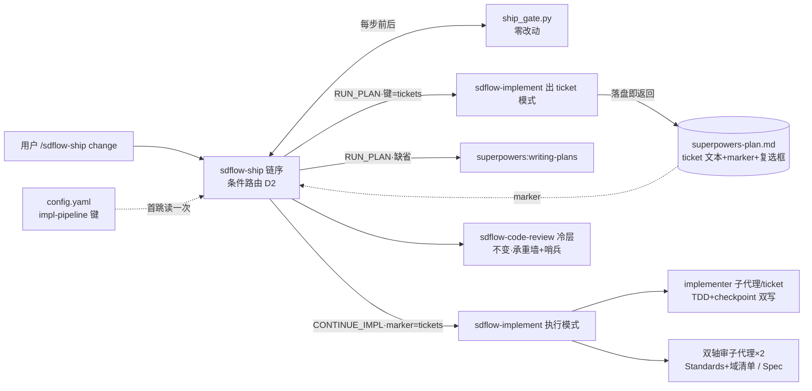
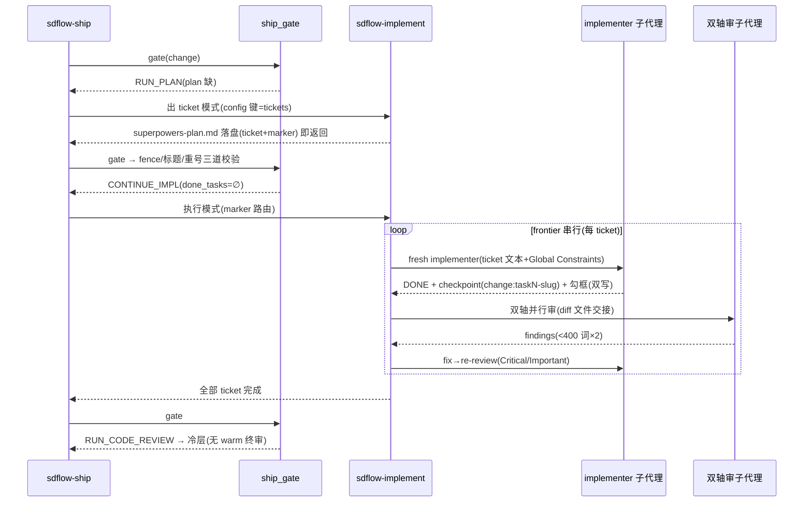

# Design: matt-workflow-integration

> 决策底稿：docs/workflow-skills/impl-pipeline-matt-vs-superpowers.md（调研 §1-§9 + 三镜/对抗镜六问裁决 §10，2026-07-10 用户拍板）。本文形式化裁决为实施设计；与底稿冲突处以本文为准。

## 1. 决策记录

### D1 编排 skill 形态：单 skill `sdflow-implement` 双模式（用户拍板）

- **候选**：A. 两 skill（出 ticket + 执行，与 gate 两状态 1:1）；B. 单 skill 双模式、出 ticket**落盘即返回**；C. 单 skill 直通（出 ticket 后同调用续执行）。
- **裁决 = B**。C 首先出局：直通取消了 plan 落盘与执行起跑之间的 gate 调用，fence/零标题/重号三道校验（ship_gate.py:727-739）只能在实现 token 烧完后才触发，且 plan→impl 过渡不再由 gate 裁决，违 adr/0006(b) 与 ship 铁律（sdflow-ship/SKILL.md:12）。A 与 B 的 gate 力学等价（对抗镜裁定「必须两 skill 才有 gate 插入点」系假二分——B 的「落盘即返回 → ship 重跑 gate → CONTINUE_IMPL 再入」拿到相同插入点），剩余差异纯在维护面：B 的 description 触发精度、README 条目、setup 链接各减半，且不把用户从未感知的内部缝隙实体化为两个名字。
- **三镜主次**：主锚系统镜（gate 插入点为硬约束，A/B 等价后此镜中立），由开发循环镜维护面账收敛，用户镜同向。
- **模式路由信号（确定性，非模型判断）**：RUN_PLAN（plan 文件缺，ship_gate.py:722-724）→ 出 ticket 模式；CONTINUE_IMPL（携 done_tasks，:750-752）→ 执行模式。skill 内部不自判模式。
- **执行形态（事实约束）〔grill-amendment〕**：sdflow-implement 由 ship 主 session 经 Skill 加载 **inline 执行**（与现 subagent-dev 同构），MUST NOT 作为子代理派发——子代理无法再派子代理，执行模式派发 implementer/双轴审的能力依赖主 session 位置。SKILL.md 与 ship 链序措辞均须避免「派发 sdflow-implement 子代理」类表述。

### D2 ship 接入：原地条件路由，不 fork（三镜一致）

- **候选**：A. fork sdflow-ship2；B. sdflow-ship/SKILL.md 链序 RUN_PLAN/CONTINUE_IMPL 两映射改条件路由。
- **裁决 = B**。gate 状态机管线无关，superpowers 专名仅 :724/:750 两处 emit 提示串（底稿 §5 亲验）；fork = 842 行加固沉淀（T10 协议 :23、熔断判据 :29、D9 resume :33）双写必漂移，adr/0007 否决 stub 的「长期维护额外面」理由逐字适用；且 fork 会让 A/B 对照混入「两编排器各自漂移」混杂因子。
- **回退设计（吸收用户「留后路」动机，优于 fork）**：①旧管线零触碰（writing-plans/subagent-dev 插件原样在装、gate 零改动）；②缺省即旧管线（不翻键 = 回退，极端删 sdflow-implement 目录 + 还原链序一段文字，git revert 级）；③盘面 marker 使两管线同时在飞、互不影响；④同 ship 之下只换实现段，一次只变一个变量。
- **试验期消歧声明（adr/0006(b) 例外边界）**：链序段显式写「RUN_PLAN/CONTINUE_IMPL 两态的skill 路由以本 SKILL.md 链序映射为权威；gate JSON `next` 字段在此二态仍输出 writing-plans/subagent-dev，仅信息性」。gate 的**状态判定**不变（步序权威仍在 gate），失真的只是 skill 名提示——Phase B 改 emit 串根治。「照 next 跑，勿凭摘要猜」指令仅约束 RERUN_STALE/STEP_IN_PROGRESS 两态（SKILL.md:29），与本声明不冲突。

### D3 gate 处理：试验期零改动外衣；否决配置化；emit 串归 Phase B（三镜一致，已固化 **adr/0017**）

- 完成判据契约 = 文件名 `superpowers-plan.md`（:722）+ `### Task <n>:` 标题集（fence-aware，:730-739）+ checkpoint 标签 ∪ 复选框双通道（:740-752），ticket 体内容不设限 → tickets 穿外衣零改动兼容，CONTINUE_IMPL 的 done_tasks resume 语义原样可用。
- **永久否决文件名配置化**：plan_first_sha 窗口锚按路径 keyed（:740），双名裂窗口锚；gate 刻意零依赖（:286「不 import yaml」不变量）；双源歧义。
- **出 ticket 收尾 MUST 显式 checkpoint（plan 单独提交）〔grill-amendment〕**：B1 完成窗口锚 = plan 首次提交 sha（:740）；未提交时 checkpoint 通道恒 ∅——ticket 带验收复选框故不触 :747-749 的 UNKNOWN（仅「未提交且无复选框」才卡），且首 ticket add -A 会把 plan 捎进同 commit 自愈（:746-748 已兜底），但依赖巧合不如显式；步末 checkpoint 亦是 G4/G5 既有纪律。
- 终局文件名迁移（tickets.md + 旧名 fallback + 双存判 UNKNOWN vs 永不改名）为真分歧，Phase B 拍板——试点期收集「外衣误导排障」实证作为判据。

### D4 机制取舍（三镜一致，keep/drop 判据 = sdflow 已有结构机制覆盖者砍、确定性信号与上下文经济学机制保）

| 取舍 | 项 | 依据 |
|---|---|---|
| 砍 | warm final whole-branch review | 冷层 sdflow-code-review 紧随（RUN_CODE_REVIEW，ship_gate.py:756）且是实证承重墙（memory: cold-code-review-load-bearing）；SDD 自记修复波成本灾难；其 Minor 分诊残值由冷层 defer-进-todolist 承接 |
| 砍 | progress ledger | gate done_tasks resume（:750-752）结构性覆盖 compaction 失忆；留则完成态双真相源，且 git-ignored 对 gate committed-only 口径不可见 |
| 砍 | task-brief 抽取层 | 行为级 ticket 文本（禁代码/路径）远小于带码 task，ticket 即 brief；对抗镜证伪了「ticket 变粗 brief 更大」的反向解读 |
| 砍 | pre-flight 批量问人 / plan-mandated 问人 | 机械冲突 gate 已查（:727-739）；裁决走 ship T10 三级协议（SKILL.md:23），阶段三无人类门 |
| 保 | 状态词表 DONE/DONE_WITH_CONCERNS/NEEDS_CONTEXT/BLOCKED | 枚举状态 = 确定性分支信号；BLOCKED 与 ship BLOCKED_UPSTREAM 上抛同构；NEEDS_CONTEXT handler 重定义为盘面自答（design/specs/ticket 文本），答不出 T10/停 |
| 保 | file handoffs（report file / review-package diff 文件）〔T125 实例〕 | 上下文经济学与 ticket 粒度无关（42k 字符 dispatch 事故教训）；review-package 类等价物以 skill 内几行 git 命令契约实现（不复制 superpowers 脚本） |
| 保 | 每 ticket 双轴审 + fix→re-review 环 | Standards 轴（仓标准 + smell 基线 + **注入 code-checklists/domains = 注入点 B，经 resolve-workflow.sh 解析**，落 dispatch 模板必填槽而非 prose 叮嘱——防注入点丢失前科）+ Spec 轴（ticket 文本验收 + R-ID）；各 <400 词封顶 |
| 保 | Global Constraints 逐字携带 | reviewer 注意力透镜，便宜且承重 |
| 保 | Reviewer ⚠️ cannot-verify-from-diff 项编排层亲自消解 | 对抗镜共同盲区裁决：垂直切片缩小但不消灭此类项，无人接 = 静默缺口 |
| 保 | 禁并行 implementer（首版） | 见 D8/Non-Goal |

### D5 手动路由三跳（用户显式要求：零模型自动判断）

```
首跳(仅新出 ticket 时刻)          在途(续跑/中断重调)         兜底
config.yaml impl-pipeline ──▶ plan 文件 frontmatter ──▶ 键缺失/非法/marker 缺失
  人手编辑,读一次字面值        marker,落盘后只读          → 一律 superpowers
```
- config 键为顶层可选段，沿 model-tiers 覆盖段先例（config.yaml:52-54 注释形态）；**sdflow-init 的 lint_config 只条件校验已知键、不拒未知顶层键（init.py:295-299 亲验）→ 零脚本改动**。validator 学新键（⑤ impl-pipeline 若存在值 ∈ {tickets,superpowers}）属可选硬化，留 Phase B（读取端非法→superpowers 已 fail-safe，无炸点）。
- marker 形态取显式 frontmatter 键（对抗镜裁定内容嗅探『# Tickets:』为弱形态）。
- gate 不读 config（零依赖不变量）；键读取由 ship 主 session 按链序做机械分支——有确定性信号故属机械执行而非判断；若试点误路由实发，键读取脚本化为后备硬化路径（假设表④）。

### D6 T126 衔接契约落点

- 三段分流改 workflow.md 阶段一（图 :13-21 + 步骤表 :68 explore 行），wayfinder 入口与降级（缺装→explore）一并写入；衔接契约三条落 `ff-generation-constraints.md` 新节（FF-0 同级、条件 = change 源于 wayfinder map）：ff 起手逐区读 map（Destination→proposal 动机+D-5；**Decisions-so-far 逐 ticket zoom 决议全文**，防 ff:100「prefer making reasonable decisions」对已决项重决歪；Out-of-scope→D-3 假设）、TG 判命中前置 chart 写 map Notes、proposal 回链 map。
- 权威源 = `sdflow-init/assets/workflow/`（本仓无规则副本，经全局 canonical 解析）；改后 dev checkout 重跑 setup.sh 才测得到（adr/0005）。
- **TG 前置的执行者落点〔grill-amendment〕**：chart 是 wayfinder（外部 skill）模式、不认识 TG——义务落 workflow.md 阶段一 wayfinder 行（主 session 规则，任务 3.1），语义 = **增强非转移**：ff 起手判触发纪律不变（map Notes 有 TG 记录则核对、无则照常全判），Notes 缺失不构成失败态、不硬卡。
- 与在飞 change rebuild-sdflow-roadmap-v2 的边界：该 change 的 roadmap 结晶**不经 ff**（其 Non-Goal 假设），本契约只约束「wayfinder → opsx:ff 出 change」路径，二者不相交；若其假设证伪需 ff 参与，届时本契约恰为其前置（已在其 Non-Goals 声明依赖方向）。

### D7 T127 grill 瘦跑落点

- 落 workflow.md 步骤表 grill 行（:70）派发 prompt 措辞：新增「上游 wayfinder 已决分支：引 resolution 快速核对（决议 vs 代码 ground truth 仍一致）即过；新生成/未决部分照常死磕」。不新增规则文件（避免 INDEX 同步面）；grill-with-docs 为 matt 外部 skill 不改内部（adr/0002 边界），瘦跑指令经派发 args 注入。
- 护栏：MUST NOT 整跳 grill（memory: grill-not-skippable）；瘦跑仅作用于有 resolved ticket 对应的分支。

### D8 试点 A/B 设计

- 试点 3-5 个有逻辑面的中型 change（排除纯文档/琐碎类——它们本不撞实现管线）；对照 = retro 30-change 池同类型分桶历史（memory: test-ratio-by-stack，change 类型是实证混杂因子）；≥1 消费仓验证缺省键路径（memory: dogfood-blind-spot）。
- 判据三条结构、**定性人读拍板**（n=3-5 不设数字阈值，adr/0009 小样本警告）：① retro per-change impl Δ 方向性下降；② 冷层 Critical/严重 findings 与 done verify FAIL 不升；③ 护栏哨兵——冷层捕获「本应被每 ticket 审拦住」的严重项占比不恶化（恶化 = 熔断，停试点回退）。
- 变量控制：试验期 implementer 档位钉死 mid（不叠加降档实验；「plan 含码→最便宜档誊抄」降档通道随预写代码消失而失效，model-tiers 判据重标另议）。

### D9 出 ticket 粒度人工话语权（开放问题③，grill 拍板 = A 收窄形制）

quiz-the-user 职能并进**设计门**——design.md 可选「切片建议」节（初步 ticket 划分 + 阻塞边草图），spec-review 顺带审、设计门一次拍板；出 ticket 模式以该节为**建议**输入（无则自主出 ticket），粒度争议走 T10。零新增人类门（adr/0004），人对粒度的话语权前移到既有拍板面。
**形制收窄〔grill-amendment，2026-07-10 拍板〕**：不动 ff 模板/config rules；落点 = ff-generation-constraints.md 增一条**独立**小条款（条件 = 仓 `impl-pipeline: tickets`，与 wayfinder 衔接契约节的条件「change 源于 map」不同，勿混节）：「design 决策区 MAY 含切片建议节；出 ticket 模式消费语义 = 建议非契约」。否决候选 C（出 ticket 后停一拍——违阶段三无人类门红线）。

## 2. 组件与依赖



## 3. 长路径序列（tickets 管线端到端）



## 4. 失败模式表（D-4）

| 失败模式 | 探测 | 降级/处置 |
|---|---|---|
| matt 语义源缺装（to-tickets/implement/code-review/tdd） | 出 ticket 模式起手检查 skill 目录 | 显式停并提示；config 未开 tickets 时本不可达（缺省仓零暴露） |
| config 键值非法/拼错 | 读键字面值比对 | 一律 superpowers（fail 向旧管线），不猜不报错阻塞 |
| plan 文件在而 marker 缺（手工/旧管线产物） | frontmatter 无 impl-pipeline 键 | 视为 superpowers 产物按旧管线续跑，不嗅探内容 |
| 弱模型照 gate next 串误调 writing-plans（试验期已知债） | 试点人工看护 + 双 plan 形态会触发 gate 标题/重号 UNKNOWN | 链序权威声明压制；实发 → Non-Goal②证伪，emit 串改提前 |
| 勾框/标签双写半态 | gate 双通道并集不假卡；执行模式逐 ticket 核对双信号 | implementer 契约钉死双写；单边缺失时执行模式补齐并记录 |
| 冷层 Critical 率升（哨兵） | 试点期逐 change 对照基线 | 熔断：停试点、config 回缺省、实证记判赢材料（D8③） |
| wayfinder 缺装（T126 大雾档） | 分流时检查 | 降级 explore（与 rebuild-sdflow-roadmap-v2 同款显式降级） |
| implementer BLOCKED 无法盘面消解 | 状态词表 | 停并上抛（同 ship BLOCKED_UPSTREAM 语义），不静默跳 ticket |

## 5. Scope-check 表（TG-25：writing-plans/subagent-dev 契约牵连面穷举，行锚本次亲验）

| 位置 | 处置 |
|---|---|
| sdflow-ship/SKILL.md:3（description 链名）| 改：实现段表述管线中性化（保触发精度） |
| sdflow-ship/SKILL.md:29（链序 RUN_PLAN/CONTINUE_IMPL 映射）| 改：条件路由 + next 提示串权威声明（D2） |
| sdflow-ship/scripts/ship_gate.py:722/:724/:750/:492/:740-752 | **零改动**（外衣兼容 D3；emit 串 Phase B） |
| sdflow-ship/tests/test_gate_impl_progress.py | 零改动（gate 未动） |
| sdflow-init/assets/workflow/workflow.md:13-21/:68（阶段一图+explore 行）| 改：三段分流（T126/D6） |
| 同上 :70（grill 行）| 改：瘦跑措辞（T127/D7） |
| 同上 :34/:74-75（阶段三行）| 加 config 键脚注，**不改默认口径**（Phase B 才全量） |
| 同上 :82/:117（G1 禁 clear 句/检查单）| 改：subagent-dev 处并列 sdflow-implement |
| sdflow-init/assets/workflow/ff-generation-constraints.md | 增：wayfinder→ff 衔接契约节（D6） |
| sdflow-init/assets/workflow/config.template.yaml + 本仓 openspec/config.yaml:52-54 邻段 | 增：impl-pipeline 可选键注释段（D5） |
| sdflow-init/scripts/init.py:295-299（lint_config）| 零改动（不拒未知顶层键，亲验；validator 学新键留 Phase B） |
| sdflow-init/assets/snippets/claude-section.md:13（禁 /clear 句源）+ 本仓 CLAUDE.md 托管块 | 改：并列 sdflow-implement（经 assets 源 + maintain 刷新，勿手改托管块） |
| README.md Skills 列表 | 增：sdflow-implement 行 |
| openspec/specs/spec-workflow/spec.md:81 | 经本 change delta MODIFIED（archive 时对码同步） |
| docs/（workflow-map/overview、sdflow-fable5/*、workflow-skills/superpowers-*.md 等） | **不回改**（历史快照原则）；活文档全量表述同步归 Phase B |
| quality-layering.md / design-diagrams.md:58,91 等 reference 内 writing-plans 提法 | 不改（描述缺省管线仍准确）；Phase B 复核 |

## 6. Migration Plan

1. 新增 sdflow-implement/SKILL.md → dev checkout `bash setup.sh` 建链接（adr/0005）。
2. ship 链序 + assets 规则 + config 模板改动随本 change 落地；消费仓经下次 `sdflow-init update` 获得规则更新，config 键**不注入存量仓**（可选段，缺失 = 缺省管线，100% 存量仓行为不变）。
3. 试点：本仓 config 开 `impl-pipeline: tickets` 跑首个试点 change；≥1 消费仓不开键验证缺省路径。
4. **回滚**：config 键回缺省/删除即止血（在途 tickets change 按 marker 跑完或人工越权处置）；彻底回滚 = git revert 本 change + 重跑 setup.sh。
5. **与 rebuild-sdflow-roadmap-v2 的实施串行〔grill 拍板〕**：本 change 评审先行推进到设计门前；两 change 共同触碰 CLAUDE.md 托管块（各经 assets 源），**实施必须串行**、后实施者 rebase 对齐托管块与 assets 改动，实施先后在设计门时定。

## 7. Compliance（D-6）

- **adr/0002**：matt/superpowers skill 只消费不改内部；本地语义改造以 sdflow-implement 内重述实现。✓
- **adr/0004**：ship 窄 scope 不变、不越两个人类点；路由为事前配置非人类门。✓
- **adr/0006(b)**：步序判定全在 gate；出 ticket 落盘即返回保插入点；next 提示串失真以链序显式声明消歧（状态判定未失真），Phase B 根治。✓
- **adr/0007**：sdflow-implement 命名（sdflow- 前缀 + 直白词根；否决 impl 缩写——0007(b) 判例、否决 ship2 版本号后缀——反地层堆积）。✓
- **adr/0003/0005**：规则改 assets 权威源；tasks 含 setup.sh 重跑与发布边界步。✓
- **spec-workflow「workflow bundle 改在权威源、经部署下发」需求（spec.md:129）**：D6/D7 全部落 assets。✓
